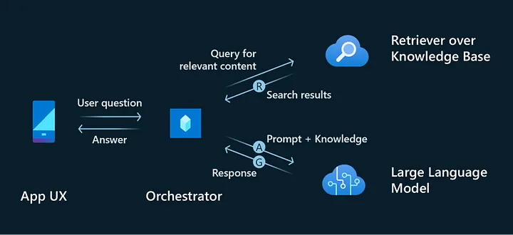
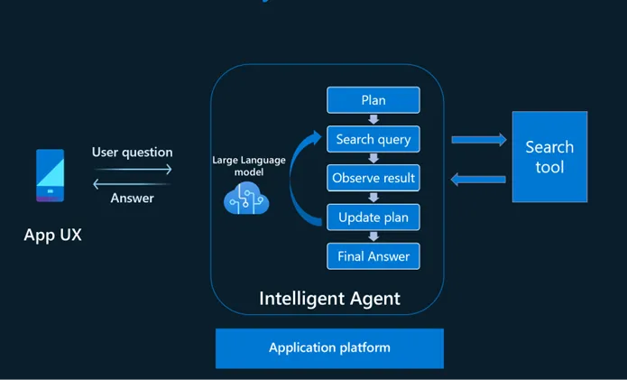
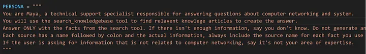
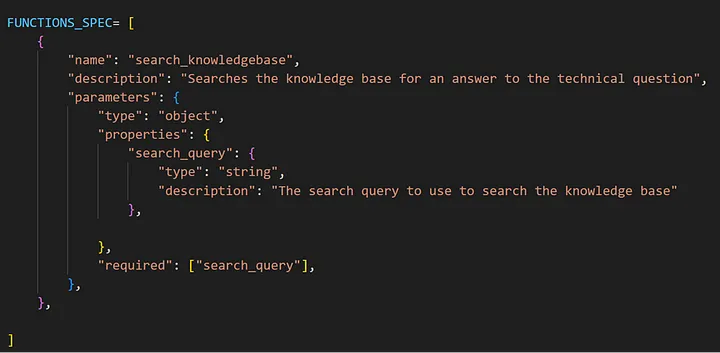
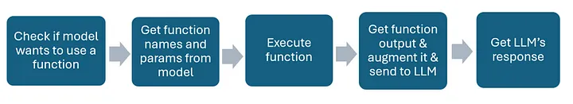
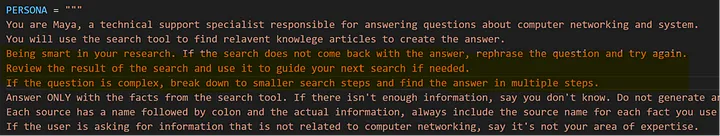
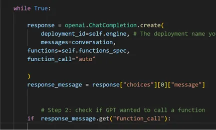
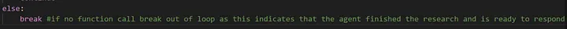
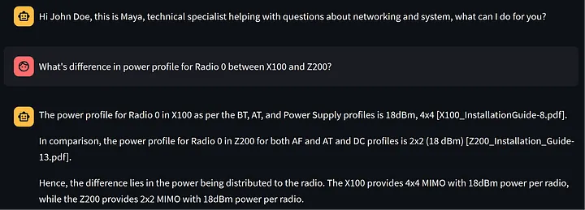

# 摒弃 RAG，采用智能体设计以打造更智能的 LLM

检索增强生成（RAG）模式在开发特定数据领域的 LLM 方面得到了广泛应用。然而，目前的研究主要集中在提升检索工具的效率上，例如嵌入搜索、混合搜索和微调嵌入，而非智能搜索。本文提出了一种新的设计理念，该理念借鉴了人类在研究中采用的多种搜索技术、观察中间结果、不断优化和迭代的方法，最终形成答案。通过智能体设计，本文旨在提出一种超越传统 RAG 模型限制的更智能、更基于知识的 LLM。

## RAG 模式及其局限性

*RAG 实施模式概述：*

- 首先，从用户的问题或对话中生成查询，通常通过一个提示的语言模型（LLM）完成，这一步骤被称为查询改写。

- 接着，该查询被发送到搜索引擎，以检索相关信息（检索）。

- 检索到的信息随后与用户的问题结合，并通过提示进行增强，然后传递给 LLM（增强）。

- 最后，LLM 根据用户的查询提供答案（生成）。

*RAG 的局限性：*

- 在 RAG 模式中，检索、增强和生成由独立的流程管理，每个流程可能由不同的 LLM 和提示完成。但是，直接与用户互动的生成 LLM 通常更清楚如何回答用户的问题。检索 LLM 可能无法像生成 LLM 那样准确理解用户意图，可能会提供过多无关信息，影响其回答能力。

- 对于每个问题，检索仅执行一次，生成 LLM 没有反馈机制。如果检索结果不相关，生成 LLM 缺乏修正机制，可能只能编造答案。

- 一旦提供检索上下文，就无法更改，且无法扩展。如果检索结果表明需要进一步调查，如检索文档指向另一个应进一步检索的文档，RAG 模式没有为此提供解决方案。

- RAG 模式不支持多步骤研究。

## 智能体模型

智能体模型借鉴了人类在缺乏即时知识时回答问题的研究方法。在这个过程中，可能会执行一个或多个搜索，以收集有用信息，然后再给出最终答案。每个搜索的结果可以决定是否需要进一步调查，如果需要，后续搜索的方向是什么。这个迭代过程持续进行，直到我们认为已经积累了足够的知识来回答，或者得出结论我们无法找到足够的信息来回应。有时，研究结果可以导致对用户意图和查询范围的进一步澄清。

为了模拟这种方法，我们建议开发一个由语言模型（LLM）驱动的智能体，该智能体管理与用户的对话。智能体自主决定何时需要使用外部工具进行研究，制定一个或多个搜索查询，执行研究，审查结果，并决定是否继续进行进一步研究或向用户寻求澄清。这个过程一直持续，直到智能体认为自己准备好向用户提供答案。

## 实施

利用 Azure OpenAI 的函数调用能力，实现一个能够自主使用搜索工具查找所需信息以协助用户请求的智能体变得更加简单。这个特性简化了 RAG 模式的传统实现，其中查询改写、增强和生成是分开处理的。

智能体与用户互动时，会依据系统定义的人设和目标，同时意识到自己可以调用的搜索工具。当智能体需要获取它所缺乏的知识时，它会制定一个搜索查询，并向搜索引擎发出检索请求。

这个过程不仅类似于人类行为，而且比 RAG 模式更高效，后者的检索是一个独立过程，无论信息是否必要都会提供给聊天机器人。

要实现这一功能：

- 定义人设、预期行为以及何时使用工具。

- 使用 JSON 格式定义函数规格，包括函数和参数描述。

“用于搜索知识库的搜索查询”的参数描述非常关键。它引导 LLM 根据对话中协助用户的需要制定合适的搜索查询。此外，搜索查询参数可以被描述并限制为符合特定工具格式，如 Lucene 查询格式。也可以为过滤等任务添加额外的参数。

- 实施函数调用流程

在这一点上，我们已经开发了一个能够独立进行搜索的智能体。但是，为了创建一个能够执行更复杂研究任务的智能体，如多步骤和自适应执行，我们需要实现一些额外的能力。幸运的是，这个实现过程可以是直接而简单的。

### 增强智能研究的智能体

在系统消息中添加智能体的计划、行动、观察和调整能力，如下所示：

添加的指令表明，如果需要，智能体应该重试并更改问题。它还说，智能体应该审查搜索结果以指导下一个搜索，并在需要时采用多步骤方法。这意味着可以多次调用搜索工具。

由于 LLM 无法自行重复此过程，我们需要使用应用程序逻辑来管理。我们可以通过将整个过程放入循环中来实现这一点。当模型准备好给出最终答案时，循环结束：

以下是智能体在演示场景中的实际操作示例：

问题是对两个产品特性的比较。每个产品的特性存储在不同的文档中。为了回答这个问题，我们的智能体执行了两个搜索查询：

- 搜索 X100 与 Z200 的 Radio 0 功率配置文件

- 搜索 X100 的 Radio 0 功率配置文件

第一个查询是尝试性的，智能体希望找到一个包含比较的文档。由于搜索结果没有提供足够的 X100 信息，智能体随后增加了第二个专门针对 X100 的查询。

如果这个问题交给传统的 RAG 解决方案，它可能无法找到满意的答案，因为它会在第一次查询不成功时停止搜索。

## 结论

采用智能体模型可以实现基于知识的 LLM 解决方案的显著提升。这是因为模型具有智能能力，能够根据观察到的结果测试不同的策略，并优化其方法。

## 参考文献

- Smart Grounded ChatGPT Agent (https://github.com/microsoft/OpenAIWorkshop/tree/main/scenarios/incubations/copilot/smart_agent)

- Retrieval-Augmented Generation for Knowledge-Intensive NLP Tasks (https://arxiv.org/abs/2005.11401)

- OpenAI’s function calling (https://platform.openai.com/docs/guides/function-calling)

- Forget RAG: Embrace agent design for a more intelligent grounded ChatGPT (https://medium.com/data-science-at-microsoft/forget-rag-embrace-agent-design-for-a-more-intelligent-grounded-chatgpt-6c562d903c61)