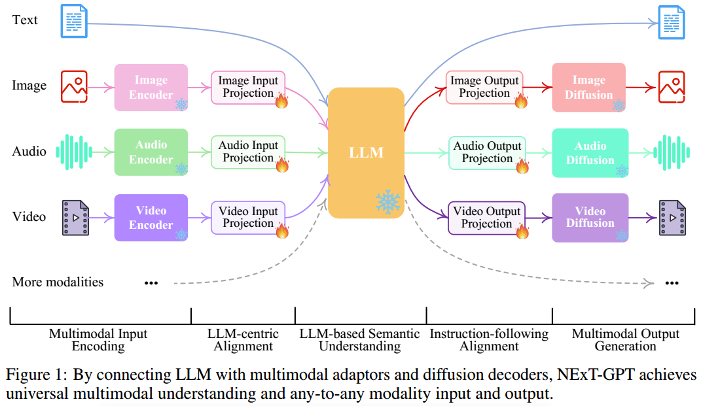
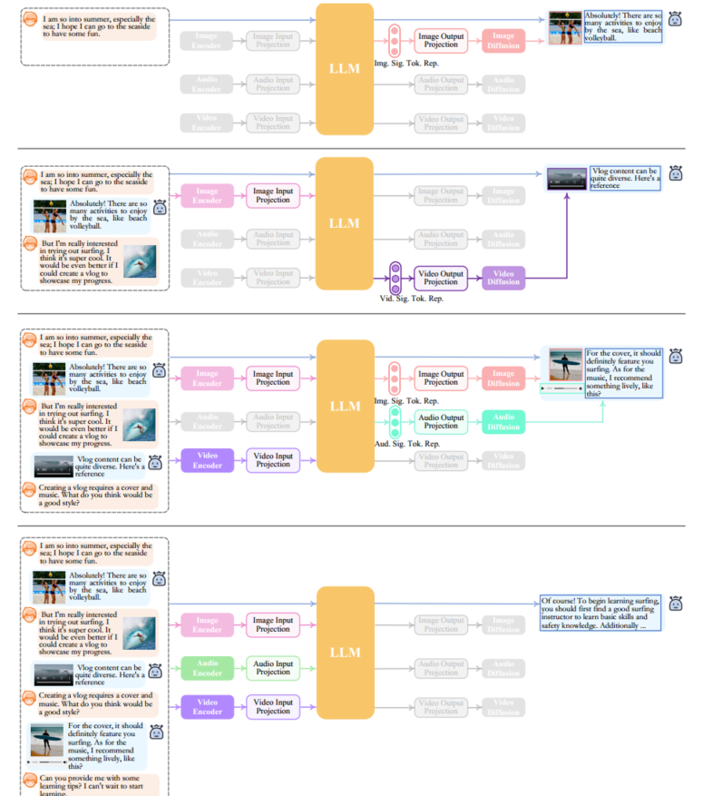
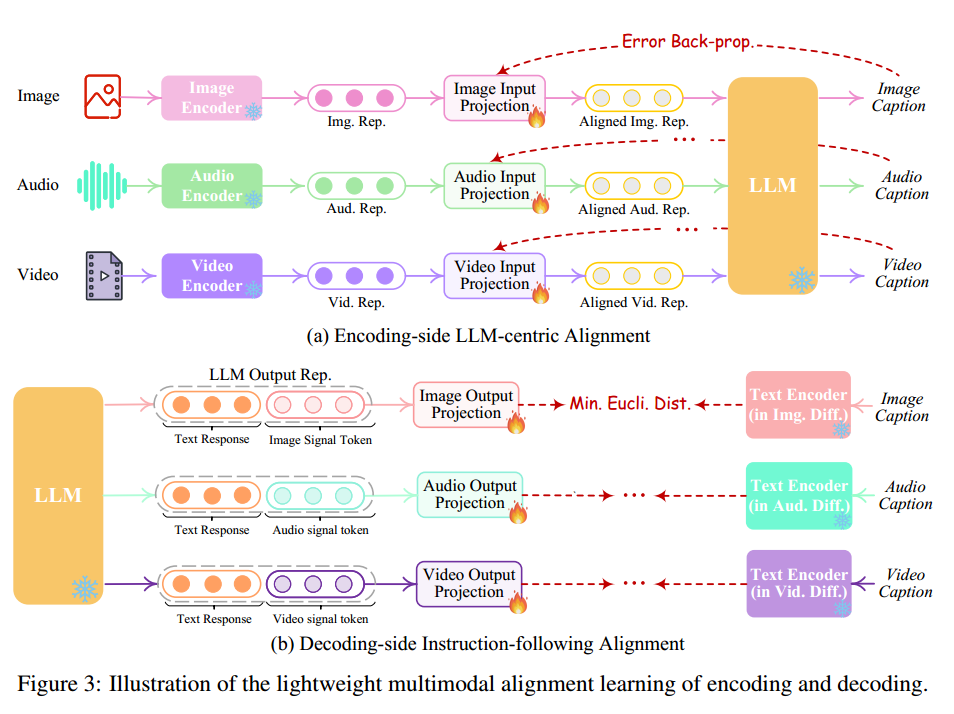
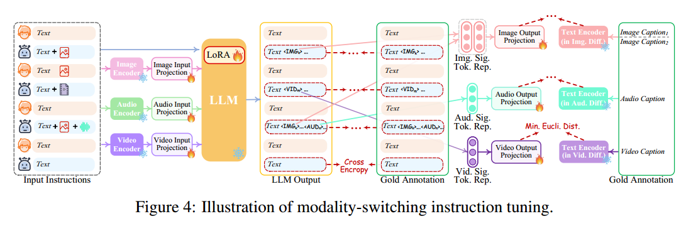

# NExT-GPT: Any-to-Any Multimodal LLM

## 摘要

**虽然最近多模态大型语言模型(mm - llm)取得了令人兴奋的进展，但它们大多受到输入侧多模态理解的限制，无法以多模态生成内容。**

由于我们人类总是通过各种方式感知世界和与人交流，因此开发能够以任何方式接受和传递内容的任意到任意mm - llm对于人类级别的AI至关重要。为了填补这一空白，我们提出了一个端到端通用的任意对任意MM-LLM系统NExT-GPT。我们将LLM与多模态适配器和不同的扩散解码器连接起来，使NExT-GPT能够感知输入并以文本、图像、视频和音频的任意组合生成输出。通过利用现有训练有素的高性能编码器和解码器，NExT-GPT仅使用少量(1%)特定投影层的参数进行调整，这不仅有利于低成本的训练，而且有利于方便地扩展到更多潜在的模式。此外，我们引入了一种模式切换指令调优(MosIT)，并为MosIT手动创建了一个高质量的数据集，在此基础上，NExT-GPT被赋予了复杂的跨模式语义理解和内容生成能力。总的来说，我们的研究展示了建立一个能够建模通用模式的统一AI代理的有希望的可能性，为社区中更多类似人类的AI研究铺平了道路。

## 介绍

最近，人工智能生成内容(Artificial Intelligence Generated Content, AIGC)这一主题在某些技术的推动下取得了前所未有的进展，例如用于文本生成的ChatGPT和用于视觉生成的扩散模型。其中，大型语言模型(Large Language Models, llm)的兴起尤为引人注目，**如Flan-T5、Vicuna、LLaMA和羊驼**，它们展示了强大的人类水平的语言推理和决策能力，为人工通用智能(Artificial General Intelligence, AGI)的发展指明了道路。我们的世界本质上是多模态的，人类用不同的感觉器官感知世界的各种模态信息，如语言、图像、视频、声音等，往往是相互补充和协同的。有了这样的直觉，纯基于文本的法学硕士最近被赋予了视觉、视频、音频等其他模态理解和感知能力。

一个值得注意的方法包括使用适配器，将其他模式的**预训练编码器与文本llm对齐**。这种努力使得多模态llm (mm - llm)快速发展，如**BLIP-2、Flamingo、MiniGPT-4、Video-LLaMA、LLaVA、PandaGPT、SpeechGPT**。然而，这些努力大多侧重于输入端的多模态内容理解，缺乏以文本以外的多模态输出内容的能力。我们强调，真正的人类认知和沟通需要在任何形式的信息之间无缝转换。这使得对任意mm - llm的探索对于实现真正的AGI至关重要，也就是说，接受任何形式的输入，并以任何形式的适当形式提供响应。

已经做出了一定的努力来模仿类似人类的任意到任意模态转换。最近，CoDi在实现同时处理和生成任意组合模态的能力方面取得了长足的进步，但它缺乏llm的推理和决策能力作为其核心，并且也仅限于简单的配对内容生成。另一方面，一些努力，如Visual-ChatGPT和HuggingGPT已经试图将llm与外部工具相结合，以实现近似“任意对任意”的多模态理解和生成。

不幸的是，由于完整的管道体系结构，这些系统面临着严峻的挑战。

**首先，不同模块之间的信息传递完全基于LLM产生的离散文本，其中级联过程不可避免地引入噪声并传播误差**。更关键的是，整个系统只利用现有的预训练工具进行推理。由于在错误传播方面缺乏全面的端到端训练，内容理解和多模态生成的能力可能非常有限，特别是在解释复杂和隐含的用户指令时。简而言之，迫切需要构建任意模态的端到端MM-LLM。

为了实现这一目标，我们提出了NExT-GPT，一种任意对任意MM-LLM，**旨在无缝处理文本、图像、视频和音频四种模式的任意组合的输入和输出**。如图1所示，NExT-GPT包括三个层。**首先，我们利用已建立的编码器以各种方式对输入进行编码，其中这些表示通过投影层被投影成LLM可以理解的类似语言的表示。**其次，我们利用现有的开源LLM作为核心来处理输入信息以进行语义理解和推理。**LLM不仅直接生成文本标记，而且还生成唯一的“模态信号”标记**，作为指令来指示解码层是否以及相应输出什么模态内容。第三，产生的带有特定指令的多模态信号，经过投影后，路由到不同的编码器，最终生成相应模态的内容。

由于NExT-GPT包含各种模式的编码和生成，从头开始训练系统将需要大量的成本。相反，我们利用现有的预训练高性能编码器和解码器**，如Q-Former ， ImageBind和最先进的潜在扩散模型**。通过加载现成的参数，我们不仅避免了冷启动训练，而且还促进了更多模式的潜在增长。

**对于跨三层的特征对齐，我们考虑仅对输入投影层和输出投影层进行局部微调**，采用以llm为中心的编码侧对齐和以指令为中心的解码侧对齐，其中最小的计算开销确保了更高的效率。此外，为了使任意到任意的MM-LLM在复杂的跨模态生成和推理方面具有人类水平的能力，**我们引入了一个模态切换指令调优(称为Mosit)，为系统配备了复杂的跨模态语义理解和内容生成**。为了解决社区中缺乏这种跨模态指令调优数据的问题，我们手动收集并注释了一个由5000个high样本组成的Mosit数据集，采用LoRA技术，我们在MosIT数据上对整个NExT-GPT系统进行了微调，更新了投影层和某些LLM参数。

总的来说，这项工作展示了开发更像人类的MM-LLM代理能够建模通用模态的有希望的可能性。本项目的贡献如下:

- 我们首次提出了一个端到端通用的任意对任意MM-LLM, NExTGPT，能够进行语义理解和推理，并生成文本、图像、视频和音频的自由输入和输出组合
- 我们引入了轻量级对齐学习技术，编码侧以llm为中心的对齐，解码侧的指令遵循对齐，有效地需要最小的参数调整(只有1%的参数)来实现有效的语义对齐。
- 我们注释了一个高质量的模态切换指令调优数据集，涵盖了文本、图像、视频和音频的各种模态组合的复杂指令，帮助MM-LLM具有类似人类的跨模态内容理解和指令推理。

## 相关工作

我们的世界充满了多模态信息，我们不断地从事理解和产生跨模态内容的复杂任务。人工智能社区相应出现了各种形式的跨模式学习任务，如图像/视频字幕、图像/视频问答、文本到图像/视频/语音合成、图像到视频合成等，所有这些都在过去几十年里取得了快速发展。

研究人员提出了高效的多模态编码器，目的是构建包含各种模态的统一表示。同时，由于不同模态的特征空间不同，进行模态对齐学习是必要的。此外，为了生成高质量的内容，已经提出了许多性能强大的方法，如Transformer ， GAN ， VAEs ， Flow模型和当前最先进的扩散模型。特别是，基于扩散的方法最近在大量的跨模态生成任务中表现出色，如DALL-E、Stable Diffusion。虽然之前所有跨模态学习的努力都仅限于对多模态输入的理解，但CoDi最近呈现出突破性的发展。

利用扩散模型的力量，CoDi拥有从并行输入模式的任何组合生成任何输出模式组合的能力，包括语言、图像、视频或音频。遗憾的是，CoDi可能仍然无法实现对输入内容的类似人类的深度推理，只有并行的跨模态馈送和生成。

多模态大型语言模型法学硕士已经对整个人工智能社区产生了深远的影响和革命**。最著名的llm，即OpenAI的ChatGPT和GPT4，采用了指令调优和基于人类反馈的强化学习(RLHF)等对齐技术**，展示了卓越的语言理解和推理能力。一系列开源llm，如Flan-T5、Vicuna、LLaMA和Alpaca，极大地推动了进步，为社区做出了贡献。之后，在构建处理多模态输入和任务的llm方面做出了重大努力，从而导致了mm - llm的发展。

**一方面，大多数研究者通过将训练良好的各种模态编码器与llm的文本特征空间对齐来构建基本的mm - llm，从而使llm能够感知其他模态输入**。例如，**Flamingo使用跨注意层将冻结图像编码器连接到llm**。**BLIP-2使用Q-Former将输入的图像查询转换为llm**。**LLaVA采用一种简单的投影方案将图像特征连接到词嵌入空间中**。对于构建能够理解视频(例如，Video-Chat和Video-LLaMA)、音频(例如，SpeechGPT)等的mm - llm，也有各种类似的实践。PandaGPT通过集成多模态编码器，即ImageBind，实现了对六种不同模态同时的全面理解。

然而，这些mm - llm都受限于只能感知多模态数据，而不能以任意模态生成内容。**为了实现具有多模态输入和输出的llm**，一些人因此探索将llm作为决策者，并利用现有的现成多模态编码器和解码器作为执行多模态输入和输出的工具，如**Visual-ChatGPT、HuggingGPT和AudioGPT**。正如上面提到的,

> 图2:NExT-GPT推理过程。灰色表示模块停用。

离散管道方案下的纯文本模块间消息(即LLM文本指令)不可避免地会引入噪声。此外，缺乏跨整个系统的全面调优也极大地限制了语义理解的有效性。我们的工作利用了上述两种类型的共同优势，即以端到端的方式学习任意到任意的MM-LLM。

## 总体架构

图1给出了该框架的概要概述。NExT-GPT包括三个主要层次:编码阶段、LLM理解和推理阶段和解码阶段。

多模态编码阶段首先，我们利用现有的成熟模型来编码各种模态的输入。对于不同的模式，有一组编码器可供选择，如QFormer ， ViT ， CLIP。在这里，我们利用ImageBind，这是一个跨六种模式的统一高性能编码器。使用ImageBind,我们不需要管理大量的异构模态编码器。然后，通过线性投影层，不同的输入表示被映射成LLM可以理解的类似语言的表示。

**LLM理解和推理阶段使用LLM作为NExT-GPT的核心代理。**

在技术上，我们采用了Vicuna2，这是一种开源的基于文本的LLM，在现有的mm -LLM中被广泛使用。LLM将来自不同模态的表示作为输入，并对输入进行语义理解和推理。它直接输出1)文本响应，以及2)每个情态的信号标记，作为指令来指示解码层是否生成多情态内容，如果生成，则生成什么内容。

**多模态生成阶段**

通过LLM(如果有的话)的特定指令接收多模态信号，基于transformer的输出投影层将信号标记表示映射为后续多模态解码器可理解的表示。从技术上讲，我们采用了当前现成的不同模态世代的潜在条件扩散模型，即用于图像合成的Stable diffusion (SD)3，用于视频合成的Zeroscope4，以及用于音频合成的AudioLDM5。信号表示被馈送到条件扩散模型的条件编码器中用于内容生成

## 轻量级多模态对齐学习

为了弥合不同模态特征空间之间的差距，并确保对不同输入的流畅语义理解，对NExT-GPT进行对齐学习是必不可少的。由于我们设计的**松耦合系统主要有三层，所以我们只需要更新编码侧和解码侧的两个投影层。**

### 编码端以llm为中心的多模态对齐

遵循现有mm - llm的惯例，我们考虑将不同的输入多模态特征与文本特征空间对齐，即核心可理解的表示LLM。因此，这被直观地称为以llm为中心的多模态对齐学习。为了完成对齐，我们准备了来自现有语料库和基准的“X-caption”对(“X”代表图像、音频或视频)数据。我们强制LLM根据黄金标题生成每个输入模态的标题。图3(a)说明了学习过程。

### 解码侧指令遵循对齐

在解码端，我们整合了来自外部资源的预训练条件扩散模型。我们的主要目的是将扩散模型与LLM的输出指令对齐。

然而，在每个扩散模型和LLM之间执行全尺寸校准过程将带来巨大的计算负担。另外，我们在这里探索一种更有效的方法，解码侧指令遵循对齐，如图3(b)所示。具体来说，由于各种模态的扩散模型仅以文本令牌输入为条件。在我们的系统中，这种条件与来自LLM的模态信号令牌有很大的分歧，这导致扩散模型对来自LLM的指令的准确解释存在差距。因此，我们考虑最小化LLM的模态信号标记表示(在每个基于transformer的项目层之后)与扩散模型的条件文本表示之间的距离。

由于只使用了文本条件编码器(冻结了扩散主干)，因此学习仅基于纯粹的字幕文本，即没有任何视觉或音频资源。这也保证了高度轻量级的训练。

## 模式切换指令调优

### 指令调优

尽管编码和解码端都采用LLM，但要使整个系统忠实地遵循和理解用户的指令并产生期望的多模态输出，这一目标仍然存在差距。为了解决这个问题，进一步的指令调优(IT)被认为是必要的，以增强LLM的能力和可控性。IT涉及使用“(INPUT, OUTPUT)”对对整个mm - llm进行额外的训练，其中“INPUT”表示用户的指令，“OUTPUT”表示符合给定指令的所需模型输出。

从技术上讲，我们利用LoRA使NExT-GPT中的一小部分参数能够在IT阶段与两层投影同时更新

如图4所示，当将IT对话样本输入到系统中时，LLM重建并生成输入的文本内容(并用多模态信号令牌表示多模态内容)。优化是基于黄金注释和LLM的输出。除了LLM调优之外，我们还对NExT-GPT的解码端进行了微调。我们将输出投影编码的模态信号标记表示与扩散条件编码器编码的金色多模态标题表示对齐。因此，全面的调整过程更接近与用户忠实有效交互的目标。

## 参考文献

- NExT-GPT: Any-to-Any Multimodal LLM (https://arxiv.org/abs/2309.05519)