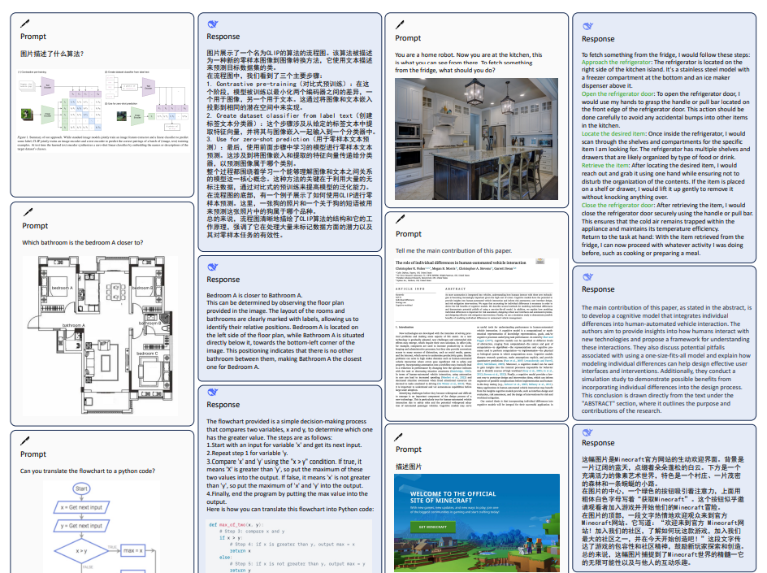

# DeepSeek-VL Towards Real-World Vision-Language Understanding

> github地址：https://github.com/deepseek-ai/DeepSeek-VL
>
> 论文地址：https://arxiv.org/pdf/2403.05525.pdf

## 摘要

我们提出了DeepSeek-VL，一个开源的视觉语言(VL)模型，专为现实世界的视觉和语言理解应用而设计。我们的方法围绕三个关键维度:

- **数据构建**:我们努力确保我们的数据是多样化的，可扩展的，并广泛覆盖现实世界的场景，包括web截图，pdf, OCR，图表和基于知识的内容(专家知识，教科书)，旨在全面表示实际环境。此外，我们根据实际用户场景创建用例分类法，并相应地构造指令调优数据集。该数据集的微调大大提高了模型在实际应用中的用户体验

- **模型架构:**考虑到效率和大多数现实世界场景的需求，DeepSeek-VL集成了一个混合视觉编码器，**可以在固定的令牌预算内有效地处理高分辨率图像(1024 x 1024)，同时保持相对较低的计算开销。**这种设计选择确保了模型能够跨各种视觉任务捕获关键语义和详细信息
- **训练策略:**我们假设一个熟练的视觉语言模型首先应该具有很强的语言能力。为了确保在预训练期间保留LLM能力，我们研究了一种有效的VL预训练策略，**从一开始就整合LLM训练，并仔细管理视觉和语言模式之间观察到的竞争动态**。从关注文本开始，我们逐渐调整比例，以促进两种方式的平衡整合。

DeepSeek-VL系列(包括13 b和7B型号)在实际应用中作为视觉语言聊天机器人展示了卓越的用户体验，在相同模型尺寸的广泛视觉语言基准测试中实现了最先进或具有竞争力的性能，同时在以语言为中心的基准测试中保持了稳健的性能。我们将13 b模型和7B模型对外开放，在此基础上促进创新。

## 介绍

**大多数开源模型和专有模型之间的性能差距在现实场景中很大程度上是明显的**，主要是由于以下原因:

- 许多开源解决方案将**相当一部分计算资源分配给指令调优阶段**。然而，训练强大语言模型的经验强调了广泛的预训练在通用智能发展中的重要性。为了向多模态模型灌输丰富的世界知识，应该强调利用广泛的视觉语言数据进行全面的预训练。
- 一种常见的做法是在指令调优期间合并各种学术数据集。虽然这种方法可能产生良好的基准测试结果，但它在提供真实的实际使用体验方面往往存在不足。
- 在模型架构方面，先前的工作**主要是将视觉转换器(通常是文本对齐的)适应于预训练的语言模型。**然而，这些模型大多在相对较低的分辨率上运行，例如336×336或448× 448。复杂的现实世界场景的复杂性，如光学字符识别或微小物体识别，需要高分辨率的处理能力。
- 而一些模型(01-ai, 2024;Lin等人，2023a;Sun等，2023;Wang等人，2023b)已经开始利用预训练，**但他们往往忽视了语言技能的保存**。通常，在长时间的多模式训练后，语言能力会下降。由于我们的目标是培养两种模态能力都很强的通才，**所以在培养新模态能力的同时，应该有一个很好的保留语言能力的训练策略**

鉴于这些，我们提出了DeepSeek- vl，一个开源的大型多模态模型，它建立在DeepSeek语言模型系列之上。我们开发模型是为了在现实场景中追求熟练的性能，这包括广泛的预训练，**基于用例分类的仔细数据管理，高分辨率处理的模型架构设计，以及平衡多模态的训练策略**。在此基础上，我们开发了一种训练方法来指导模型缩放，从1B到7B。与其他类似规模的大型多模态模型(lmm)相比，这些全面的探索在实际环境中带来了显著的性能优势。

**视觉模块旨在优化高分辨率视觉输入的利用率**，同时保持在固定的令牌预算内，以有效地管理推理成本。因此，我们采用了一种混合视觉编码器，**该编码器结合了用于384 × 384分辨率的粗语义提取的文本对齐编码器和用于捕获1024 × 1024分辨率的详细视觉信息的高分辨率编码器**。通过融合这两个编码器，**我们的混合方法有效地将1024×1024分辨率图像(在大多数用例中已足够)压缩为576个令牌。这个令牌计数在丰富的视觉表示和令牌经济之间取得了平衡，使其对文本图像交错和多回合推理场景都是可行的。**

在多模态模型的预训练过程中，**一个常见的挑战是当训练过程过度依赖视觉语言数据时，语言能力可能会下降**。我们的研究表明，**保持相当大比例的语言数据——具体来说，至少70%——对于保持模型中语言知识的完整性至关重要**。这种平衡对于实现健壮的多模态功能是至关重要的，它不会损害语言性能。此外，我们还引入了一种新的“情态预热”策略。这种方法在训练过程中仔细调整模式的比例，逐渐纳入更多的视觉语言数据。仔细调整模态比例以及热身策略会导致两种模态的平衡表现。

在我们的模型上迭代时，我们在扩展到更大的模型尺寸之前先进行小规模的实验。然而，较小的模型，如1B模型，无法在基准上展示合理的性能(Schaeffer et al, 2024)，并忠实地反映模型的性能。我们采取两种方法来解决这个问题。首先，我们从多选择的角度对评估协议进行修改，比较选项的困惑度。此外，为了防止指令跟踪能力成为瓶颈，我们在预训练阶段混合了一小部分指令调优数据。这样，我们可以使用1B模型获得合理的性能，并且在实验过程中更准确地测量每次迭代的影响。

通过对通用视觉和语言基准的广泛评估，DeepSeek-VL系列在实际应用中展示了卓越的用户体验，并在相同模型尺寸的广泛视觉语言基准测试中实现了最先进或具有竞争力的性能，同时保持了强大的以语言为中心的性能。为了促进创新和广泛的应用，我们把我们的两个版本，即13 b和7B，公开供公众查阅，希望能满足不同计算能力的需要。

## 数据设计

多样化和庞大的数据集是视觉语言模型训练的重要组成部分。

我们的数据集可以分为两部分:**视觉语言预训练数据和视觉语言监督微调数据**。VL预训练数据由来自不同来源的视觉文本数据组成，旨在增强模型的基本跨模态理解能力;而VL监督微调数据的规模相对较小，旨在教会模型完成特定的下游任务。通过设计，在**训练第一阶段使用VL预训练数据对视觉语言适配器进行预热**，并在**第二阶段对视觉语言模型进行联合预训练**，在**训练第三阶段使用VL Supervised Fine-Tuning Data，即视觉语言监督微调**。

### 视觉语言预训练数据

1）交错的图像-文本数据使模型能够更好地对多模态输入进行上下文学习，我们使用了三个公共数据集MMC4 (Zhu等人，2024)、Wiki (Burns等人，2023)、Wikihow (Yang等人，2021)和Epub教科书。

2）图片说明数据来自三个高质量的图像-文本配对数据集:Capsfusion (Yu et al .， 2023a)、TaiSu (Liu et al .， 2022b)和Detailed caption (echo840, 2024)。

3）表格和图表数据使模型能够学习一般表格和图表图像的理解能力。它包含了各种各样的公共数据源，包括Chart2text (Kantharaj等人，2022)、Geo170K (Gao等人，2023)、Unichart (Masry等人，2023)、Ureader (Ye等人，2023)、M-paper (Hu等人，2023)、ScienceQA (Lu等人，2022b)、ScreenQA (Hsiao等人，2022)、sciigraphqa - 295k (Li和Tajbakhsh, 2023)、Paper2figure100k (Rodriguez等人，2023)、Widget Captioning (Li等人，2020)、Screen2words (Wang等人，2021)和Refexp (Mao等人，2016)。

4）Web代码数据赋予模型从图形界面或可视化图重构代码的能力。利用Websight (HuggingFaceM4, 2024)进行UI逆渲染，我们采用了类似于MATCHA (Liu et al .， 2022a)的策略进行视觉图逆渲染。这涉及到对来自Stack数据集的大约146万个Jupyter笔记本的处理(Kocetkov et al, 2023)。通过提取这些笔记本并整理所有图表以及相应的先前代码段，我们成功地策划了一个包含200万对图像和代码的集合。为了获得更好的数据质量，我们过滤了110万个实例，每个实例由单个图像加上至少5行代码组成，以构成我们的主要训练数据集

## 效果

## 模型下载 from Huggingface

| Model                 | Sequence Length | Download                                                     |
| --------------------- | --------------- | ------------------------------------------------------------ |
| DeepSeek-VL-1.3B-base | 4096            | [🤗 Hugging Face](https://huggingface.co/deepseek-ai/deepseek-vl-1.3b-base) |
| DeepSeek-VL-1.3B-chat | 4096            | [🤗 Hugging Face](https://huggingface.co/deepseek-ai/deepseek-vl-1.3b-chat) |
| DeepSeek-VL-7B-base   | 4096            | [🤗 Hugging Face](https://huggingface.co/deepseek-ai/deepseek-vl-7b-base) |
| DeepSeek-VL-7B-chat   | 4096            | [🤗 Hugging Face](https://huggingface.co/deepseek-ai/deepseek-vl-7b-chat) |

## 问题与回答

Q: **这篇论文试图解决什么问题？**

A: 这篇论文试图解决的主要问题是如何有效地扩展开源大型语言模型（LLMs），特别是在7B和67B两个广泛使用的模型配置中。具体来说，论文关注以下几个方面：

- 规模扩展的规律（Scaling Laws）：论文深入研究了LLMs的扩展规律，以指导如何在保持性能的同时增加模型和数据的规模。这包括对超参数（如批量大小和学习率）的扩展规律进行建模，以及对模型和数据规模的最优分配策略进行探索。

- 数据集的质量与多样性：论文强调了数据集质量对模型扩展行为的影响。通过迭代改进数据集，作者发现数据质量的提高可以显著影响模型扩展的效率和效果。

- 模型架构与超参数的优化：论文基于LLaMA架构，对模型的宏观设计进行了微调，以优化训练和推理。同时，通过实验确定了最优的超参数设置。

- 模型训练与评估：论文介绍了用于训练和评估DeepSeek LLM的高效框架，包括数据并行、张量并行、序列并行和1F1B流水线并行等技术。此外，还讨论了模型训练的稳定性和效率问题。

- 模型的对齐（Alignment）：论文探讨了如何通过监督微调（SFT）和直接偏好优化（DPO）来提高模型的对齐性，使其在生成响应时更加有帮助、无害和符合人类价值观。

- 模型的安全性：论文强调了在模型开发过程中确保安全性的重要性，并提出了一种安全内容分类系统来评估模型的安全性。

- 模型的性能评估：论文通过在多个公共基准测试和开放性评估中对DeepSeek LLM进行评估，展示了其在代码、数学和推理等领域的优越性能。

**Q: 论文如何解决这个问题？**

A: 论文通过以下几个关键步骤解决了如何有效地扩展开源大型语言模型（LLMs）的问题：

**深入研究扩展规律（Scaling Laws）**：

- 对超参数（如批量大小和学习率）的扩展规律进行建模，以确定在不同计算预算下的最佳值。

- 使用IsoFLOP曲线方法拟合扩展曲线，分析模型和数据规模的最优分配策略，以预测大型模型的泛化误差。

**构建和优化数据集：**

- 通过去重、过滤和重混等策略，确保数据集的多样性和信息密度，以提高模型训练效率。

- 在数据集迭代过程中，关注数据质量的提升，因为高质量的数据可以更有效地驱动大型模型的训练。

**设计和训练模型：**

- 基于LLaMA架构，对模型的宏观设计进行调整，以优化训练和推理过程。

- 使用多步学习率调度器，以便于持续训练，并在不同计算预算下保持性能。

**模型对齐和安全性：**

- 通过监督微调（SFT）和直接偏好优化（DPO）来提高模型的对齐性，使其生成的响应更加有帮助、无害。

- 在整个训练过程中确保模型安全性，包括预训练、SFT和DPO阶段。

**全面评估模型性能：**

- 在多个公共基准测试和开放性评估中对DeepSeek LLM进行评估，包括代码、数学、推理等领域。

- 使用“Do-Not-Answer”数据集评估模型的安全性，确保模型在实际应用中能够提供安全、无害的响应。