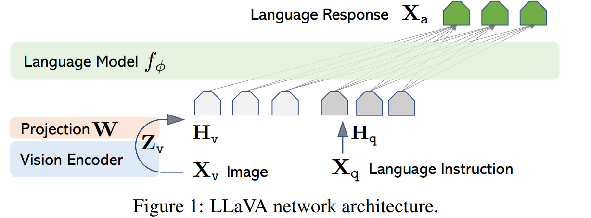

### 利用LLM(Large Language Model)做多模态任务

大型语言模型LLM（Large Language Model）具有很强的通用知识理解以及较强的逻辑推理能力，但其只能处理文本数据。虽然已经发布的GPT4具备图片理解能力，但目前还未开放多模态输入接口并且不会透露任何模型上技术细节。因此，现阶段，如何利用LLM做一些多模态任务还是有一定的研究价值的。

下面是近几年基于LLM做vision-language任务的一些工作，可以分为4个类别：

1. 将**视觉转化为文本**，作为LLM的输入，例如PICA，PromptCap，ScienceQA；

2. 利用**LLM作为理解中枢**调用多模态模型，例如VisualChatGPT, MM-REACT；

3. 利用视觉模态**影响LLM的解码，**例如ZeroCap，MAGIC；

4. 冻住LLM，**训练视觉编码器等额外结构以适配LLM，**例如Frozen，Flamingo，PaLM-E。

#### 1.利用视觉转化为文本

以PICA为例，它的目标是充分利用LLM中的海量知识来做Knowledge-based QA。给定一张图和问题，以往的工作主要从外部来源，例如维基百科等来检索出相关的背景知识以辅助答案的生成。但PICA尝试将图片用文本的形式描述出来后，直接和问题拼在一起作为LLM的输入，让LLM通过in-context learning的方式直接生成回答。

> github地址：https://github.com/microsoft/PICa
>
> 论文地址：https://arxiv.org/pdf/2109.05014.pdf

PICA是一种使用GPT-3进行基于小样本的VQA的方法。PICA没有使用明确的结构化知识库来检索和推理外部知识，而是通过提示GPT-3来联合获取和处理相关知识。它继承了GPT-3强大的小样本能力，并以显著的优势超过了OK-VQA上的监督技术。

#### 2. 利用LLM做理解中枢调用多模态模型

以微软Visual ChatGPT为例，它的目标是使得一个系统既能和人进行视觉内容相关的对话，又能进行画图以及图片修改的工作。为此，Visual ChatGPT采用ChatGPT作为和用户交流的理解中枢，整合了多个视觉基础模型（Visual Foundation Models），通过prompt engineering （即Prompt Manager）告诉ChatGPT各个基础模型的用法以及输入输出格式，让ChatGPT决定为了满足用户的需求，应该如何调用这些模型，如下图所示。

> 3月9日，微软亚洲研究院发布了图文版 ChatGPT——Visual ChatGPT，并在 Github 开源了基础代码，短短一周已经获得了 19.7k 颗星，目前已经达到34.4k
>
> github地址：https://github.com/moymix/TaskMatrix
>
> 论文地址：https://arxiv.org/pdf/2303.04671.pdf

#### 3.利用视觉多模态影响LLM的解码

​	为了适应特定跨模态任务的文本领域，MAGIC预先使用了跨模态训练数据集中的文本数据，采取无监督的方式更新语言模型的参数（仅需在1块NVIDIA 1080Ti 上运行不到两个小时），从而使得语言模型更加熟悉该领域的文本分布。MAGIC Search解码算法，使用l视觉信息指导预训练语言模型的生成过程。

> github地址：https://github.com/yxuansu/MAGIC
>
> 论文地址：https://arxiv.org/pdf/2205.02655.pdf

#### 4.训练视觉编码器等额外结构以适配LLM

这部分工作是目前关注度最高的工作，因为它具有潜力来“以远低于多模态通用模型训练的代价将LLM拓展为多模态模型”

> github地址：https://github.com/NExT-GPT/NExT-GPT
>
> 论文地址：https://arxiv.org/pdf/2309.05519.pdf

NExT-GPT一个端到端通用的任意对任意MM-LLM（Multimodal-Large Language Model）系统。NExT-GPT将LLM与多模态适配器和不同的扩散解码器连接起来，使NExT-GPT能够感知输入并以文本、图像、视频和音频的任意组合生成输出。

基本思想是**利用编码器对各种模态的输入进行编码，将其投影为LLM可理解的类语言表示**。ExT-GPT利用现有的开源LLM作为核心，处理输入信息，进行语义理解和推理。LLM不仅直接生成文本标记，而且还产生独特的“模态信号”标记，这些标记作为指令来指示解码层是否要相应地输出什么模态内容。然后，生成带有特定指令的多模态信号，经过投影后传输到不同的编码器，最终生成相应模态的内容。

> github地址：https://github.com/haotian-liu/LLaVA
>
> 论文地址：https://arxiv.org/pdf/2304.08485.pdf

LLaVA工作的核心贡献有三点：1. 提出了新的多模态模型训练方法，可以通过 instruction-following 数据进行训练；2. 提出了一个新的 instruction-following 数据集；3. 代码数据全部开源，方便复现。

- LLaVA模型通过连接视觉编码器和语言模型，实现了通用的视觉和语言理解能力。
- LLaVA具有不错的多模态对话能力，在未见过的图像和指令上有时达到多模态GPT-4的水准（85.1%的相对得分）。
- 在Science QA数据集上进行微调后，LLaVA和GPT-4的协同作用达到了92.53%的新的最高准确率。

