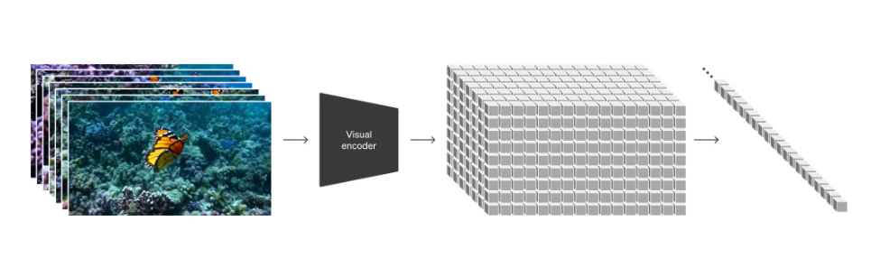
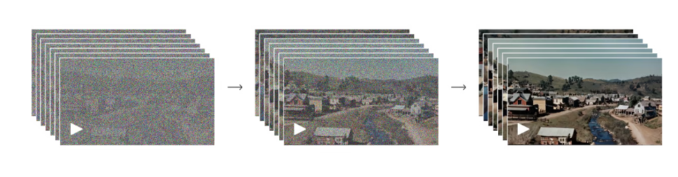
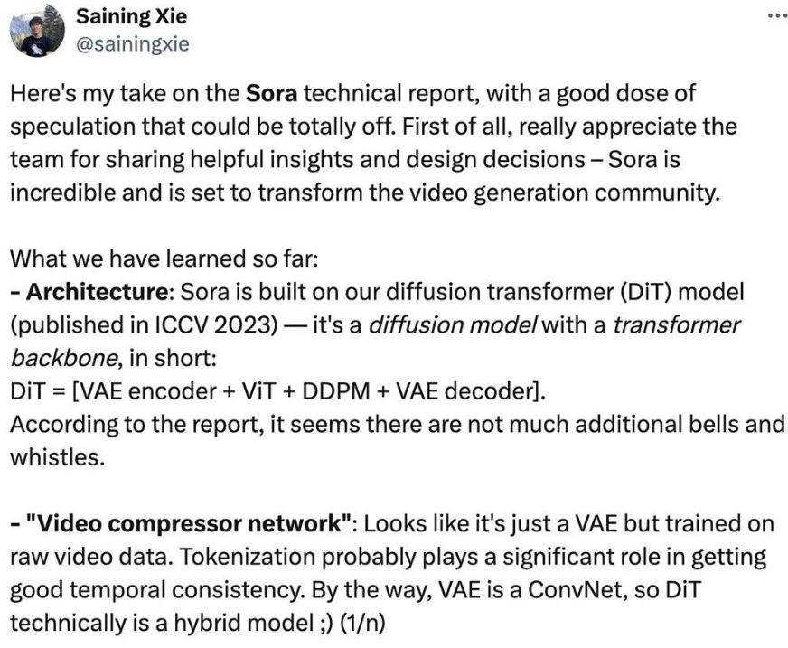

# SORA生成视频模型

OpenAI新爆款Sora的热度持续发酵，在AI圈中成为话题的中心。马斯克、杨立昆、贾扬清、Jim Fan、谢赛宁、周鸿祎、李志飞等科技人物纷纷下场评论，一些视频、影视、营销从业者也关注起这个新工具。

> 报告地址：[Video generation models as world simulators (openai.com)](https://openai.com/research/video-generation-models-as-world-simulators)

本技术报告主要关注两个方面：（1）将各种类型的视觉数据转化为统一的表示方法，以便进行大规模生成模型的训练；（2）对Sora的能力和限制进行定性评估。

许多先前的研究都使用了各种方法对视频数据进行生成建模，包括循环网络、生成对抗网络和扩散模型。这些研究通常专注于特定类型的视觉数据、较短的视频或固定尺寸的视频。Sora是一种对视觉数据进行广义建模的模型，它可以生成跨越不同持续时间、宽高比和分辨率的视频和图像，高清视频的长度可达一分钟。

## 目前视频生成模型比较

Runway 是 18s（20s 以内），Pika 最开始是 3 秒，Sora 是 60s。

## 技术特点

1. **三维空间的连贯性**：Sora可以生成带有动态相机运动的视频。随着相机移动和旋转，人物和场景元素在三维空间中保持连贯的运动。

2. **模拟数字世界**：Sora还能模拟人工过程，如视频游戏。Sora能够同时控制Minecraft中的玩家，并高保真地渲染游戏世界及其动态。通过提及“Minecraft”的提示，可以零样本地激发Sora的这些能力

3. **长期连续性和物体持久性**：对视频生成系统来说，Sora通常能够有效地模拟短期和长期的依赖关系。同样，它能在一个样本中生成同一角色的多个镜头，确保其在整个视频中的外观一致。

4. **与世界互动**：Sora有时能够模拟对世界状态产生简单影响的行为。例如，画家可以在画布上留下随时间持续的新笔触，或者一个人吃汉堡时留下咬痕。

## 报告内的技术表述

### 将视觉数据转化为patch

从大型语言模型中汲取灵感，这些模型通过在互联网规模的数据上进行训练获得了通用能力。成功的LLM范式在一定程度上得益于使用了能够优雅地统一文本、代码、数学和各种自然语言的标记。在这项工作中，考虑了生成视觉数据模型如何继承这些好处。而LLMs具有文本标记，Sora具有视觉补丁。先前已经证明patch是一种有效的视觉数据模型表示方法。发现，patch是一种高度可扩展且有效的表示方法，适用于训练各种类型的视频和图像的生成模型。

在高层次上，通过首先将视频压缩成低维潜空间，然后将表示分解成时空patch来处理视频。

### 视频压缩网络

训练一个网络，降低视觉数据的维度。这个网络以原始视频作为输入，并输出一个在时间和空间上都被压缩的潜在表示。Sora在这个压缩的潜在空间中进行训练，并生成视频。还训练了一个相应的解码器模型，将生成的潜在表示映射回像素空间。

### 时空潜在patch

给定一个压缩的输入视频，提取一系列时空补丁，它们充当变换器令牌。这个方案也适用于图像，因为图像只是具有单个帧的视频。基于补丁的表示使得Sora能够在分辨率、持续时间和宽高比可变的视频和图像上进行训练。在推理时，可以通过将随机初始化的补丁排列在适当大小的网格中来控制生成的视频的大小。

### 视频生成 scaling transformer

Sora是一个扩散模型，给定输入的噪声补丁（以及像文本提示这样的条件信息），它被训练成预测原始的“干净”补丁。重要的是，Sora是一个diffusion *transformer*。transformer 在各个领域展示了显著的扩展性能，包括语言建模、计算机视觉、图像处理和图像生成。

在这项工作中，发现diffusion *transformer*在**视频模型**中也能有效地进行扩展。下面，展示了在训练过程中使用固定种子和输入的视频样本的比较。随着训练计算的增加，样本质量显著提高。

1）可变的持续时间，分辨率，画面比例

过去生成图像和视频的方法通常是将视频调整大小、裁剪或修剪到标准尺寸 - 例如，256x256分辨率的4秒视频。报告中指出，相反，使用**原始尺寸**的数据进行训练有几个好处。

- 采样灵活性

  Sora可以采样宽屏1920x1080p视频、竖屏1080x1920视频以及两者之间的所有内容。这使得Sora可以直接以原生宽高比为不同设备创建内容。它还可以在生成全分辨率内容之前，**快速原型**化较低尺寸的内容 - 所有这些都使用同一模型。

- 改善的构图和布局

  经验性地发现，在其原生宽高比上训练视频可以提高构图和布局的质量。将Sora与另一个版本的模型进行比较，后者将所有训练视频裁剪为正方形，这是训练生成模型时的常见做法。相比之下，Sora生成的视频在构图上有所改善。

- 语言理解

  训练从文本到视频的生成系统需要大量配有文本标题的视频。采用了在**DALL·E 3**中引入的重新标注技术，应用于视频。首先训练一个高度描述性的标题生成模型，然后用它为训练集中的所有视频生成文本标题。报告中指出，在高度描述性的视频标题上进行训练，可以提高文本的准确性以及视频的整体质量。

类似于**DALL·E 3**，利用**GPT**将简短的用户提示转换成更长、更详细的标题，这些标题随后被送往视频模型。这使得Sora能够生成高质量的视频，精确地根据用户的提示进行创作。

2）图像和视频作为prompt

以上所有结果和页面都展示了文本到视频的示例。但是Sora也可以接受其他输入，比如现有的图片或视频。这种能力使得Sora能够执行各种图像和视频编辑任务，比如创建完美循环的视频，给静态图像添加动画效果，将视频向前或向后延长等等。

- DALL·E图像动画化

  Sora能够根据输入的图像和提示生成视频。

- 扩展生成的视频

  Sora还可以将视频向前或向后延长时间。

- 视频到视频编辑

  扩散模型已经为从文本提示编辑图像和视频提供了大量的方法。下面其中一种方法**SDEdit**，应用于Sora。这种技术使得Sora能够零样本地转换输入视频的风格和环境。

- 拼接视频

  可以使用Sora逐渐插值两个输入视频，从而在完全不同的主题和场景构图之间创建无缝过渡。

- 图像生成能力

  Sora还能够生成图像。通过在一个帧的时间范围内，将**高斯噪声**的patch排列在一个空间网格中来实现这一点。该模型可以生成不同尺寸的图像，最高分辨率可达2048x2048。

## 训练过程

Sora 的训练受到了大语言模型（Large Language Model）的启发。这些模型通过在互联网规模的数据上进行训练，从而获得了广泛的能力。

Sora实际上是一种扩散型变换器模型（diffusion transformer）。

首先将视频压缩到一个低维潜在空间19中，然后将这种表现形式分解成时空区块，从而将视频转换为区块。

训练了一个用于降低视觉数据维度的网络。这个网络以原始视频为输入，输出在时间和空间上都被压缩的潜在表示。Sora在这个压缩的潜在空间上进行训练，并在此空间中生成视频。还开发了一个对应的解码器模型，它能将生成的潜在表示映射回到像素空间。

对于给定的压缩输入视频，提取一系列时空区块，它们在变换器模型中充当标记（token）。这种方案同样适用于图像，因为图像本质上是单帧的视频。基于区块的表示方法使Sora能够针对不同分辨率、持续时间和纵横比的视频和图像进行训练。在推理过程中，可以通过在适当大小的网格中排列随机初始化的区块来控制生成视频的大小。

随着 Sora 训练计算量的增加，样本质量有了显著提升。

Sora训练时没有对素材进行裁切，使得Sora能够直接为不同设备以其原生纵横比创造内容。

针对视频的原生纵横比进行训练，还可以提高构图和取景的质量。

训练文本到视频的生成系统需要大量配有相应文本提示的视频。应用了在DALL·E 3中引入的重新字幕技术到视频上。

与DALL·E 3相似，也利用了GPT技术，将用户的简短提示转换成更详细的提示，然后发送给视频模型。Video generation models as world simulators

## 对Sora技术报告的看法

先看**架构**，构建于扩散Transformer（DiT）模型上，DiT=[VAE编码器+ ViT + DDPM + VAE解码器]。

其次是**视频压缩网络**，看起来只是一个训练原始视频数据的VAE（一个ConvNet），Token化可能在获得良好的时间一致性方面发挥重要作用。

谢赛宁回顾说，在研究DiT项目时，他和Bill没有创造“新颖性”，而是优先考虑了简单和可扩展性。

简单意味着灵活。他认为人们经常忽略掉一件很酷的事，当涉及到处理输入数据时，如果让模型方式更灵活。例如在MAE中，ViT帮助我们只处理可见patches，而忽略掩码patches；类似的，Sora“可通过在适当大小的网格中安排随机初始化的patches来控制生成视频的大小”，而UNet并不直接提供这种灵活性。

**他猜测Sora可能还会使用谷歌的Patch n' Pack（NaViT），使DiT适应各种分辨率/持续时间/宽高比。‍**

> 论文地址：arxiv.org/abs/2212.09748

可扩展性是**DiT**论文的核心主题。就每**Flop**的时钟时间而言，优化的**DiT**比**UNet**运行得快得多。更重要的是，**Sora**证明了**Dil**扩展定律不仅适用于图像，也适用于视频——Sora复制了在DiT中观察到的视觉扩展行为。

谢赛宁推测在Sora报告中，第一个视频的质量相当糟糕，怀疑它使用的是基本模型尺寸，并做了个粗略计算：DiT XL/2是B/2模型的5倍GFLOPs，所以最终的16X计算模型可能是DiT-XL模型大小的3倍，这意味着Sora可能有大约30亿个参数——如果是真的，这不是一个不合理的模型大小。这可能表明，训练Sora模型可能不需要像人们预期的那样多的GPU——预计会有非常快的迭代。

## 关键点

OpenAI 的研究论文《Video generation models as world simulators》探讨了在视频数据上进行大规模训练生成模型的方法。这项研究特别关注于文本条件扩散模型，这些模型同时在视频和图像上进行训练，处理不同时长、分辨率和宽高比的数据。研究中提到的最大模型 Sora 能够生成长达一分钟的高保真视频。以下是论文的一些关键点：

1. 统一的视觉数据表示：研究者们将所有类型的视觉数据转换为统一的表示，以便进行大规模的生成模型训练。Sora 使用视觉补丁（patches）作为其表示方式，类似于大型语言模型（LLM）中的文本标记。
2. 视频压缩网络：研究者们训练了一个网络，将原始视频压缩到一个低维潜在空间，并将其表示分解为时空补丁。Sora 在这个压缩的潜在空间中进行训练，并生成视频。
3. 扩散模型：Sora 是一个扩散模型，它通过预测原始“干净”的补丁来从输入的噪声补丁中生成视频。扩散模型在语言建模、计算机视觉和图像生成等领域已经显示出了显著的扩展性。
4. 视频生成的可扩展性：Sora 能够生成不同分辨率、时长和宽高比的视频，包括全高清视频。这种灵活性使得 Sora 能够直接为不同设备生成内容，或者在生成全分辨率视频之前快速原型化内容。
5. 语言理解：为了训练文本到视频生成系统，需要大量的视频和相应的文本标题。研究者们应用了在 DALL·E 3 中引入的重新描述技术，首先训练一个高度描述性的标题生成器，然后为训练集中的所有视频生成文本标题。
6. 图像和视频编辑：Sora 不仅能够基于文本提示生成视频，还可以基于现有图像或视频进行提示。这使得 Sora 能够执行广泛的图像和视频编辑任务，如创建完美循环的视频、动画静态图像、向前或向后扩展视频等。
7. 模拟能力：当视频模型在大规模训练时，它们展现出了一些有趣的新兴能力，使得 Sora 能够模拟物理世界中的某些方面，如动态相机运动、长期一致性和对象持久性等。
8. 讨论：尽管 Sora 展示了作为模拟器的潜力，但它仍然存在许多局限性，例如在模拟基本物理交互（如玻璃破碎）时的准确性不足。研究者们认为，继续扩展视频模型是开发物理和数字世界模拟器的有前途的道路。

