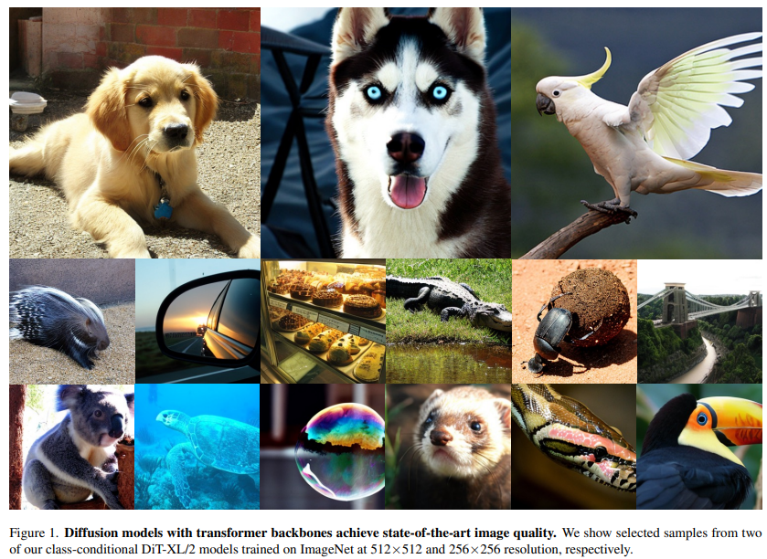
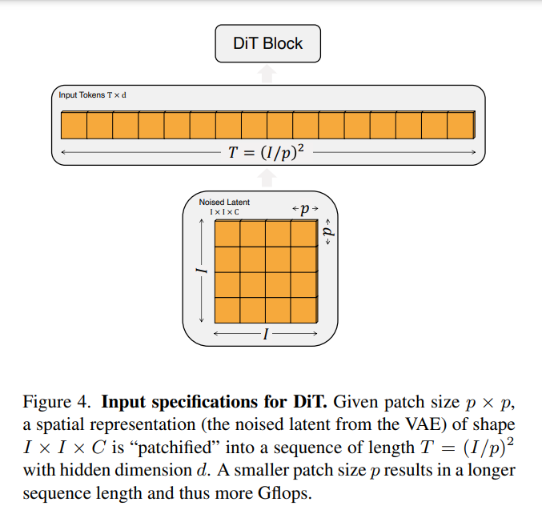
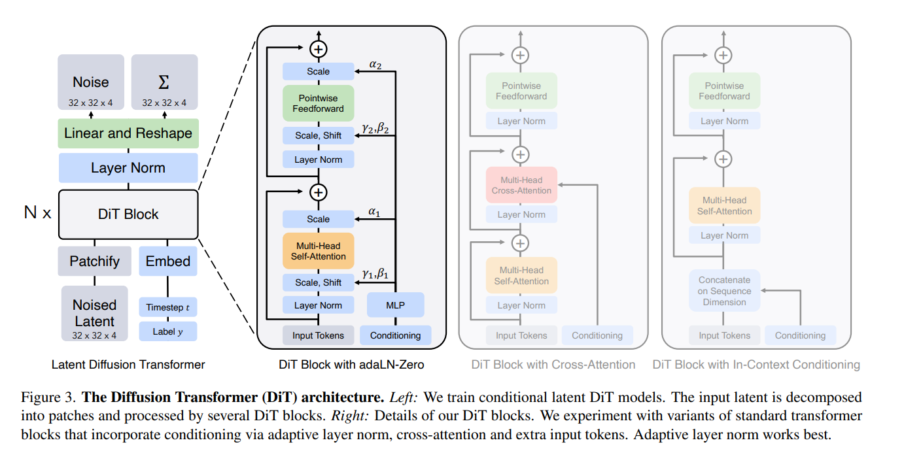
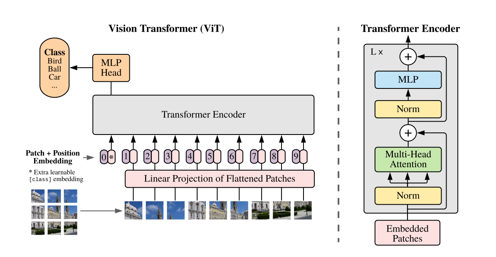

**Sora**目前持续引发广泛关注，不仅在大众群体中热度不减，更在专业学术界激起了激烈的讨论。特别是对其图像编码器部分，诸多学者进行了深入的研究与推测。在众多声音中，DiT模型成为了热议的焦点。接下来，我们将深入探讨DiT模型的实现原理，并与ViT模型进行比较。

## DiT

当前扩散模型大部分是采用**UNet架构**来进行建模，UNet可以实现输出和输入一样维度。扩散模型使用的UNet除了包含基于残差的卷积模块，同时采用self-attention。自从**ViT**之后，transformer架构已经大量应用在图像任务上，我们将介绍Meta的工作**DiT：Scalable Diffusion Models with Transformers**。

> 文献地址：https://arxiv.org/abs/2212.09748

在深入探索DiT模型架构的奥秘之前，让我们先揭开DiT所采用的扩散模型的神秘面纱。值得一提的是，DiT并未沿袭传统的pixel diffusion路径，而是采纳了**latent diffusion**架构，**Stable Diffusion**也使用了该架构。latent diffusion的精妙之处在于它巧妙地运用**autoencoder**技术，将图像压缩至低维度的latent空间。随后，扩散模型用来生成latent。最后，再通过autoencoder重建图像。

DiT采用的autoencoder是**SD**所使用的**KL-f8**，对于256x256x3的图像，其压缩得到的latent大小为32x32x4，这就降低了扩散模型的计算量。另外，这里扩散过程的nosie scheduler采用简单的linear scheduler（timesteps=1000，beta_start=0.0001，beta_end=0.02），这个和SD是不同的。 其次，DiT所使用的扩散模型沿用了OpenAI的**Improved DDPM**，相比原始DDPM一个重要的变化是不再采用固定的方差，而是**采用网络来预测方差**。在DDPM中，生成过程的分布采用一个参数化的高斯分布来建模：

DiT使用的transformer架构，才是核心部分。其实DiT基本沿用了ViT的设计，如下图所示，首先采用一个**patch embedding来将输入进行patch化**，即得到一系列的tokens。

这篇论文主要是尝试使用ViT取代DDPM中的UNet，叫做Diffusion Transformer-DiT，作者训练了DiT-S、DiT-B、DiT-L 和 DiT-XL四种模型，每种模型的patch取8,4,2, 一共训练了12个模型。

模型第一层是对 sequences of patches 进行操作(就是ViT把图片看成16∗16的的单词之后单词构成的序列)

如图所示，给定的patch是p\*p,VAE采样出来的噪声大小是I\*I*C,那么patches会变成长度为$T=(I/\hat p)^2$的一个序列,每个patch维度是d,位置嵌入用的是sine-cosine。

将输入token化之后，就可以像ViT那样接transformer blocks了。DiT共设计了四种方案来实现两个额外embeddings的嵌入，具体如下：

1. **In-context conditioning**：将两个embeddings看成两个tokens合并在输入的tokens中，这种处理方式有点类似ViT中的cls token，实现起来比较简单，也不基本上不额外引入计算量。
2. **Cross-attention block**：将两个embeddings拼接成一个数量为2的序列，然后在transformer block中插入一个cross attention，条件embeddings作为cross attention的key和value；这种方式也是目前文生图模型所采用的方式，它需要额外引入15%的Gflops。
3. **Adaptive layer norm (adaLN) block**：采用adaLN，这里是将time embedding和class embedding相加，然后来回归scale和shift两个参数，这种方式也基本不增加计算量。
4. **adaLN-Zero block**：采用zero初始化的adaLN，这里是将adaLN的linear层参数初始化为zero，这样网络初始化时transformer block的残差模块就是一个identity函数；另外一点是，这里除了在LN之后回归scale和shift，还在每个残差模块结束之前回归一个scale，如上图所示。

这里也贴一下基于**adaLN-Zero**的DiT block的具体实现代码：

~~~python
class DiTBlock(nn.Module):
    def __init__(self, hidden_size, num_heads, mlp_ratio=4.0, **block_kwargs):
        super().__init__()
        self.norm1 = nn.LayerNorm(hidden_size, elementwise_affine=False, eps=1e-6)
        self.attn = Attention(hidden_size, num_heads=num_heads, qkv_bias=True, **block_kwargs)
        self.norm2 = nn.LayerNorm(hidden_size, elementwise_affine=False, eps=1e-6)
        mlp_hidden_dim = int(hidden_size * mlp_ratio)
        approx_gelu = lambda: nn.GELU(approximate="tanh")
        self.mlp = Mlp(in_features=hidden_size, hidden_features=mlp_hidden_dim, act_layer=approx_gelu, drop=0)
        self.adaLN_modulation = nn.Sequential(
            nn.SiLU(),
            nn.Linear(hidden_size, 6 * hidden_size, bias=True)
        )

        nn.init.constant_(adaLN_modulation[-1].weight, 0)
        nn.init.constant_(adaLN_modulation[-1].bias, 0)

    def forward(self, x, c):
        shift_msa, scale_msa, gate_msa, shift_mlp, scale_mlp, gate_mlp = self.adaLN_modulation(c).chunk(6, dim=1)
        x = x + gate_msa.unsqueeze(1) * self.attn(modulate(self.norm1(x), shift_msa, scale_msa))
        x = x + gate_mlp.unsqueeze(1) * self.mlp(modulate(self.norm2(x), shift_mlp, scale_mlp))
        return x
~~~

虽然DiT发现**adaLN-Zero**效果是最好的，但是这种方式只适合这种只有类别信息的简单条件嵌入，因为只需要引入一个class embedding；但是对于文生图来说，其条件往往是序列的text embeddings，采用cross-attention方案可能是更合适的。 由于对输入进行了token化，所以在网络的最后还需要一个decoder来恢复输入的原始维度，DiT采用一个简单的linear层来实现，直接将每个token映射为p\*p\*2C的tensor，然后再进行reshape来得到和原始输入空间维度一样的输出，但是特征维度大小是原来的2倍，分别用来预测噪音和方差。具体实现代码如下所示：

~~~python
class FinalLayer(nn.Module):
    def __init__(self, hidden_size, patch_size, out_channels):
        super().__init__()
        self.norm_final = nn.LayerNorm(hidden_size, elementwise_affine=False, eps=1e-6)
        self.linear = nn.Linear(hidden_size, patch_size * patch_size * out_channels, bias=True)
        self.adaLN_modulation = nn.Sequential(
            nn.SiLU(),
            nn.Linear(hidden_size, 2 * hidden_size, bias=True)
        )
        
     nn.init.constant_(self.adaLN_modulation[-1].weight, 0)
        nn.init.constant_(self.adaLN_modulation[-1].bias, 0)
        nn.init.constant_(self.linear.weight, 0)
        nn.init.constant_(self.linear.bias, 0)

    def forward(self, x, c):
        shift, scale = self.adaLN_modulation(c).chunk(2, dim=1)
        x = modulate(self.norm_final(x), shift, scale)
        x = self.linear(x)
        return x
~~~

DiT中主要体现的还是ViT中的核心内容，那么ViT是如何操作的？

## Vision Transformer (ViT)模型

> 论文地址：https://arxiv.org/pdf/2010.11929.pdf

ViT模型是基于Transformer的模型在CV视觉领域的开篇之作。ViT模型是基于Transformer Encoder模型的，但其实最关键的是如何将图片像素转化成时序数据，输入到Transformer模型中去，同时又要避免复杂度过大，计算量，维度过大的问题。

**1.怎么把图片转化成token？**其将图像化整为0，切分成patch,就是一个一个的块状图像。VIT模型结构如下：

输入图片被划分为一个个16x16的小块，也叫做patch。接着这些patch被送入一个全连接层得到embeddings，然后在embeddings前再加上一个特殊的cls token。然后给所有的embedding加上位置信息编码positional encoding。接着这个整体被送入Transformer Encoder，然后取cls token的输出特征送入MLP Head去做分类，总体流程就是这样。

**VIT模型上图展示的过程近一步分解为6步：**

**步骤１：将图片转换成patches序列**

为了让Transformer能够处理图像数据，第一步必须先**将图像数据转换成序列数据**。假如我们有一张图片$X\in R^{H*W*C}$，patch大小为p，那么我们可以创建N个图像patches，可以表示为$X_p$,其中$N = ( H ∗ W ) / p^2 $，N就是序列的长度，类似一个句子中单词的个数。

**步骤2:将Patches展平**
在原论文中，作者选用的patch大小为16，那么一个patch的shape为(3,16,16)，维度为3，将它铺平之后大小为3x16x16=768。即一个patch变为长度为768的向量。不过这看起来还是有点大，此时可以使用加一个Linear transformation，即添加一个线性映射层，将patch的维度映射到我们指定的embedding的维度，这样就和NLP中的词向量类似了。

**步骤3:添加Position embedding**

与CNNs不同，此时模型并不知道序列数据中的patches的位置信息。所以这些patches必须先追加一个位置信息，也就是图中的带数字的向量。实验表明，不同的位置编码embedding对最终的结果影响不大，在Transformer原论文中使用的是固定位置编码，在ViT中使用的可学习的位置embedding 向量，将它们加到对应的输出patch embeddings上。

**步骤4：添加class token**
在输入到Transformer Encoder之前，还需要添加一个特殊的class token，这一点主要是借鉴了BERT模型。添加这个class token的目的是因为，ViT模型将这个class token在Transformer Encoder的输出当做是模型对输入图片的编码特征，用于后续输入MLP模块中与图片label进行loss计算。（其实也可以不用添加cls）

**步骤5:输入Transformer Encoder**
将patch embedding和class token拼接起来输入标准的Transformer Encoder中。

**步骤6：多分类**
注意Transformer Encoder的输出其实也是一个序列，但是在ViT模型中只使用了class token的输出，将其送入MLP模块中，去输出最终的分类结果。

ViT的整体思想比较简单，主要是将图片分类问题转换成了序列问题。即将图片patch转换成token，以便使用Transformer来处理。听起来很简单，但是ViT需要在海量数据集上预训练，然后在下游数据集上进行微调才能取得较好的效果，否则效果不如ResNet50等基于CNN的模型。

### 整体框架代码

~~~python
class ViT(nn.Module):
    def __init__(self, *, image_size, patch_size, num_classes, dim, depth, heads, mlp_dim, pool = 'cls', channels = 3, dim_head = 64, dropout = 0., emb_dropout = 0.):
        super().__init__()
        image_height, image_width = pair(image_size) ## 224*224 *3
        patch_height, patch_width = pair(patch_size)## 16 * 16  *3
        assert image_height % patch_height == 0 and image_width % patch_width == 0, 'Image dimensions must be divisible by the patch size.'

        num_patches = (image_height // patch_height) * (image_width // patch_width)
        patch_dim = channels * patch_height * patch_width
        assert pool in {'cls', 'mean'}, 'pool type must be either cls (cls token) or mean (mean pooling)'

        self.to_patch_embedding = nn.Sequential(
            Rearrange('b c (h p1) (w p2) -> b (h w) (p1 p2 c)', p1 = patch_height, p2 = patch_width),
            nn.Linear(patch_dim, dim),
        )

        self.pos_embedding = nn.Parameter(torch.randn(1, num_patches + 1, dim))
        self.cls_token = nn.Parameter(torch.randn(1, 1, dim))
        self.dropout = nn.Dropout(emb_dropout)

        self.transformer = Transformer(dim, depth, heads, dim_head, mlp_dim, dropout)

        self.pool = pool
        self.to_latent = nn.Identity()

        self.mlp_head = nn.Sequential(
            nn.LayerNorm(dim),
            nn.Linear(dim, num_classes)
        )

    def forward(self, img):
        x = self.to_patch_embedding(img) 
        b, n, _ = x.shape 
        cls_tokens = repeat(self.cls_token, '() n d -> b n d', b = b)
        x = torch.cat((cls_tokens, x), dim=1)
        x += self.pos_embedding[:, :(n + 1)]
        x = self.dropout(x)
        x = self.transformer(x)

        x = x.mean(dim = 1) if self.pool == 'mean' else x[:, 0]

        x = self.to_latent(x)
        return self.mlp_head(x)
~~~

### patches embeddings

~~~python
self.to_patch_embedding = nn.Sequential(
            Rearrange('b c (h p1) (w p2) -> b (h w) (p1 p2 c)', p1 = patch_height, p2 = patch_width),
            nn.Linear(patch_dim, dim),
        )
~~~

### CLS Token

~~~python
class PatchEmbedding(nn.Module):
    def __init__(self, in_channels: int = 3, patch_size: int = 16, emb_size: int = 768):
        self.patch_size = patch_size
        super().__init__()
        self.proj = nn.Sequential(
            nn.Conv2d(in_channels, emb_size, kernel_size=patch_size, stride=patch_size),
            Rearrange('b e (h) (w) -> b (h w) e'),
        )
        self.cls_token = nn.Parameter(torch.randn(1, 1, emb_size))
        
    def forward(self, x: Tensor) -> Tensor:
        b, _, _, _ = x.shape  
        x = self.proj(x)  
        cls_tokens = repeat(self.cls_token, '() n e -> b n e', b=b)
        print(cls_tokens.shape)
        print(x.shape)
        x = torch.cat([cls_tokens, x], dim=1)
        return x
    
PatchEmbedding()(x).shape

~~~

### Positional Encoding

~~~python
class PatchEmbedding(nn.Module):
    def __init__(self, in_channels: int = 3, patch_size: int = 16, emb_size: int = 768, img_size: int = 224):
        self.patch_size = patch_size
        super().__init__()
        self.projection = nn.Sequential(
            nn.Conv2d(in_channels, emb_size, kernel_size=patch_size, stride=patch_size),
            Rearrange('b e (h) (w) -> b (h w) e'),
        )
        self.cls_token = nn.Parameter(torch.randn(1,1, emb_size))
        self.positions = nn.Parameter(torch.randn((img_size // patch_size)**2 + 1, emb_size
        
    def forward(self, x: Tensor) -> Tensor:
        b, _, _, _ = x.shape
        x = self.projection(x)
        cls_tokens = repeat(self.cls_token, '() n e -> b n e', b=b)
        x = torch.cat([cls_tokens, x], dim=1)
        print(x.shape, self.positions.shape)
        x += self.positions
        return x
    
PatchEmbedding()(x).shape
~~~

