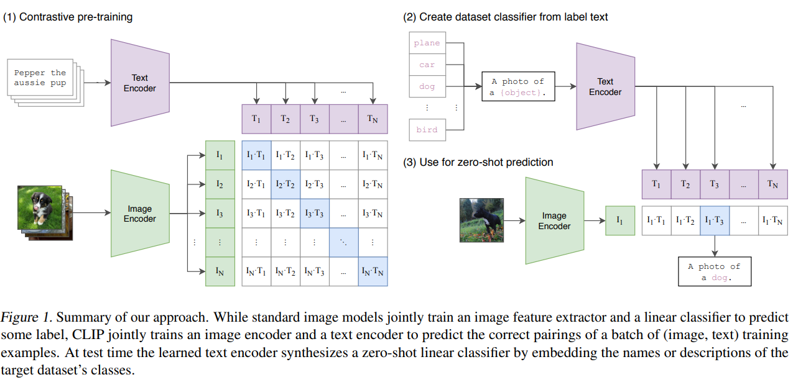
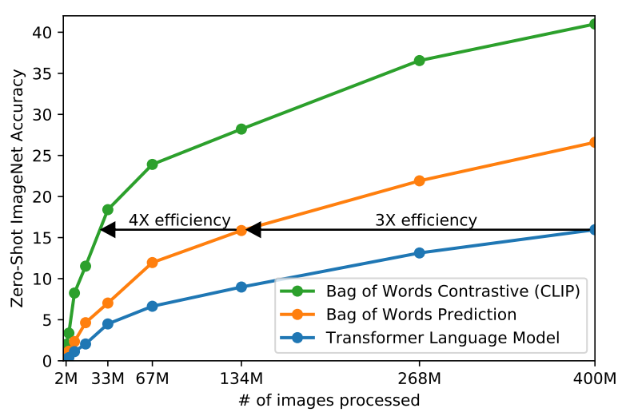

# 多模态CLIP详解与使用

​	在2021年，计算机视觉领域见证了vision transformer的广泛应用。谷歌提出的ViT引领了这一波热潮，随后出现了许多基于vision transformer的计算机视觉任务。同时，Open AI在2021年1月份发布的DALL-E和CLIP也对计算机视觉产生了重要影响。DALL-E是一种基于文本生成图像的模型，它能够根据文本描述生成相应的图像。而CLIP则是一种使用文本作为监督信号来训练可迁移的视觉模型，它能够将文本和图像进行匹配，从而实现跨模态的视觉理解。这两个工作都激发了计算机视觉领域的新一轮研究热潮。

这次与大家细聊一下CLIP的相关内容。

> 文献地址：https://arxiv.org/pdf/2103.00020.pdf
>
> github地址：https://github.com/OpenAI/CLIP

## 1. zero-shot

在[介绍blip](./20240304-1314_多模态大模型BLIP的详解.md)这篇博客中有简单的提及zero-shot，这次将详细的介绍一下它。

在自然语言处理(NLP)领域，Zero-Shot指的是一个模型在没有接受过特定任务的训练数据的情况下，可以完成该任务。这个概念近年来引起了广泛关注。

- zero-shot learning (ZSL) 

  它能够帮助模型从没有见过的语言环境中、在没有标记的训练数据下学习并完成任务。ZSL 的基本思想是，通过学习对象（例如图像）与语义嵌入之间的映射关系，在新的测试样本上进行推理。

- zero-shot text classification（ZSTC）

   它是一种将文本分类器应用于未见过的类别或主题，这是一种非常有用的技术。ZSTC 的核心是利用预训练的语言模型，通过建立文本与语义嵌入之间的映射关系来完成任务。

​	示例：

~~~python
import torch
from transformers import pipeline, AutoTokenizer

tokenizer = AutoTokenizer.from_pretrained("facebook/bart-large-mnli")
model = pipeline("text-classification", model="facebook/bart-large-mnli")

text = "I love playing basketball."
labels = ["sports", "politics", "entertainment"]
hypothesis_template = "This text is about {}."

# zero-shot classification
result = model(text, labels=labels, hypothesis_template=hypothesis_template)
print(result)
~~~

​	在机器视觉(CV)领域：假设斑马是未见过的类别，但根据描述外形和马相似、有类似老虎的条纹、具有熊猫相似的颜色，通过这些描述推理出斑马的具体形态，从而能对斑马进行辨认。零次学习就是希望能够模仿人类的这个推理过程，使得计算机具有识别新事物的能力，

### 1.1 面临的问题

- **领域漂移问题（domain shift problem）**
- **枢纽点问题（Hubness problem）**
- **语义间隔（semantic gap）**

### 1.2 CLIP模型

CLIP的英文全称是**Contrastive Language-Image Pre-training**，即一种基于对比文本-图像对的预训练模型。与CV中的一些对比学习方法如**moco**和**simclr**不同的是，CLIP的训练数据是文本-图像对：一张图像和它对应的文本描述，这里希望通过对比学习，模型能够学习到文本-图像对的匹配关系。CLIP包括两个模型：**Text Encoder**和**Image Encoder**，其中Text Encoder用来提取文本的特征，可以采用NLP中常用的text transformer模型；而Image Encoder用来提取图像的特征，可以采用常用**CNN模型**或者**vision transformer**。（[有没有感觉与blip中图像编码器和文本编码器一样，只是在blip中这些预训练模型的参数是被冻结了](./20240304-1314_多模态大模型BLIP的详解.md)）

- CLIP是一种基于对比学习的多模态模型，它的创新之处在于能够将图像和文本映射到一个共享的向量空间中，从而使得模型能够理解图像和文本之间的语义关系。这种共享的向量空间使得CLIP在图像和文本之间实现了无监督的联合学习，从而可以用于各种视觉和语言任务。
- CLIP的设计灵感源于一个简单的思想：让模型理解图像和文本之间的关系，不仅仅是通过监督训练，而是通过自监督的方式。CLIP通过大量的图像和文本对来训练，使得模型在向量空间中将相应的图像和文本嵌入彼此相近。
- CLIP将图像和文本先分别输入一个图像编码器image_encoder和一个文本编码器text_encoder，得到图像和文本的向量表示 I_f 和 T_f 。然后将图像和文本的向量表示映射到一个共享的多模态空间，得到新的可直接进行比较的图像和文本的向量表示 I_e 和T_e 。然后计算图像向量和文本向量之间的cosine相似度。最后，对比学习的目标函数就是让正样本对的相似度较高，负样本对的相似度较低。

> 统一的向量空间： CLIP的一个关键创新是将图像和文本都映射到同一个向量空间中。这使得模型能够直接在向量空间中计算图像和文本之间的相似性，而无需额外的中间表示。

CLIP模型训练分为三个阶段：

- Contrastive pre-training：预训练阶段，使用图片 - 文本对进行对比学习训练；
- Create dataset classifier from label text：提取预测类别文本特征;
- Use for zero-shot predictiion：进行 Zero-Shoot 推理预测;

**代码实现**

~~~python
# 分别提取图像特征和文本特征
I_f = image_encoder(I) #[n, d_i]
T_f = text_encoder(T) #[n, d_t]
# 对两个特征进行线性投射，得到相同维度的特征，并进行l2归一化
I_e = l2_normalize(np.dot(I_f, W_i), axis=1)
T_e = l2_normalize(np.dot(T_f, W_t), axis=1)
# 计算缩放的余弦相似度：[n, n]
logits = np.dot(I_e, T_e.T) * np.exp(t)
# 对称的对比学习损失：等价于N个类别的cross_entropy_loss
labels = np.arange(n) # 对角线元素的labels
loss_i = cross_entropy_loss(logits, labels, axis=0)
loss_t = cross_entropy_loss(logits, labels, axis=1)
loss = (loss_i + loss_t)/2
~~~

在预训练阶段，对比学习十分灵活，只需要定义好正样本对和负样本对就行了，其中能够配对的图片-文本对即为正样本。具体来说，先分别对图像和文本提特征，这时图像对应生成 I1、I2 ... In 的特征向量，文本对应生成T1、T2 ... Tn 的特征向量，然后中间对角线为正样本，其余均为负样本。这样的话就形成了n个正样本，n^2 - n个负样本。一旦有了正负样本，模型就可以通过对比学习的方式训练起来了，完全不需要手工的标注。自监督的训练需要大量的数据，OPEN AI的这个训练数据量大约在 4亿个的数量级。

> 为了训练CLIP，OpenAI从互联网收集了共**4个亿的文本-图像对**，论文称之为**WebImageText**，如果按照文本的单词量，它和训练GPT-2的WebText规模类似，如果从数量上对比的话，它还比谷歌的JFT-300M数据集多一个亿，所以说这是一个很大规模的数据集。CLIP虽然是多模态模型，但它主要是用来**训练可迁移的视觉模型**。论文中Text Encoder固定选择一个包含63M参数的text transformer模型，而Image Encoder采用了两种的不同的架构，一是常用的CNN架构ResNet，二是基于transformer的ViT，其中ResNet包含5个不同大小的模型：**ResNet50**，**ResNet101**，**RN50x4**，**RN50x16**和**RNx64**（后面三个模型是按照EfficientNet缩放规则对ResNet分别增大4x，16x和64x得到），而ViT选择3个不同大小的模型：**ViT-B/32**，**ViT-B/16**和**ViT-L/14**。所有的模型都训练32个epochs，采用AdamW优化器，而且训练过程采用了一个**较大的batch size：32768**。由于数据量较大，最大的ResNet模型RN50x64需要在592个V100卡上训练18天，而最大ViT模型ViT-L/14需要在256张V100卡上训练12天，可见要训练CLIP需要耗费多大的资源。对于ViT-L/14，还在336的分辨率下额外finetune了一个epoch来增强性能，论文发现这个模型效果最好，记为**ViT-L/14@336**，论文中进行对比实验的CLIP模型也采用这个。
>
> 由于训练数据巨大，训练十分耗费时间，所以必须对训练策略进行一些改进以提升训练效率。采用对比学习进行训练的一个重要原因也是考虑到训练效率。如下图最下面的蓝线表示像GPT2这种预测型的任务，可以看到是最慢的。中间黄线是指一种bag of words 的方式，不需要逐字逐句地去预测文本，文本已经抽象成特征，相应的约束也放宽了，这样做训练速度立马提高了 3 倍。接下来进一步放宽约束，不再去预测单词，而是去判断图片-文本对，也就是绿色的线 对比学习的方法，这样效率又可以一下提升至4倍。 
>
> 

## 2.应用

### 2.1 环境

~~~shell
pip install torch==1.9.0
pip install torchaudio==0.9.0
pip install torchvision==0.10.0 
pip install ftfy regex tqdm
pip install git+https://github.com/openai/CLIP.git
~~~

### 2.2 模型的下载

~~~python
_MODELS = {
"https://openaipublic.azureedge.net/clip/models/3035c92b350959924f9f00213499208652fc7ea050643e8b385c2dac08641f02/ViT-L-14-336px.pt",
}
~~~

文字编码器是transformer，图片编码器测试了各种版本的ResNet（经过Efficientnet最优宽度深度分辨率）和VIT。共训了5个resnet和4个VIT，其中ViT-L/14@336px效果最好。

 本示例使用ViT-L/14@336px模型，下载完成后，将模型放到/opt/models目录下。

### 2.3使用clip与编码测试

~~~python
import torch
import clip
from PIL import Image
from torchvision import transforms
 
class ClipEmbeding:
    device = "cuda" if torch.cuda.is_available() else "cpu"
 
    def __init__(self):
        self.model, self.processor = clip.load("/opt/models/ViT-L-14-336px.pt", device=self.device)
        self.tokenizer = clip.tokenize
 
    def probs(self, image: Image):
        process_image = self.processor(image).unsqueeze(0).to(self.device)
        text = self.tokenizer(["a diagram", "a dog", "a cat"]).to(self.device)
 
        with torch.no_grad():
            logits_per_image, logits_per_text = self.model(process_image, text)
            probs = logits_per_image.softmax(dim=-1).cpu().numpy()
 
        print("Label probs:", probs)
 
 
    def embeding(self, image: Image, text: str):
        process_image = self.processor(image).unsqueeze(0).to(self.device)
        text = self.tokenizer([text]).to(self.device)
 
        image_features = self.model.encode_image(process_image)
        text_features = self.model.encode_text(text)
        return image_features, text_features
 
if __name__ == "__main__":
    image_path = '/opt/data/cat.jpg'
 
    pil_image = Image.open(image_path)
 
    clip_embeding = ClipEmbeding()
    clip_embeding.probs(pil_image)
~~~

输出结果`Label probs: [[1.4230663e-05 1.1715608e-03 9.9881423e-01]]`经过clip模型预测，图片与“a cat”的相似程度最高。

### 2.4 clip模型Zero-Shot Prediction

~~~python
import os
import clip
import torch
from torchvision.datasets import CIFAR100
import matplotlib.pyplot as plt
 
# Load the model
device = "cuda" if torch.cuda.is_available() else "cpu"
model, preprocess = clip.load('/opt/models/ViT-L-14-336px.pt', device)
 
# Download the dataset
cifar100 = CIFAR100(root=os.path.expanduser("data"), download=True, train=False)
 
# Prepare the inputs
image, class_id = cifar100[1000]
image_input = preprocess(image).unsqueeze(0).to(device)
text_inputs = torch.cat([clip.tokenize(f"a photo of a {c}") for c in cifar100.classes]).to(device)
 
plt.imshow(image)
plt.show()
 
# Calculate features
with torch.no_grad():
    image_features = model.encode_image(image_input)
    text_features = model.encode_text(text_inputs)
 
# Pick the top 5 most similar labels for the image
image_features /= image_features.norm(dim=-1, keepdim=True)
text_features /= text_features.norm(dim=-1, keepdim=True)
similarity = (100.0 * image_features @ text_features.T).softmax(dim=-1)
values, indices = similarity[0].topk(5)
 
# Print the result
print("\nTop predictions:\n")
for value, index in zip(values, indices):
    print(f"{cifar100.classes[index]:>16s}: {100 * value.item():.2f}%")
~~~

》输出结果：

~~~shell
Top predictions:
          rabbit: 60.15%
           shrew: 10.15%
    sweet_pepper: 4.02%
       porcupine: 2.11%
           mouse: 1.50%
~~~

## 总结

总结一下 clip这篇工作的贡献，clip中的思想打破了之前这种固定种类标签的范式，意思是说不论在你收集数据集的时候，还是在训练模型的时候，**你都不需要像imagenet一样做1000类，或这像Coco那样做80类**，你直接就搜集这种**图像文本对**就可以了，然后用无监督的方式，**要么去预测它的相似性**，**要么去生成它**，总之呢是跟这种固定多少类别的范式说再见啦。