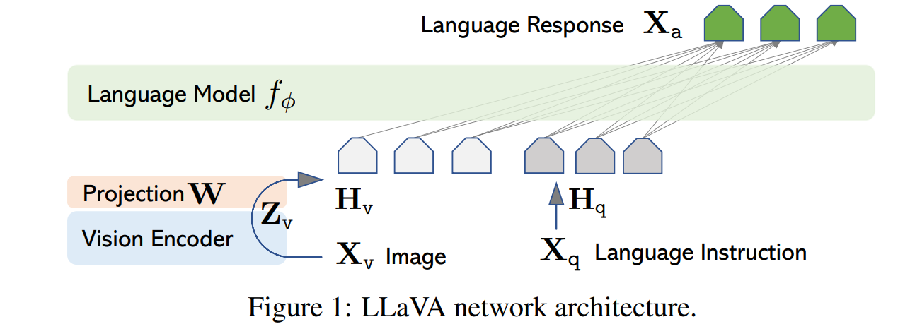
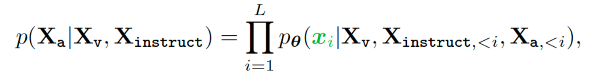

# 多模态大模型LLaVA的详解

之前我们介绍了多模态大模型的几种类型和多模态大模型的实现方式比如**blip**，以及**clip**多模态模型的详细介绍，本期主要和大家详细的了解一下**LLaVA**多模态大模型的实现方式。

> 论文地址：https://arxiv.org/pdf/2304.08485.pdf
>
> github地址：https://github.com/haotian-liu/LLaVA

## LLaVA文章

### 1. 基本思想

简单来说是想借助GPT-4的能力，丰富image-text数据集中的文本信息，例如在一个数据集包含以下两种信息:

- 从image caption的任务**获取到caption的文本**
- 从目标检测或者分割的任务获取到物体在图片中的**坐标和类别**

让GPT-4结合caption和boxes的信息，回答三种类型的问题:

- conversation: 一些简单的对话，例如图中是一辆怎样的车；图中是位于哪里的停车场；人在图像中做什么
- detailed description: 一些更细节的描述，期望能结合caption和boxes详细的描述图中的信息
- complex reasoning: 一些更复杂因果分析，可以结合前两种类型的问题做推理，例如图片中的人面临的挑战是什么。

### 2. 模型基本结构

使用视觉编码器CLIP ViT-L/14和语言解码器LLaMA构建多模态的大模型，并通过生成的数据进行指令微调。

- 首先，将输入图片X通过经过训练的视觉编码器得到图片特征Z。

- 然后，通过一个映射矩阵W将图片特征Z转化为视觉Token H。这样，视觉Token H_v和语言Token H_q指令就都处于同一个特征空间。将它们拼接后一起输入大模型进行处理。映射层W可以使用更复杂的网络来提升性能，**例如Flamingo中使用的gated cross-attention或BLIP-2中使用的Q-former。**

这种多模态大模型的架构允许将图像和语言信息进行融合，并在同一个特征空间中进行处理。通过微调生成的数据，可以进一步优化模型的性能。这种方法有助于提高多模态任务的表现，并为图像和语言之间的相互理解提供了强大的能力。

请注意，映射层W的选择取决于具体的任务和性能需求。Flamingo中的gated cross-attention和BLIP-2中的Q-former是一些可选的选择，可以根据需要进行替换或改进。

在Flamingo中的cross attention和BLIP中的Q-Former，与上面的projection有相似的功能，不过projection更像是个丐版的映射，简洁的达到了目的，但效果应该没有另外两篇文章中较复杂模块的效果好。

将图像和promt文本一起进行tokenizer，作为序列输入到模型中，代码如下：

~~~python
# 将图像和文本一起转成tokens
def tokenizer_image_token(prompt, tokenizer, image_token_index=IMAGE_TOKEN_INDEX, return_tensors=None):
    prompt_chunks = [tokenizer(chunk).input_ids for chunk in prompt.split('<image>')]

    def insert_separator(X, sep):
        return [ele for sublist in zip(X, [sep]*len(X)) for ele in sublist][:-1]

    input_ids = []
    offset = 0
    if len(prompt_chunks) > 0 and len(prompt_chunks[0]) > 0 and prompt_chunks[0][0] == tokenizer.bos_token_id:
        offset = 1
        input_ids.append(prompt_chunks[0][0])

    for x in insert_separator(prompt_chunks, [image_token_index] * (offset + 1)):
        input_ids.extend(x[offset:])

    if return_tensors is not None:
        if return_tensors == 'pt':
            return torch.tensor(input_ids, dtype=torch.long)
        raise ValueError(f'Unsupported tensor type: {return_tensors}')
    return input_ids
~~~

### 3.训练

使用如下图的方式组织每一轮的对话输入输出，训练模型预测助手的答案以及在哪里停止，因此仅使用绿色序列和标记来计算**自回归模型**中的损失，即根据所有前轮的指令和回答来预测当前目标回答X_a，也就是经典的next token prediction。

文中使用了两阶段的训练方式：

1. 第一阶段是预训练，frozen视觉vit和语言llm模型，从CC3M数据中过滤了595K图像-文本对，Xinstruct是单轮训练，只训练Project W权重。
2. 第二阶段是微调，只frozen视觉的vit权重，更新Project和LLM大语言模型的权重。分成2个任务：

### 4. github中的代码解读

**clip_encoder.py**

该程序主要是用于构建一整个基于CLIP的VIT视觉模型，是整个LLAVA模型视觉框架的构建，重要部分在于内部的CLIPVisionTower类

~~~python
    def __init__(self, vision_tower, args, delay_load=False):
        super().__init__()

        self.is_loaded = False  # 初始没有加载模型 用于判断是否加载好了模型

        self.vision_tower_name = vision_tower # 传参设置视觉模块名称
        self.select_layer = args.mm_vision_select_layer 
        # 这行代码从args对象中获取mm_vision_select_layer属性，并将其赋值给select_layer实例变量。这可能是用来选择模型中的特定层 比如为-2的时候，可能就是加载输出层的前一层
        
        self.select_feature = getattr(args, 'mm_vision_select_feature', 'patch') # 设置有两个可选择的 一个是patch 另一个是cls_patch 

        if not delay_load: # 默认调用load_model来加载模型
            self.load_model()
        else:
            self.cfg_only = CLIPVisionConfig.from_pretrained(self.vision_tower_name)
~~~

**load_model函数**

~~~python
    def load_model(self):
    	# 这个好理解，一个是 img的处理模块 一个是vit视觉模块，llava中并不训练vit，因此vit的梯度为False 最后设置is_load为true代表已经加载完毕了
    	# 整个模型调用transformer中的CLIP库加载模型。
        self.image_processor = CLIPImageProcessor.from_pretrained(self.vision_tower_name) 
        self.vision_tower = CLIPVisionModel.from_pretrained(self.vision_tower_name)
        self.vision_tower.requires_grad_(False)

        self.is_loaded = True
~~~

**feature_select函数**

~~~python
    def feature_select(self, image_forward_outs):
    	# image_feature是图像的特征，源码中  select_layer = -2（finetune.sh中mm_vision_select_layer 默认值为-2 代表的是拿到了img经过VIT的计算后的倒数第二层的特征值）
    	# 具体来说应该是 分类的前一个头，对应于VIT的原文中，应该是MLP的输出结果 也有可能是transformer encoder的输出结果。
        image_features = image_forward_outs.hidden_states[self.select_layer]
        # 如果是patch 那么不要第一个特征，应该是cls（VIT中第一个token做的是cls）
        if self.select_feature == 'patch':
            image_features = image_features[:, 1:]
        # cls_patch 是完全保留的
        elif self.select_feature == 'cls_patch':
            image_features = image_features
        else:
            raise ValueError(f'Unexpected select feature: {self.select_feature}')
        return image_features
~~~

**forward函数**

~~~python
# 注意这里设置为不需要梯度计算，因为llava不训练整个clip的vit
    @torch.no_grad()
    def forward(self, images):
        if type(images) is list: # 如果输入图像是list时
            image_features = []
            for image in images: # 遍历
            # 计算前向输出结果 并且增加维度，应该是表示 批次顺序的维度
                image_forward_out = self.vision_tower(image.to(device=self.device, dtype=self.dtype).unsqueeze(0), output_hidden_states=True)
            # 拿到特征
                image_feature = self.feature_select(image_forward_out).to(image.dtype)
                image_features.append(image_feature)
        else:
        # 单一图片 直接计算这张图片， 并且拿到feature
            image_forward_outs = self.vision_tower(images.to(device=self.device, dtype=self.dtype), output_hidden_states=True)
            image_features = self.feature_select(image_forward_outs).to(images.dtype)

        return image_features
~~~

### 5. 部署

#### 代码下载

~~~shell
git clone https://github.com/haotian-liu/LLaVA.git
cd LLaVA
~~~

#### 虚拟环境安装

~~~shell
conda create -n llava python=3.10 -y
conda activate llava
pip install --upgrade pip  # enable PEP 660 support
~~~

#### 模型预测安装

~~~shell
pip install -e .
~~~

#### 训练环境安装

~~~shell
   pip install -e ".[train]"
   pip install flash-attn --no-build-isolation  # 可能安装失败
~~~

> flash-attn可以进行离线安装
>
> 离线下载地址：https://github.com/Dao-AILab/flash-attention/releases
>
> 安装方式：`pip install *.whl`

#### 启动网页预测

   ~~~pyrhon
   python -m llava.serve.controller --host 0.0.0.0 --port 10000
   python -m llava.serve.gradio_web_server --controller http://localhost:10000 --model-list-mode reload
   ~~~

#### 推理权重下载

​	**liuhaotian/llava-v1.5-7b** hugging face地址：https://huggingface.co/liuhaotian/llava-v1.5-7b/tree/main

​	**openai/clip-vit-large-patch14-336** hugging face地址：https://huggingface.co/openai/clip-vit-large-patch14-336/tree/main

> 下载后放在同一个文件夹下，将llava-v1.5-7b下的config.json有关clip-vit的视觉编码器路径进行设置

#### 运行

~~~python
python -m llava.serve.model_worker --host 0.0.0.0 --controller http://localhost:10000 --port 40000 --worker http://localhost:40000 --model-path liuhaotian/llava-v1.5-13b
~~~
