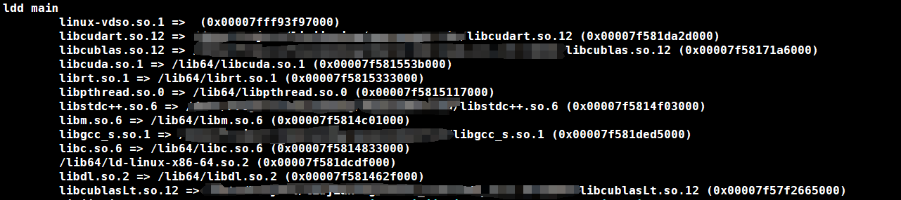

# llama.cpp的编译安装

上篇我们介绍了llama.cpp的易用特；接下来为大家介绍它的编译与安装过程。

## 克隆存储库

```bash
git clone https://github.com/ggerganov/llama.cpp
cd llama.cpp
```

```bash
# 对于国内用户，对Github的访问可能不大稳定，可切换github镜像，截至发稿时间镜像有效。
git clone https://hub.nucc.cf/ggerganov/llama.cpp
cd llama.cpp
```

## CMakeLists.txt解析

### CPU指令集部分


是否启用CPU中的高级矢量扩展指令集启用高位宽的寄存器，以提升单个物理核心对于整数/浮点数的计算能力。

其中，AVX512-VBMI是一组高效字节操作的矢量指令；而AVX512-VNNI则是一组专门用于加速神经网络计算的矢量指令。需要确认您的CPU支持该指令集并有相关静态库/动态库的方法实现或安装相关驱动，强行编译可能导致编译失败。

## 第三方硬件及支持库部分


是否启用cBLAS及CUBALS等硬件相关的线性加速库，默认关闭。需要依据自身硬件安装情况配置完整驱动后启用相关Cmake命令行选项。

其中CUDA相关参数具体意义为：

| 参数 | 类型       | 默认值 | 描述 |
| --- |----------| --- | --- |
| LLAMA_CUDA_FORCE_DMMV | 布尔型      | false | 强制使用反量化+矩阵向量乘法核，而不是使用对量化数据进行矩阵向量乘法的核。默认情况下，决策是基于计算能力(MMVQ适用于6.1/Pascal/GTX 1000或更高)。不影响k-quants。 |
| LLAMA_CUDA_DMMV_X | 正整数 >= 32 | 32 | 每次迭代经过CUDA去量化+矩阵向量乘法核处理的x方向值个数。增加该值可以提高快速gpu的性能。强烈推荐2的幂。不影响k-quants。（实测64有效，NV A800 80G） |
| LLAMA_CUDA_MMV_Y | 正整数      | 1 | CUDA mul mat vec内核在y方向上的块大小。增加该值可以提高快速gpu的性能。推荐幂为2。（实测调节为2有效，规格同上） |
| LLAMA_CUDA_F16 | 布尔型      | false | 启用后CUDA去量化+ mul mat vec核以及q4_1和q5_1矩阵乘法核使用半精度浮点运算。可以在相对较新的gpu上提高性能。 |
| LLAMA_CUDA_KQUANTS_ITER | 1/2      | 2 | Q2_ K和Q6_ K量化格式每迭代和每个CUDA线程处理的值的数量。将此值设置为1可以提高慢速GPU的性能。 |
| LLAMA_CUDA_PEER_MAX_BATCH_SIZE | 正整数      | 128 | 允许多个gpu之间进行对等访问的最大批处理大小。对等访问需要Linux或NVLink。在使用NVLink时，为更大的批处理规模启用对等访问可能是有益的。 |


主要为AMD显卡的HIP套件启用支持、VULKAN调用显卡资源的支持、苹果Apple Silicon 系列的机器学习库METAL支持、SYCL加速支持等。

## 编译参数

推荐使用cmake进行工程构建，当然也可以使用Zig和make，笔者对cmake更熟悉些，以下介绍cmake的构建方法。

### 纯CPU环境

纯CPU环境若想提升硬件使用率，需要开启高级指令集，同时链接对应的支持库。

开启该命令行选项时，请确保您的CPU支持Cmake 中CPU指令集部分，并将cmake命令行选项设置为ON。

linux系统下查看CPU指令集支持的方式：cpuinfo


笔者使用的计算平台CPU为 Intel(R) Xeon(R) Gold 6330 CPU，支持avx,、avx2、avx512_vnni、avx512_vbmi等指令，可将cmake CPU部分对应参数设定为ON：

```bash
-DLLAMA_AVX512=ON -DLLAMA_AVX512_VBMI -DLLAMA_AVX512_VNNI=ON ...
```

Windows下推荐使用cpu-z工具来查看硬件信息，下载详见下方链接。

[CPU-Z | Softwares | CPUID](https://www.cpuid.com/softwares/cpu-z.html)

运行可见笔者的本地计算机并不支持AXV_512及相关配套指令，如在本地构建，需去除对应命令行参数


### 使用CUDA套件加速

由于笔者计算平台未配置AMD专业显卡，故仅介绍使用CUDA套件的编译参数。

注意：

- 确保您已安装了CUDAToolkit加速库套件，推荐固定路径安装而非使用conda。使用conda容易造成不同环境下动态库链接混乱。
- 确保安装的CUDAtoolkit版本与加速卡安装驱动的CUDA版本一致

额外添加 CUDAToolkit_ROOT 命令行参数及启用CUDA功能的LLAMA_CUBLAS参数：

```bash
-DCUDAToolkit_ROOT=/path/to/your/cuda/tool/kit -DLLAMA_CUBLAS=ON
```

若环境中存在多个CUDAtoolkit，并且不确定PATH检索先后顺序时，也可指定 nvcc的位置：

```bash
-DCMAKE_CUDA_COMPILER=/path/to/your/nvcc
```

## 构建Time！

cmake参数设置完成后，运行 cmake指令生成工程配置：

```bash
cmake -B build_path -DCMAKE_C_COMPILER=gcc -DCMAKE_CXX_COMPILER=g++ -DCUDAToolkit_ROOT=/path/to/your/cuda/tool/kit -DLLAMA_CUBLAS=ON \
-DCMAKE_CUDA_COMPILER=/path/to/your/nvcc -DLLAMA_AVX512=ON -DLLAMA_AVX512_VBMI -DLLAMA_AVX512_VNNI=ON
```

运行cmake生成工程：

```bash
cmake -B build_path --config Release
```

等待编译完成（期间可以享受您的☕ 。哈哈，时间倒也没那么长啦）

## 编译结果展示

```bash
> cd build_path/bin
> ls
```


主要可执行文件：

- main ：主运行文件
- server ： 运行 webserver，开启相关接口可执行文件
- quantize ： 量化模型（GGML、GGUF）可执行文件
- benchmark： 性能评估可执行文件
- perplexity ： 模型困惑度评估可执行文件

### Tips

CUDA环境及其他动态库配置较为繁琐，请确保您的可执行文件编译后能链接到正确的动态库。

检查方法：

```bash
ldd main
```

显示结果：



动态库链接正常！

## 下期预告

如何在非root权限下，不使用conda，安装稳定、易于链接的 CUDAtoolkit。