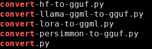
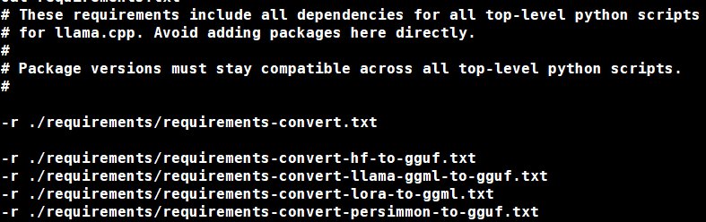
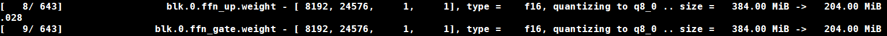
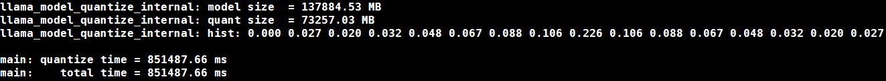

# LLM的量化 —— 基于llama.cpp套件的应用

## 引子

在当今人工智能的浪潮中，大型模型扮演着举足轻重的角色。它们通过海量的数据和复杂的算法，在训练阶段习得了解决各种问题的能力。然而，当这些庞然大物走出训练场，步入实际应用时，它们所面临的挑战才刚刚开始。

大模型的训练与推理过程，虽然同属于机器学习的范畴，却有着截然不同的需求和特点。训练阶段，模型需要在大规模数据集上进行反复迭代，不断调整参数以优化性能。这是一个计算密集且时间消耗巨大的过程，往往需要借助强大的硬件集群和高效的并行计算技术。而推理阶段，则是模型将所学应用于新数据、产生预测结果的过程。它更加**注重实时性**和**部署的便捷性**，因为在实际应用中，用户通常期望能够快速地获得模型的响应。

然而，大模型训练后的部署并非易事。受限于硬件规模，许多强大的模型难以在单个设备上完整部署，更不用说在资源有限的边缘设备上运行了。此外，推理过程中并不需要像训练那样高的数据精度。过高的精度不仅会增加计算负担，而且在很多情况下并不会带来明显的性能提升。

因此，模型推理优化成为了一个热门且关键的研究领域。通过优化算法、压缩模型大小、降低数据精度等方法，我们可以在有限的硬件资源上实现更高效的模型推理。这不仅有助于提升模型的实时性能，还能让更多人享受到人工智能技术带来的便利。

接下来我们将以llama.cpp提供的量化套件为例。看量化后大模型在部署上有何改变，能否进一步提高大模型的推理效率。

## 量化

### 背景
量化是一种将模型中的权重、激活值等参数从高精度（如32位浮点数）转换为低精度（如8位整数）表示的技术。通过降低数据精度，量化可以显著减少模型存储空间和计算复杂度，从而加速推理过程并降低能耗。同时，由于量化后的模型更适用于资源有限的边缘设备，因此也促进了深度学习技术在移动端和嵌入式系统等领域的应用。

量化的主要分为：

- 训练后量化（Post Training Quantization） :这种方法不需要重新训练模型，而是在训练完成后对模型进行量化。它通常通过统计模型参数的分布范围来确定量化参数（如量化阈值和量化级数），然后将浮点数参数转换为定点数表示。这种方法实现简单，但可能会由于量化误差导致一定的性能损失。
- 量化感知训练（Quantization-Aware Training） : 与训练后量化相比，量化感知训练通过在训练过程中对模型进行量化，从而在训练过程中对模型进行量化。因此，它能够尽可能地减少量化带来的误差。但训练过程会增加计算量，因此在训练过程中，量化感知训练通常会牺牲一定的训练精度。

尽管存在多种大模型优化算法如知识蒸馏、剪枝等方法，但受限于训练数据的获取、训练过程的高算力消耗以及实现复杂度等因素，它们在实际应用中往往面临一定的挑战。相比之下，量化是一种可不必重新训练优化方法，具有实现简单、效果显著等优势。因此，量化被认为是最容易实现的大模型部署优化方法之一。通过降低数据精度和减少计算需求，量化技术有望推动深度学习技术在更广泛领域的应用和发展。

### 量化过程
在此我们详细介绍利用之前安装的llama.cpp套件，对llama模型进行量化的过程。

在`llama.cpp`安装路径下，查看包含convert的量化脚本：
```shell
ls | grep convert
```
可见相关脚本如下：



注意到好多熟悉的单词：hf、llama等等，还有些不认识的: gguf、ggml这些都是什么？
现在大家只需要知道它们是llama.cpp可以识别的一种模型保存格式就行了。
~~先卖个关子，等下期再给大家做详细介绍。~~ 

这些脚本可以非常方便地把从HuggingFace上下载的LLM转换为llama.cpp可用的格式。甚至包括LoRA等模型。

### 转化脚本依赖安装
老生常谈的pip安装依赖：
```shell
pip install -r requirements.txt
```

展开requirements可以看到不同的脚本依赖保存在不同的文件中：


### 运行转化脚本

针对从HuggingFace上下载的模型，在[Github项目页面上](https://github.com/ggerganov/llama.cpp)检查检查其是否在llama.cpp中是可以转化的。

安装完成后，检查转换工具是否可用：
```shell
python convert-hf-to-gguf.py --help
```
显示如下帮助文档则说明相关依赖已安装成功：
```
Convert a huggingface model to a GGML compatible file

positional arguments:
  model                directory containing model file

optional arguments:
  -h, --help           show this help message and exit
  --vocab-only         extract only the vocab
  --awq-path AWQ_PATH  Path to scale awq cache file
  --outfile OUTFILE    path to write to; default: based on input
  --outtype {f32,f16}  output format - use f32 for float32, f16 for float16
  --bigendian          model is executed on big endian machine
```

运行转化脚本，保留f32格式：
```shell
python convert-hf-to-gguf.py /path/to/your/llm --outfile /path/to/your/llm.gguf --outtype f32
```

转化过程所用时间与模型大小有关，大模型的转化过程可能需要一定时间。

### gguf模型量化

在上一步中，我们已经将大模型转换为gguf格式。接下来，我们通过`llama.cpp`提供的量化套件，对gguf模型进行量化。
切换到构建路径,查看量化工具`quantize`的具体使用方法：
```shell
cd build/bin
./quantize
```

显示帮助文档：
```
usage: ./quantize [--help] [--allow-requantize] [--leave-output-tensor] [--pure] model-f32.gguf [model-quant.gguf] type [nthreads]

  --allow-requantize: Allows requantizing tensors that have already been quantized. Warning: This can severely reduce quality compared to quantizing from 16bit or 32bit
  --leave-output-tensor: Will leave output.weight un(re)quantized. Increases model size but may also increase quality, especially when requantizing
  --pure: Disable k-quant mixtures and quantize all tensors to the same type

Allowed quantization types:
   2  or  Q4_0   :  3.56G, +0.2166 ppl @ LLaMA-v1-7B
   3  or  Q4_1   :  3.90G, +0.1585 ppl @ LLaMA-v1-7B
   8  or  Q5_0   :  4.33G, +0.0683 ppl @ LLaMA-v1-7B
   9  or  Q5_1   :  4.70G, +0.0349 ppl @ LLaMA-v1-7B
  10  or  Q2_K   :  2.63G, +0.6717 ppl @ LLaMA-v1-7B
  12  or  Q3_K   : alias for Q3_K_M
  11  or  Q3_K_S :  2.75G, +0.5551 ppl @ LLaMA-v1-7B
  12  or  Q3_K_M :  3.07G, +0.2496 ppl @ LLaMA-v1-7B
  13  or  Q3_K_L :  3.35G, +0.1764 ppl @ LLaMA-v1-7B
  15  or  Q4_K   : alias for Q4_K_M
  14  or  Q4_K_S :  3.59G, +0.0992 ppl @ LLaMA-v1-7B
  15  or  Q4_K_M :  3.80G, +0.0532 ppl @ LLaMA-v1-7B
  17  or  Q5_K   : alias for Q5_K_M
  16  or  Q5_K_S :  4.33G, +0.0400 ppl @ LLaMA-v1-7B
  17  or  Q5_K_M :  4.45G, +0.0122 ppl @ LLaMA-v1-7B
  18  or  Q6_K   :  5.15G, -0.0008 ppl @ LLaMA-v1-7B
   7  or  Q8_0   :  6.70G, +0.0004 ppl @ LLaMA-v1-7B
   1  or  F16    : 13.00G              @ 7B
   0  or  F32    : 26.00G              @ 7B
          COPY   : only copy tensors, no quantizing
```

可见Q2、Q3、Q4、Q5、Q6，Q8、F16、F32等量化程度。可以依据设备显存和推理准确度要求，选择适合的量化水平。

注意：**由于llama.cpp提供的是不需要训练数据的权重映射方法。因此越高程度的量化对模型对模型的精确度影响越大。在需要更高精度的场景下，需酌情降低量化程度。**

接下来正式量化gguf模型：
```shell
./quantize /path/to/your/llm.gguf /path/to/your/llm.quant.gguf Q2_K 16
```

在运行过程中可见不同层的量化过程：



此处提示量化过程将原有Float16位权重转换为8位数据，原有层大小由384M下降为204M。

### 结果查看

以千问-72B单模态模型为例，转换后gguf格式模型运行量化完成后，显示量化结果如下：


可见模型大小由原有的134G下降为71G左右，整体下降了近50%。

那LLM的量化过程是否对推理有何影响呢？莫急，且听下回分解。

## 下期预告
**基于llama.cpp的量化后LLM部署与服务**