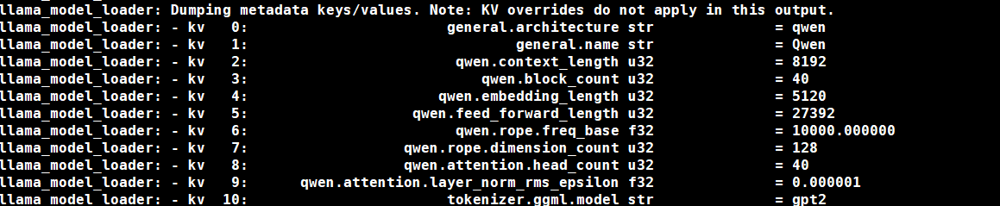
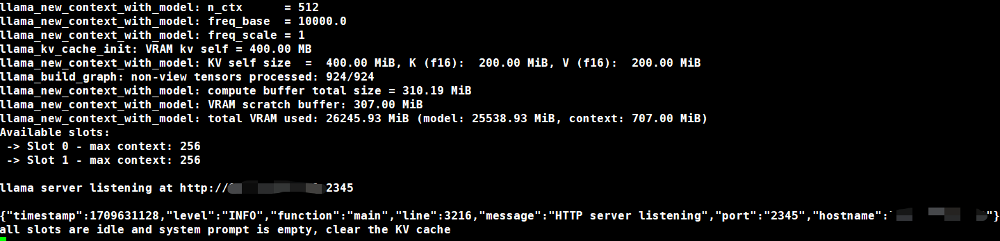
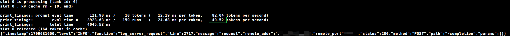

# 量化后模型的部署

## 引子

在上篇量化模型结束之后，我们已经得到了远远小于原始模型的量化后模型，接下来我们来学习如何通过llama.cpp将这个模型部署到服务端并做调试。

## 参数

在llama.cpp构建完成后，我们除了得到运行模型的主要可执行文件`main`和量化工具`quantize`之外，注意到还有一个`server`可执行文件。没错，就是它了，让我们看看具体是怎么用的吧

```shell
./server 

usage: ./server [options]

options:
  -h, --help                show this help message and exit
  -v, --verbose             verbose output (default: disabled)
  -t N, --threads N         number of threads to use during computation (default: 56)
  -tb N, --threads-batch N  number of threads to use during batch and prompt processing (default: same as --threads)
  -c N, --ctx-size N        size of the prompt context (default: 512)
  --rope-scaling {none,linear,yarn}
                            RoPE frequency scaling method, defaults to linear unless specified by the model
  --rope-freq-base N        RoPE base frequency (default: loaded from model)
  --rope-freq-scale N       RoPE frequency scaling factor, expands context by a factor of 1/N
  --yarn-ext-factor N       YaRN: extrapolation mix factor (default: 1.0, 0.0 = full interpolation)
  --yarn-attn-factor N      YaRN: scale sqrt(t) or attention magnitude (default: 1.0)
  --yarn-beta-slow N        YaRN: high correction dim or alpha (default: 1.0)
  --yarn-beta-fast N        YaRN: low correction dim or beta (default: 32.0)
  -b N, --batch-size N      batch size for prompt processing (default: 512)
  --memory-f32              use f32 instead of f16 for memory key+value (default: disabled)
                            not recommended: doubles context memory required and no measurable increase in quality
  --mlock               force system to keep model in RAM rather than swapping or compressing
  --no-mmap             do not memory-map model (slower load but may reduce pageouts if not using mlock)
  --numa                attempt optimizations that help on some NUMA systems
  -ngl N, --n-gpu-layers N
                        number of layers to store in VRAM
  -ts SPLIT --tensor-split SPLIT
                        how to split tensors across multiple GPUs, comma-separated list of proportions, e.g. 3,1
  -mg i, --main-gpu i   the GPU to use for scratch and small tensors
  -nommq, --no-mul-mat-q
                        use cuBLAS instead of custom mul_mat_q CUDA kernels.
                        Not recommended since this is both slower and uses more VRAM.
  -m FNAME, --model FNAME
                        model path (default: models/7B/ggml-model-f16.gguf)
  -a ALIAS, --alias ALIAS
                        set an alias for the model, will be added as `model` field in completion response
  --lora FNAME          apply LoRA adapter (implies --no-mmap)
  --lora-base FNAME     optional model to use as a base for the layers modified by the LoRA adapter
  --host                ip address to listen (default  (default: 127.0.0.1)
  --port PORT           port to listen (default  (default: 8080)
  --path PUBLIC_PATH    path from which to serve static files (default examples/server/public)
  --api-key API_KEY     optional api key to enhance server security. If set, requests must include this key for access.
  -to N, --timeout N    server read/write timeout in seconds (default: 600)
  --embedding           enable embedding vector output (default: disabled)
  -np N, --parallel N   number of slots for process requests (default: 1)
  -cb, --cont-batching  enable continuous batching (a.k.a dynamic batching) (default: disabled)
    -spf FNAME, --system-prompt-file FNAME
                        Set a file to load a system prompt (initial prompt of all slots), this is useful for chat applications.
  --mmproj MMPROJ_FILE  path to a multimodal projector file for LLaVA.
  --log-disable         disables logging to a file.

  --override-kv KEY=TYPE:VALUE
                        advanced option to override model metadata by key. may be specified multiple times.
                        types: int, float, bool. example: --override-kv tokenizer.ggml.add_bos_token=bool:false
```

其中主要的参数：

- `-m` 量化后模型路径
- `--host` 服务端ip
- `--port` 服务端端口
- `-ngl` 将指定数量的Transformer层放置于GPU显存，其余放置在内存。用于平衡显存占用和计算速度。可以超过模型实际层数，此时server会选择所有层。
- `-ts` 在多卡计算机上，可以罗列各个卡的权重分配比例。可手动平衡各卡负载。
- `-np` 开启服务的数量，如果实际请求超过该服务数量，server会返回无法服务代码
- `--api-key` 服务端api key，用于增强服务端安全性
- `--thread` 服务端CPU线程数，在多服务部署时，增加CPU线程数有助于帮助服务端更快处理请求
- `-mg` 放置上K-V Cache等缓存的GPU编号。经验来说，该卡应剩余较多显存而算力则无太高要求。（卖个关子，等后面再详细解释为什么这样做。其实基于Python的推理也是类似的，大模型推理真神奇）

## 运行部署

```shell
./server --host 192.xxx.xxx.xxx --port 2345 -m /path/to/your/model.gguf -np 8 -ts 7,8 -ngl 99 -mg 0
```

server开始运行，你可以看到模型的基本信息（此处为测试模型，具体以实际运行为准）



server已经开始服务，可以看到每个slot可提供的上下文数量和上下文占用的显存等信息，上下文放置于main GPU上。



## 使用客户端

基准测试，如何建立一个简单的网站？

```shell
curl --request POST \
      --url http://192.xxx.xxx.xxx:2345/completion \
      --header "Content-Type: application/json" \
      --data '{"prompt": "如何通过十个步骤构建一个简单的网站？:","n_predict": 512}'
```

返回结果如下：

```json
{
  "content":" 以下是构建简单网站的十个步骤:\n\n1. 决定网站类型和主题。\n\n2. 注册一个域名和选择一个合适的托管服务商。\n\n3. 安装内容管理系统（CMS），如WordPress，Joomla等。\n\n4. 设计网站布局和样式，并使用CSS进行样式设置。\n\n5. 创建并添加 所需页面，包括主页、关于页面、产品/服务页面等。\n\n6. 添加必要的功能模块，如联系表单、社交媒体分享按钮等。\n\n7. 集成支 付系统（如果需要）以及SEO优化工具。\n\n8. 测试网站以确保所有链接和功能正常工作。\n\n9. 发布网站并进行市场推广。\n\n10.  定期更新网站内容，并监视网站的性能和安全性。",
  "generation_settings":{"frequency_penalty":0.0,"grammar":"",...}
```

服务端显示如下：



**40.52 Tokens/Sec** 呀，是不是非常的快！而且，server还兼容OpenAI接口格式，可以使用OpenAI的集成工具进行测试与使用。

至此，服务部署就成功啦，高效且愉快地享受大模型带来的乐趣吧！

## 下期预告

量化后模型的评估
