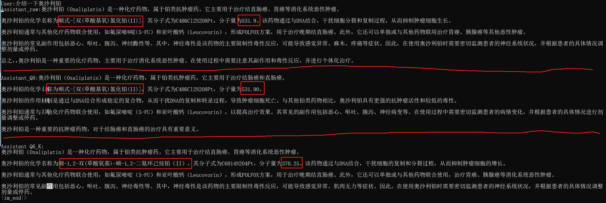
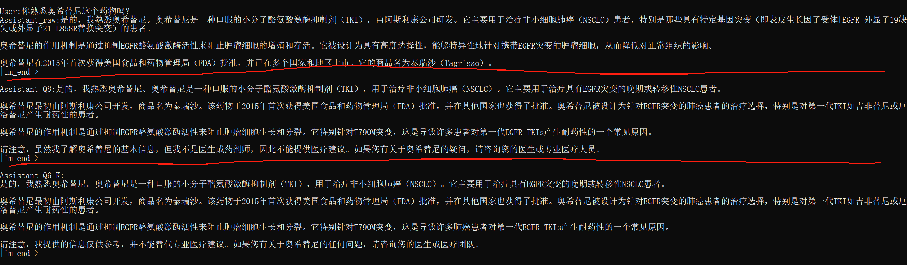
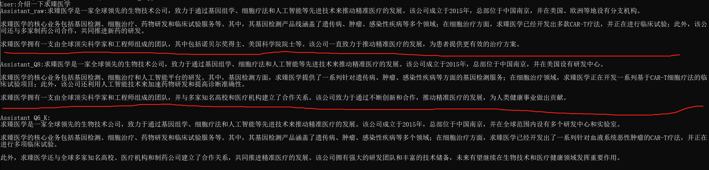

# 量化后模型性能的评估

## 引子

在上一篇博客中，我们介绍了如何使用llama.cpp套件对模型进行量化。在量化后，带来诸多好处，例如显存占用的显著下降、处理速度的显著提升等等。

但量化并不是万能的手段，无法同时达到“省、快、稳、准”的目标。模型量化后虽然可以部署到更为廉价和通用的设备上，推理速度得到相当大的提升，达到了“省”与“快”的目的。但因为数据精度下降带来的影响，模型的性能可能会有所下降。在模型性能下降的同时，我们如何对模型的性能进行评估，在各个指标中寻找一个可以接受的平衡点呢？

嘛，如果问文心一言，肯定又会说到要在标准问题集上分别评估模型的如下性能了：

1. **准确性评估**：
   - **困惑度（Perplexity）**：一种评估模型预测文本不确定性的度量，较低的困惑度通常意味着模型预测更为准确。
   - **准确率（Accuracy）**：对于分类任务，准确率是正确预测的样本数与总样本数的比例。
   - **F1 分数**：结合了精确率（precision）和召回率（recall）的度量，用于评估模型的整体性能。

2. **效率评估**：
   - **模型大小**：量化后模型的大小，通常以参数数量或所占存储空间来衡量。
   - **推理速度**：模型处理输入并生成输出的速度，通常以每秒处理的词数或句子数来衡量。
   - **内存占用**：模型在推理过程中占用的内存量。

3. **一致性评估**：
   - **人类评估**：通过人类评估者判断模型输出与预期输出的一致性。
   - **自动一致性检查**：使用自动化工具来比较模型输出与参考输出的一致性。

4. **多样性评估**：
   - **n-gram 多样性**：评估模型生成文本中不同n-gram（如2-gram, 3-gram等）的多样性。
   - **独特句子比例**：生成的文本中独特句子的比例。

5. **健壮性评估**：
   - **对抗性攻击测试**：通过输入精心设计的样本来测试模型的健壮性，观察其是否容易被误导。
   - **噪声输入测试**：向输入添加噪声（如拼写错误、语法错误等），观察模型处理这些输入的能力。

6. **可解释性评估**：
   - **注意力可视化**：如果模型使用了注意力机制，可以通过可视化注意力权重来理解模型的决策过程。
   - **模型内部状态分析**：分析模型内部的激活、梯度等信息来理解模型是如何处理输入的。

7. **偏见和公平性评估**：
   - **偏见检测**：使用特定设计的测试集来检测模型是否表现出性别、种族、宗教等方面的偏见。
   - **公平性指标**：计算不同群体在模型性能上的差异，以评估模型的公平性。

等等等等。当然了，这些由专家提出的系统评估指标当然是最好的。只是它们太概括，太空泛了。让我们来看看真正简单且容易实现的方法吧，Let's go.

## 动手之前的准备

在开始之前，我们要准备不同量化程度的模型。针对iChosenGPT,我们分别准备了原始精度、INT8、INT6量化程度的模型。

此外，还需要编写客户端代码，用于向模型发送问题，获取答案。如果是可以接收流式数据的客户端，那自然是更好了。

## 开始评估

清楚你在大模型微调时所使用的数据集领域及其关键问题-答案对（别告诉我你是从头训练的一整个大模型~_~），量化对微调后模型在微调数据集上的性能时我们最关注的指标。如果量化后失去了微调带来的领域知识增强，那实在是意见令人丧气的事。

大模型在训练完成后会有自己的内部表示学习，这种学习包括了对输入数据的抽象表示和语义理解。在深度学习中，这种内部表示通常由模型的权重参数所决定，这些参数在训练期间通过反向传播算法进行调整，以最小化模型在训练数据上的损失函数。

这个内部表示可以被认为是模型对输入数据的潜在表达，其中包含了模型在学习任务中所获得的知识和模式。对于自然语言处理任务，例如文本生成或问答，内部表示可能包括对语法结构、语义关系和上下文信息的抽象表示。

这种内部表示的学习是深度学习模型成功的关键之一。一旦模型完成了训练，这些内部表示就成为了模型推理和生成输出的基础。在推理阶段，模型使用这些学到的表示来理解和回答新的输入数据，这也使得模型能够适应不同领域和任务的变化。

以iChosenGPT为例，我们添加了公司信息、检测产品信息、肿瘤相关医药信息等问题，可以抽取其中的关键问题对，构建其相近的同义语句进行提问：

- **模型**：介绍一下你自己/介绍一下公司产品

- **医药**：你知道xxxx药物么，针对的疾病有哪些？

- **产品**：你知道xxxx产品是什么，适合哪些人群？

## 评估过程

针对iChosenGPT量化后的模型，我们调用本地客户端针对其医药领域的标准问题在不同量化程度的模型上进行了对比，接下来是一些有趣的结果:

### 医药知识测试

在不同量化程度的模型同时部署的情况下，以不同问题进行测试，从上到下分区分别为：原始精度模型、INT8量化模型，INT6量化模型。

相比于原基准线模型，INT8量化模型在文本量和细节陈述上有小幅下降，但关键信息如药品分子结构式和分子量这些数据还是准确的。反观INT6量化模型，除了在文本量和细节陈述上整体下降，其在关键信息上也出现了问题，红框圈出的分子结构式和分子量，都是错误的。

同样是化疗药物相关信息，相比于原始精度的部署模型，在INT8和INT6量化精度上，具体的敏感化疗位点信息没有输出，药物的商品名也有所丢失。INT6相比于INT8，在意义表述方面差距不大，注意到在文本量的输出上INT6要差一些。

### 公司相关知识测试

对于公司内容介绍中，同样也可以见到：随着量化程度的提高，表述内容梗概变化不大，细节会显著下降。例如将分支机构的位置由具体改位“有多个”，忽略对公司团队的具体介绍等等。

## 总结

在进行大模型的简单量化测试过程中，我们观察到了一个有趣的现象：随着模型量化程度的不断提升，模型在表达具体细节方面的能力逐渐减弱。这种损失并非微不足道，而是直接影响了模型对复杂、细致信息的处理能力。特别是在面对需要精确描述的场景时，如数字的准确表述或具体事件的详细陈述，模型的性能下降尤为明显。

然而，尽管在细节表达上有所不足，但大模型在量化后的总体表述逻辑仍然保持了相对清晰。这一点与小模型在量化后容易出现的逻辑混乱、重复提问（如“What did you want to do”这类无意义的复读）形成了鲜明的对比。这表明大模型在量化过程中，虽然牺牲了一部分细节处理能力，但其核心的逻辑框架和整体信息处理能力仍然得到了较好的保留。

从我们的经验来看，模型的参数量大小与其在量化过程中的性能损失有着密切的关系。具体来说，参数量越大的模型在相同的量化程度下，其性能损失相对较小。这意味着大型模型在量化过程中具有更强的鲁棒性和适应性，能够更好地抵抗量化带来的不利影响。相反，参数量较小的模型在同样的量化条件下，其性能损失要明显得多。这可能是因为小模型的参数空间有限，量化过程中的任何微小变化都可能对其性能产生显著影响。

综上所述，大模型在简单量化过程中虽然会损失一定的细节表达能力，但其总体逻辑清晰且相对稳健。而参数量的大小则是影响模型量化性能损失的关键因素之一。
