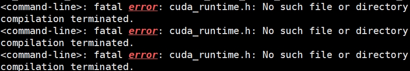
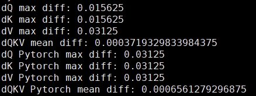

# Attention机制的优化 —— 长文本处理加速模块FlashAttention的简介与应用

## 背景

长文本处理面临的瓶颈主要包括计算复杂度高、内存消耗大和运行时间长。由于长文本包含大量的单词或字符，传统的自然语言处理方法需要处理大量的数据，这会导致计算资源的巨大消耗。特别是当使用基于注意力机制的模型（如Transformer）处理长文本时，由于自注意力机制需要对每个词与其他所有词进行交互计算，计算复杂度和内存需求随着文本长度的增加而显著增加。

在处理超长文本，如科研文献的全文时，使用如Transformer模型中的传统的Self-Attention，需要对序列中的每个元素计算与其他所有元素的相似度，导致计算量随着序列长度的增加而显著增加。这种计算方式在处理非常长的序列时可能变得非常低效。
此外，传统的Attention机制需要将整个序列加载到内存中，以便计算注意力权重。对于非常长的序列，这可能会导致巨大的内存消耗，甚至超出硬件的限制。在部署参数量较大模型时，加速卡中缓存的容量往往是限制部署的最重要因素，在大参数量模型全量缓存+长上下文缓存时，很可能导致推理甚至整个部署的失败。

因此，传统的Attention算法在处理长序列时面临着计算复杂度和内存消耗的双重挑战。为了克服这些弱点，研究者们提出了一系列改进的Attention机制，如上文提到的Flashattention，以及其他的如Sparse Attention、Efficient Attention等，旨在降低计算复杂度和内存消耗，提高处理长序列的效率。FlashAttention在众多以Python为基础架构的推理框架中作为主要的加速模块存在。

下面我们介绍下Flashattention的优化策略和安装方法。

## 策略
FlashAttention通过几种关键技术解决了长文本处理的瓶颈问题：

1. Tiling技术：FlashAttention利用tiling技术将长序列切分成较小的块（tiles），并在GPU的SRAM中进行局部注意力计算。这种方法显著减少了需要在高带宽内存（HBM）和SRAM之间传输的数据量，从而降低了内存访问的延迟和开销。

2. IO复杂度优化：通过优化数据的布局和访问模式，FlashAttention减少了不必要的内存读写次数，从而优化了整体的IO复杂度。这意味着在处理长文本时，数据的传输效率更高，进而提升了处理速度。

3. 算法改进：除了硬件层面的优化，FlashAttention还可能在算法层面进行了改进，比如采用了更有效的注意力计算方式，或者引入了块稀疏注意力等策略，以减少不必要的计算量。

4. 内存管理：通过更智能的内存管理策略，如缓存机制、数据重用等，FlashAttention能够更有效地利用有限的内存资源，从而降低长文本处理时的内存消耗。

## 安装

### 1. 预先准备：
- Pytorch （嵌入框架）
- packaging ```pip install packaging``` 辅助编译工具
- ninja （辅助编译工具）

### 2. 克隆仓库、完成配置

由于涉及到CUDA代码和C++代码的编译，直接使用pip安装会间接调用编译脚本，并使可能发生的TraceBack错误信息变得难以阅读。推荐使用如下方式安装：

直接克隆官方的存储库，并进入目录：
```shell
git clone https://github.com/Dao-AILab/flash-attention.git
```

或使用国内稳定镜像：
```shell
git clone https://hub.nuaa.cf/Dao-AILab/flash-attention.git
```

使用Python调取安装脚本进行安装：
```shell
python setup.py install
```

在conda环境中，大家可能会遇到如下问题：


找不到CUDA路径，是不是有很多教程都说可以手动指定来着？然而根本也没有效果或者带来更多问题来着?

敲黑板敲黑板！
安装过程是由Python调取ninja-> gcc/g++ cc1/cc1plus -> nvcc/ptxas 如果之前有虚拟环境安装过Pytorch和CUDA-toolkit。同时系统中也有其它安装CUDA工具包时，编译器的一连串库文件、头文件检索会变得非常复杂。
pytorch、cuda-toolkit、flash-attention是一套完整配合的整体。既然手动配置存在问题，咱就可以交给包管理器不是。

所以，最佳的解决方案就是：
1. 卸载掉虚拟环境中当前版本的pytorch，这会同时清空CUDA环境。然后重新安装pytorch，同样也会配置CUDA环境。
2. 重新创建一个虚拟环境，安装pytorch，包管理器会自动安装CUDA环境。最后再编译安装flash-attention

同时在CPU资源有限的设备上，也要指定ninja配置并行编译的最大线程数
```shell
python setup.py install --ninja-max-jobs=4
```

还是漫长佛如编译时间，享受您的下午茶吧！
编译完成后，安装命令行有如下提示：
```shell
...

Using /your/user/anaconda/envs/env_v/lib/python3.10/site-packages
Searching for mpmath==1.3.0
Best match: mpmath 1.3.0
Adding mpmath 1.3.0 to easy-install.pth file

Using /your/user/anaconda/envs/env_v/lib/python3.10/site-packages
Finished processing dependencies for flash-attn==2.4.2
```

好啦，安装成功！

### 3. 验证安装

```python
from flash_attn import flash_attn_qkvpacked_func, flash_attn_func
```

正常引入无报错。

接下来是老生常谈的pytest环节：

```shell
pytest -q -s tests/test_flash_attn.py
```

测试示例结果如下：



验证成功！


