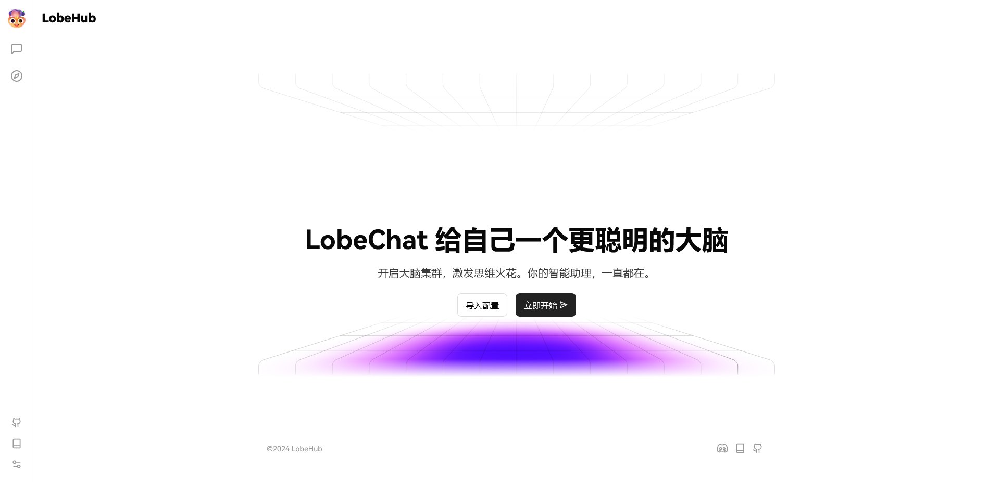
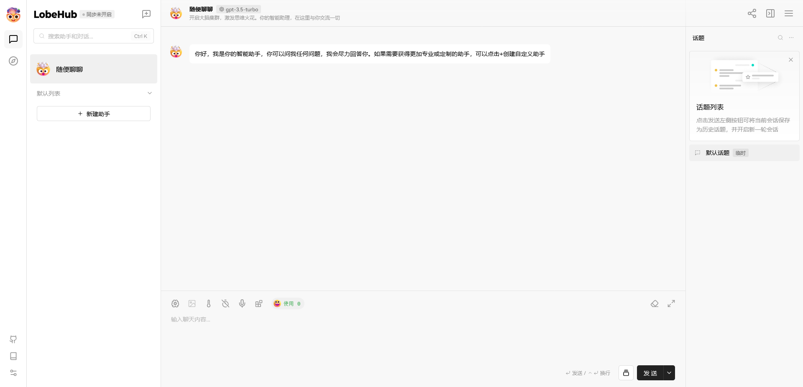
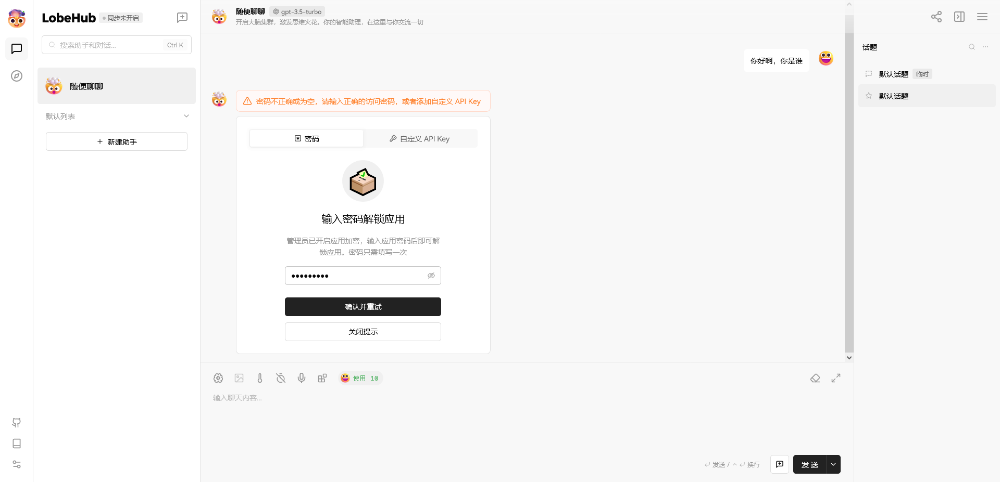
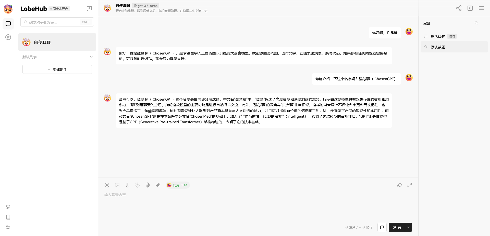
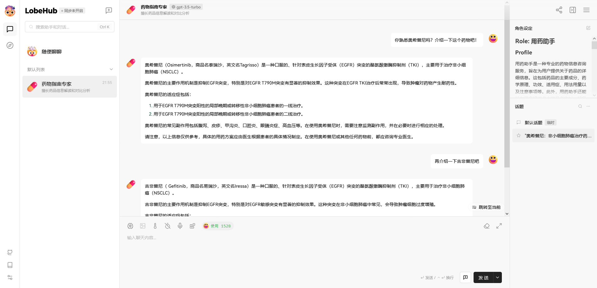

# 开源速递 | Lobe Chat---现代化设计的开源 LLMs 应用框架

## 前言

欢迎来到“开源速递”第一篇：LobeChat（一个现代化、可扩展的ChatGPT/LLMs聊天应用与开发框架）开源项目的教程。

通过本教程，你将学习如何利用LobeChat的强大功能，快速搭建属于自己的智能对话助手。

让我们一起探索如何将先进的人工智能技术融入日常生活和工作，开启高效、智能的交流新篇章。


## 软件开发环境部署

```bash
# 创建文件夹！
cd /work/projects/os
mkdir OS001_LobeChat
cd OS001_LobeChat

# 拉取源代码并拷贝，生成osexpress项目文件夹！
git clone https://github.com/lobehub/lobe-chat
cp -r lobe-chat osexpress

# 进入项目文件夹，修改配置！
cd osexpress
cp .env.example .env
vim .env  # ACCESS_CODE, OPENAI_API_KEY, OPENAI_PROXY_URL!

# 安装依赖！
pnpm install
pnpm dev -- --host 0.0.0.0 --port 60001
```

备注：在修改配置文件“.env”时，我这里主要修改了三个参数：

- ACCESS_CODE
- OPENAI_API_KEY
- OPENAI_PROXY_URL

修改后两个，主要是便于你后续在使用OpenAI模型时不需要手动输入 API Key，而设置前者，则是为了保护你的 API Key 不被轻易滥用，保护好你的钱包！

## 基础测试效果

打开浏览器，访问如下网址：http://<YOUR_SERVER_IP>:60001



> 系统首页

看到这个界面，OK，那样恭喜你，说明部署成功了！接下来就 enjoy it 吧！



> 聊天界面



> 设置秘钥的情况下，需要输入秘钥



> 成功对话


> 查找聊天助手



> 使用聊天助手：以“药物指南专家”为例

## 软件生产环境打包

前面采用开发环境部署，是为了便于你基于该项目进行二次开发，并能随时预览效果。

当你完成开发，就需要对软件进行打包镜像，进行生产部署了。

下面介绍如何快速打包：

### Dockerfile 备份与修改

```bash
cd /work/projects/os/OS001_LobeChat/osexpress
cp Dockerfile Dockerfile.bak
vim Dockerfile
```

修改后的 Dockerfile 内容如下：

```Dockerfile
FROM node:20-slim AS base

## Sharp dependencies, copy all the files for production
FROM base AS sharp
ENV PNPM_HOME="/pnpm"
ENV PATH="$PNPM_HOME:$PATH"
RUN corepack enable

WORKDIR /app

COPY node_modules ./
RUN pnpm add sharp

## Install dependencies only when needed
FROM base AS builder
ENV PNPM_HOME="/pnpm"
ENV PATH="$PNPM_HOME:$PATH"
RUN corepack enable

WORKDIR /app

COPY package.json ./

# If you want to build docker in China
# RUN npm config set registry https://registry.npmmirror.com/
# RUN npm config set fetch-retries 15
# RUN pnpm i

COPY . .
RUN pnpm run build:docker

## Production image, copy all the files and run next
FROM base AS runner
WORKDIR /app

ENV NODE_ENV production

RUN addgroup --system --gid 1001 nodejs
RUN adduser --system --uid 1001 nextjs

COPY --from=builder /app/public ./public

# Set the correct permission for prerender cache
RUN mkdir .next
RUN chown nextjs:nodejs .next

# Automatically leverage output traces to reduce image size
# https://nextjs.org/docs/advanced-features/output-file-tracing
COPY --from=builder --chown=nextjs:nodejs /app/.next/standalone ./
COPY --from=builder --chown=nextjs:nodejs /app/.next/static ./.next/static
COPY --from=sharp --chown=nextjs:nodejs /app/node_modules/.pnpm ./node_modules/.pnpm

USER nextjs

EXPOSE 60002

# set hostname to localhost
ENV HOSTNAME "0.0.0.0"
ENV PORT=60002

# General Variables
ENV ACCESS_CODE "<YOUT_ACCESS_CODE>"
ENV CUSTOM_MODELS ""

ENV API_KEY_SELECT_MODE ""

# OpenAI
ENV OPENAI_API_KEY "<YOUR_OPENAI_KEY>"
ENV OPENAI_PROXY_URL "<YOUR_OPENAI_URL>"

# Azure OpenAI
ENV USE_AZURE_OPENAI ""
ENV AZURE_API_KEY ""
ENV AZURE_API_VERSION ""

# Google
ENV GOOGLE_API_KEY ""

# Zhipu
ENV ZHIPU_API_KEY ""

# Moonshot
ENV MOONSHOT_API_KEY ""

# Ollama
ENV OLLAMA_PROXY_URL ""

# Perplexity
ENV PERPLEXITY_API_KEY ""

# Anthropic
ENV ANTHROPIC_API_KEY ""

# Mistral
ENV MISTRAL_API_KEY ""

# OpenRouter
ENV OPENROUTER_API_KEY ""
ENV OPENROUTER_CUSTOM_MODELS ""

# 01.AI
ENV ZEROONE_API_KEY ""

CMD ["node", "server.js"]

```

同本地的.env文件，我这里也主要修改了以下几个参数：

- ACCESS_CODE
- OPENAI_API_KEY
- OPENAI_PROXY_URL

当然，也还有其他一些地方也做了修改：你可以对比一下，也可以不用管，直接用上面的代码进行整体替换即可！

除此之外，还需要修改“.dockerignore”，将其中的“node_modules”去掉，因为Dockerfile中要用到这个文件夹！同时也需要加上“.env”，最终即：

```text
Dockerfile
.dockerignore
npm-debug.log
.next
.git
scripts
docs
.github
*.md
.env
.env.example
```

### 构建镜像

```bash
cd /work/projects/os/OS001_LobeChat/osexpress
docker build -t osexpress001_lobechat:v1.0 .
```

如果运行失败，请多次尝试！

成功的效果：

```bash
iChosenGPT@Server:/work/projects/os/OS001_LobeChat/osexpress$ docker build -t osexpress001_lobechat:v1.0 .
[+] Building 286.4s (22/22) FINISHED
 => [internal] load build definition from Dockerfile
 => => transferring dockerfile: 2.21kB
 => [internal] load metadata for docker.io/library/node:20-slim
 => [internal] load .dockerignore
 => => transferring context: 231B
 => [base 1/1] FROM docker.io/library/node:20-slim@sha256:dcb9e35d8afca163a231cdfad9657d2360947f212faf0fab647f8d11cb1e63a9
 => [internal] load build context
 => => transferring context: 34.36MB
 => CACHED [runner 1/9] WORKDIR /app
 => CACHED [runner 2/9] RUN addgroup --system --gid 1001 nodejs
 => CACHED [runner 3/9] RUN adduser --system --uid 1001 nextjs
 => CACHED [sharp 1/4] RUN corepack enable
 => CACHED [sharp 2/4] WORKDIR /app
 => CACHED [builder 3/5] COPY package.json ./
 => [sharp 3/4] COPY node_modules ./
 => [builder 4/5] COPY . .
 => [sharp 4/4] RUN pnpm add sharp
 => [builder 5/5] RUN pnpm run build:docker
 => [runner 4/9] COPY --from=builder /app/public ./public
 => [runner 5/9] RUN mkdir .next
 => [runner 6/9] RUN chown nextjs:nodejs .next
 => [runner 7/9] COPY --from=builder --chown=nextjs:nodejs /app/.next/standalone ./ 
 => [runner 8/9] COPY --from=builder --chown=nextjs:nodejs /app/.next/static ./.next/static
 => [runner 9/9] COPY --from=sharp --chown=nextjs:nodejs /app/node_modules/.pnpm ./node_modules/.pnpm
 => exporting to image
 => => exporting layers
 => => writing image sha256:e171e91ea74919b827a7fe907972e0bbc8eec4523850ec6bc8d51a4f2fec5ae4
 => => naming to docker.io/library/osexpress001_lobechat:v1.0 

iChosenGPT@Server:/work/projects/os/OS001_LobeChat/osexpress$ docker images                                                                                                                                                                
REPOSITORY              TAG       IMAGE ID       CREATED         SIZE                                                                                                                                                                              
osexpress001_lobechat   v1.0      e171e91ea749   8 seconds ago   353MB
```

需要注意的是，这里运行的前提是你已经在本地成功启动过项目了，也就是说你已经在本地下载好了全部的依赖了（在“node_modules”下）！

接下来，基于新构建的docker镜像，启动容器试试：

```bash
iChosenGPT@Server:/work/projects/os/OS001_LobeChat/osexpress$ docker run -it -p 60002:60002 --name=osexpress001_lobechat -d osexpress001_lobechat:v1.0
f6ef4deae34e38250b6316a78a87dc4420c3d74b30320e2a87125d4188b6e9a4

iChosenGPT@Server:/work/projects/os/OS001_LobeChat/osexpress$ docker ps
CONTAINER ID   IMAGE                        COMMAND                  CREATED          STATUS          PORTS                                NAMES
f6ef4deae34e   osexpress001_lobechat:v1.0   "docker-entrypoint.s…"   40 seconds ago   Up 35 seconds   0.0.0.0:60002->60002/tcp   osexpress001_lobechat
```

打开浏览器，访问：http://<YOUR_SERVER_IP>:60002

OK，跟本地一样一样的！

接下来，你就可以在项目原代码基础上进行二次开发，边开发边查看本地效果。开发测试完成后，可以打包为docker镜像进行生产环境部署了。

## 参考文献

- https://github.com/lobehub/lobe-chat

- https://github.com/lobehub/lobe-chat/wiki/Setup-Development.zh-CN