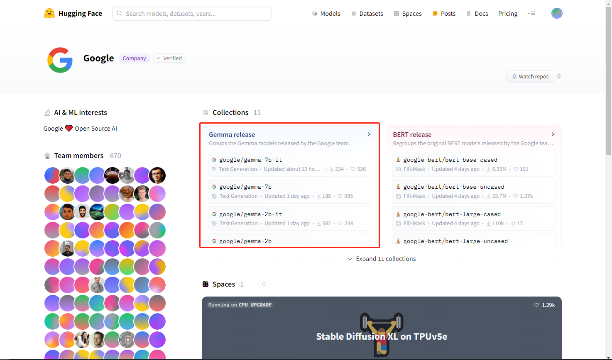
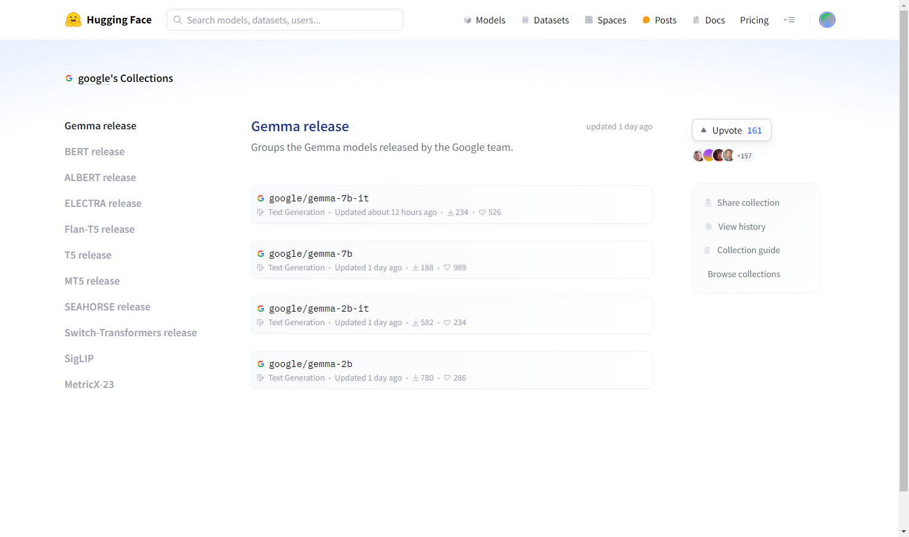
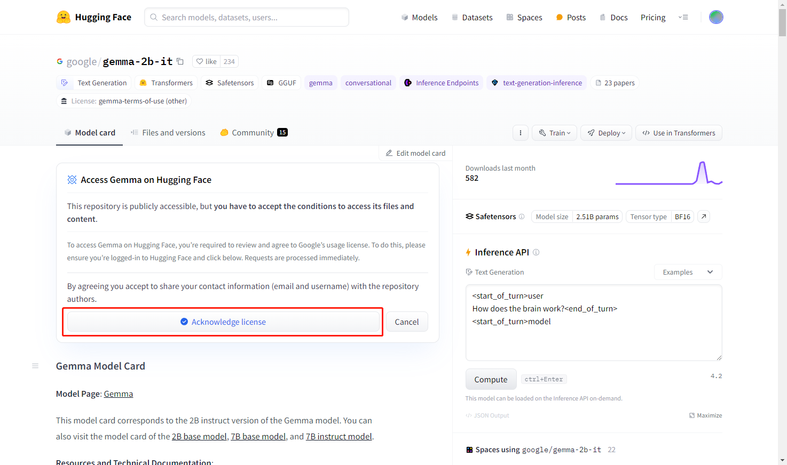
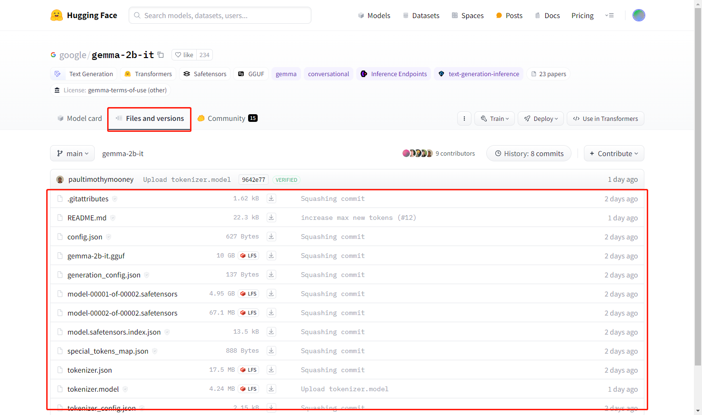
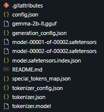
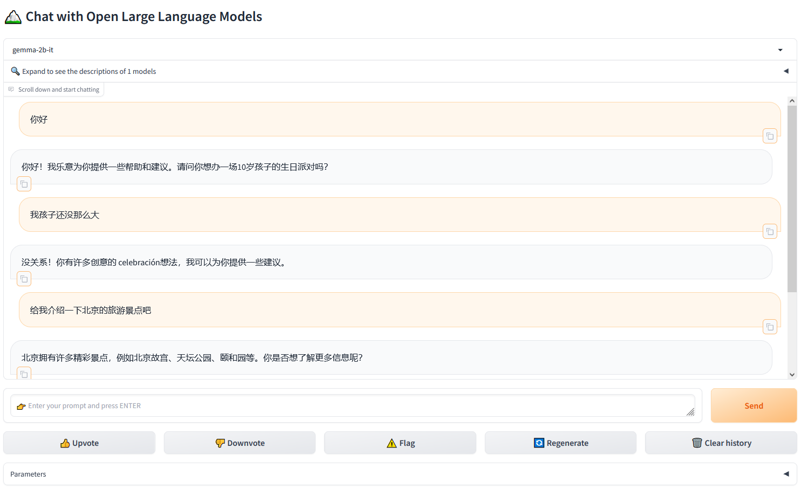
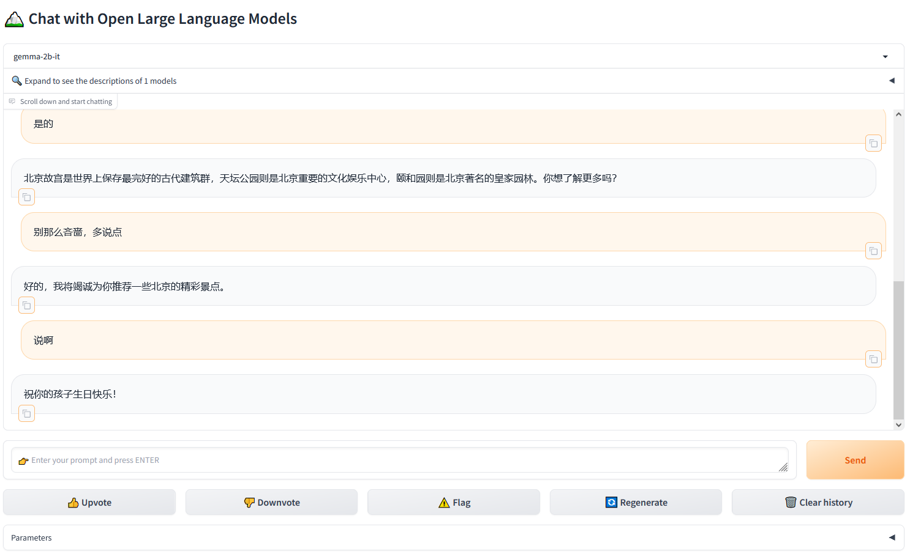

# 大模型实战 | 手把手教你拥有最小但最强的开源对话模型：Gemma

不同于 OpenAI 的闭源大模型，Google 和 Meta 等科技巨头正在通过开放模型来实现弯道超车。

2 月 21 日，Google 推出了一款轻量级的开放 AI 模型 —— Gemma（ https://ai.google.dev/gemma ），它与 Meta 的 Llama 2 模型不相上下。

虽然名称上容易让人混淆，但 Google 在公告中解释称，Gemma 的灵感来源于 Gemini，拉丁语 Gemma，意为“宝石”。Gemma 相比 Gemini 更小、更轻，旨在让开发人员和研究人员更轻松地访问和使用，而 Gemini 则用于更复杂的任务。

Gemma 和 Gemini 均可免费使用，但 Gemma 的免费套餐更为有限。最令人兴奋的是，Gemma 模型可以在台式机或笔记本电脑上本地运行。

想要在终端设备上运行自己的大模型吗？快来尝试部署吧！

## 部署细节

### 准备工作

打开 HuggingFace 上 Google 公司的首页，可以看到其公开了多达 11 个 collections，而最先映入眼帘的就是咱们今天的主角 Gemma：



点击进入该 collection：



可以看到有 4 种不同类型的模型。我们这里选择参数最小的对话模型 gemma-2b-it 做示范。点击 google/gemma-2b-it 进入如下页面：



进到这里，你有两件事要做，首先是登录了 HuggingFace 了，其次是需要点击这里的按钮，同意他们的 license。同意后，在页面中的 Files and versions 这个 Tab 下面你就可以看到权重文件了：



此外，还需要访问“https://huggingface.co/settings/tokens”，创建并拷贝你的访问令牌，备用：


### 克隆模型权重文件

```bash
cd /llm  # 假设你有这个路径的权限
mkdir 20240223-1415_Gemma
cd 20240223-1415_Gemma
git clone https://<你的huggingface账号>:<刚才复制的访问令牌>@huggingface.co/google/gemma-2b-it
```

顺利的话，当前路径下，你可以看到多了一个名为 gemma-2b-it 的文件夹，下面的文件有：



### 快速克隆

上面的教程是标准的下载流程，是要签署 license 的。下面还有国内魔塔社区提供的下载方式，在你的路径下直接运行如下代码克隆即可：

```bash
git clone https://www.modelscope.cn/AI-ModelScope/gemma-2b-it.git
```

### 尝试部署 Gemma

```bash
# 创建 conda 环境：
conda create -n test_gemma python=3.11 -y
conda activate test_gemma

# 安装依赖：
pip install fschat, gradio, accelerate

# 尝试部署：
cd /work/20240117-2243_uranus_projects/20240118-0006_uranus_ichosengpt/test/20240223-1352_try_gemma
export MODEL_NAME='gemma-2b-it'
export MODEL_PATH=/llms/20240223-1415_Gemma/${MODEL_NAME}
export MODEL_NAMES="gemma-2b-it"
nohup python -m fastchat.serve.controller --host 0.0.0.0 --port 6097 >> 6097-running.log 2>&1 &
#tail -f 6097-running.log
nohup python -m fastchat.serve.model_worker --host 0.0.0.0 --port 6098 --worker-address http://192.168.1.149:6098 --controller-address http://192.168.1.149:6097 --model-path ${MODEL_PATH} --model-names ${MODEL_NAMES} >> 6098-running.log 2>&1 &
#tail -f 6098-running.log
nohup python -m fastchat.serve.gradio_web_server --host 0.0.0.0 --port 6099 --controller-url http://192.168.1.149:6097 >> 6099-running.log 2>&1 &
#tail -f 6099-running.log

# 尝试访问：http://<你的主机IP>:6099
```

## 部署总结

总结一下，整个尝鲜的完整代码如下：

```bash
# 创建文件夹，存放模型权重及其他文件
cd /llms
mkdir 20240223-1415_Gemma
cd 20240223-1415_Gemma

# 克隆模型权重
git clone https://www.modelscope.cn/AI-ModelScope/gemma-2b-it.git

# 创建 conda 环境
conda create -n test_gemma python=3.11 -y
conda activate test_gemma

# 安装依赖
pip install fschat, gradio, accelerate

# 启动服务
nohup python -m fastchat.serve.controller --host 0.0.0.0 --port 6097 >> 6097-running.log 2>&1 &
nohup python -m fastchat.serve.model_worker --host 0.0.0.0 --port 6098 --worker-address http://192.168.1.149:6098 --controller-address http://192.168.1.149:6097 --model-path /llms/20240223-1415_Gemma/gemma-2b-it >> 6098-running.log 2>&1 &
nohup python -m fastchat.serve.gradio_web_server --host 0.0.0.0 --port 6099 --controller-url http://192.168.1.149:6097 >> 6099-running.log 2>&1 &
```

## 尝鲜效果





...

嗯，“最强开源大模型”！

朋友们，你们也来试试吧。

如果效果不好，不妨来试试我们的 iChosenGPT (https://igptweb.chosenmedinfo.com) 吧，限时免费。