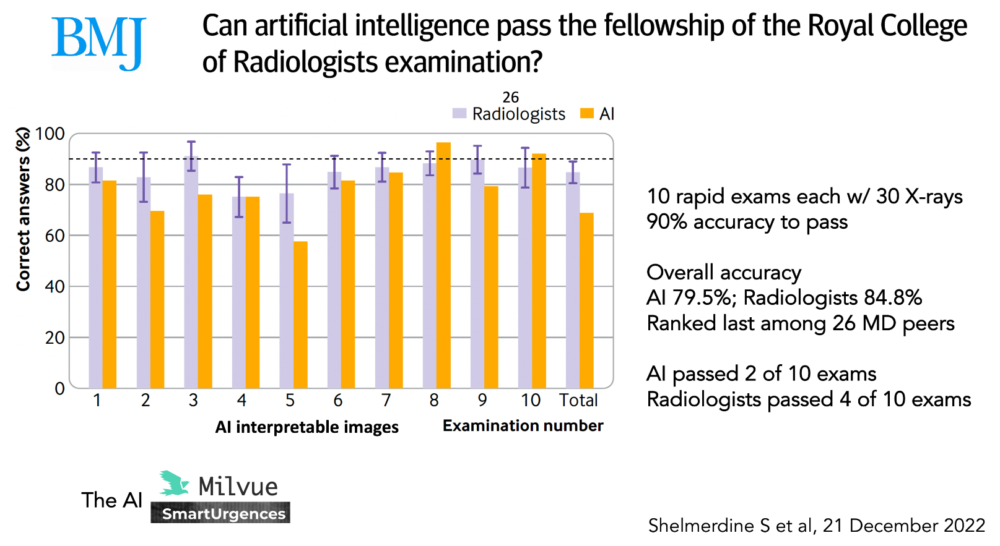
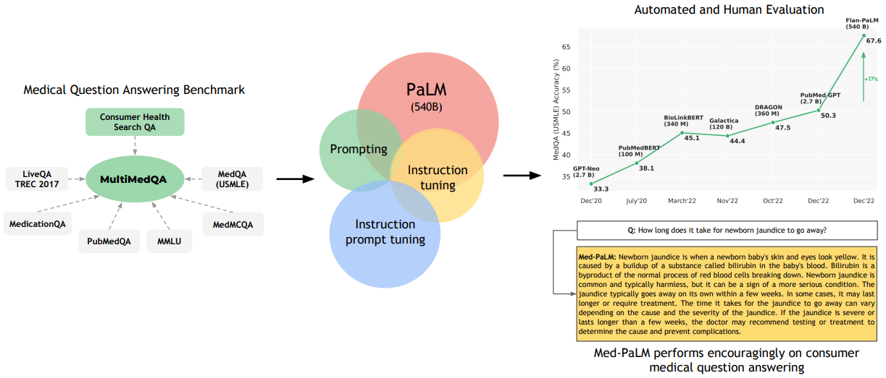
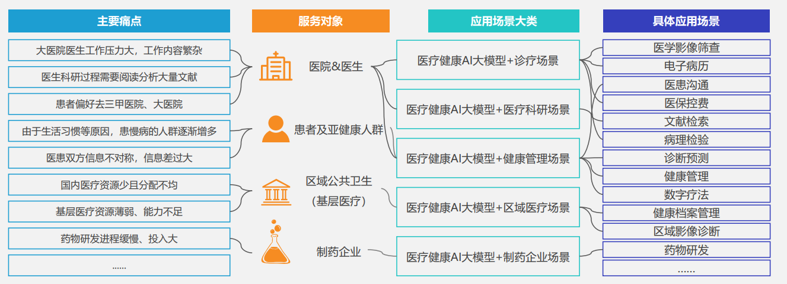
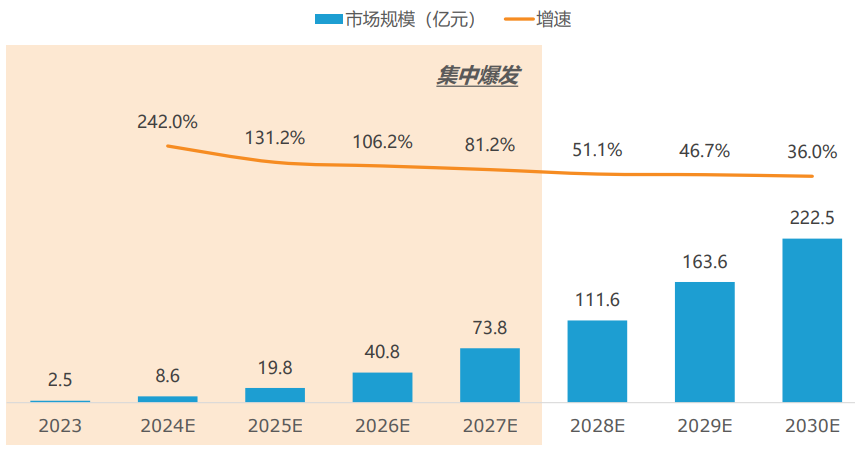

# 观点 | 医疗健康AI的历程、现状及展望

## 前言

2023年9月，习近平总书记在黑龙江考察调研期间首次提到“新质生产力”，强调整合科技创新资源，引领发展战略性新兴产业和未来产业，加快形成新质生产力。

其中医疗健康领域中的大模型（单/多模态大模型）具有广泛的应用前景，可以在药物研发、医学影像、医疗文本分析、辅助决策平台等方面发挥重要作用。这些应用有助于提升医疗服务的质量和可及性，推动医疗产业的创新发展，并促成新的产业生态和生产力的形成。

## 历程

- 在2017年，清华大学的吴及老师的团队和科大讯飞公司合作建立了 Xiaoyi，对 200 万份医疗记录和 40 万篇文章进行了训练。它能够在中国的医疗执照考试中取得 456 分的合格成绩，而 360 分以上就是合格，它在记忆和信息回忆方面表现出色，但对病人案例的分析方面表现不佳。虽然它吸引了媒体的关注，但没有人可以自信到人工智能已经准备好取代医生的位置或正式获得许可。

- 在 2020 年在医疗大数据公司曾经试图用电子病历做预训练模型。小量尝试的结果发现对 NLP 下游任务的提升并不明显，基本在 1% 准确率。

- 2022 年人工智能接受了一项具体的测试，即通过英国皇家放射学院的考试，与 26 名最近通过该考试的放射科医生进行比较，该考试包括 10 组 30 张图像，每组只有 35 分钟的解释时间。结果总结如下，被认为是人工智能可解读的图像显示，人工智能通过了 2 套考试，定义为 ≥90% 的准确率（如第 8 套和第 10 套考试），人工智能的总体准确率为 79.5%，而放射科医生为 84.8%，只通过了 4 套考试。AI 显然还有改进的余地，但这对 AI 来说还算不错，它是 Milvue 公司的一个商业产品。而且这还没有使用基础模型。

  

- 2023年，**Google Research** 和 **DeepMind** 合作在 **Nature** 上发表论文《Large Language Models Encode Clinical Knowledge》，构建了一个大型医疗问答数据集 **MultiMedQA**，包含六个医学问答数据库。他们提出了 **Flan-PaLM** 和 **Med-PaLM** 模型。专业医生评价显示，Med-PaLM 在理解、检索和推理能力上均超过 90%，接近医生水平，有显著提升。

  

  > 文献地址：https://www.nature.com/articles/s41586-023-06291-2

## 现状

图来源:2023医疗健康 AI 大模型行业研究报告

医学正处于人工智能(AI)的变革过程中。现在有充分的证据表明，专门的人工智能模型具有临床用途，可以达到甚至超过专家临床医生在狭窄任务中的表现。在《2023医疗健康 AI 大模型行业研究报告》也有提到 AI 大模型在不同人群中有不同的大模型应用场景。当前使用大型语言模型处理医疗文本可以为医疗专业人员提供更准确、快速、个性化的诊断和治疗建议，从而提高医疗效果和患者满意度。

近期，医疗领域的深度学习应用发展迅速，从过去基于单模态数据的监督学习转向利用多种数据类型的研究。这种多模态数据的引入为深度学习在医学领域带来了新的可能性，突破了单一模态数据无法捕捉到复杂疾病异质性的限制。

其中，全切片成像（WSI）、组织病理学和临床记录等数据类型可以被多方考虑服务于患者。通过放射组学和病理学，可以对放射学和组织病理学数字图像进行定量分析，提取可用于临床决策的特征。传统方法使用标准的统计方法进行特征提取，但现在可以使用深度学习框架，如深度自编码器（DAN）和视觉变压器（ViTs），实现自动化、高通量的特征提取。

这些技术能够推动了精准医疗的发展，因为深度学习模型可以综合多模态数据，考虑癌症发病率、肿瘤生长情况、治疗路径以及副作用、社会经济因素和护理目标等因素，从而实现个性化的医疗和精准治疗。然而，利用多模态数据仍然面临一些挑战，如数据集的收集和整合、数据对齐和配准、特征提取和选择、模型设计和训练等。解决这些挑战需要跨学科的合作和创新方法，以充分发挥多模态数据在医疗领域中的潜力。	

正如在 《Nature Medicine》杂志上发表的文章所述，之前我们确实没有一个实用的方法来进行多模态医学人工智能的研究。但有了大语言模型，就有了一条前进的道路，可以在很多方向上尝试。

## 预测：2023年-2027年为医疗健康AI大模型集中爆发阶段

图来源:2023医疗健康AI大模型行业研究报告

随着技术成熟度以及数据可用性增加，医疗健康 AI 大模型对医疗场景中（如药物发现、个性化医疗、医学影像、数据增强）的部分研发阻碍给出解决方案，加快医疗研发速度。同时，其生成式人工智能操作难度低，更能够被医疗领域的专业人员接受并使用。因此根据亿欧预测，2023-2027年为医疗健康AI大模型集中爆发的阶段。

虽然医疗健康 AI 大模型在一定程度上降低了某些方面的成本，但它们的使用和维护仍然需要相当的资源投入，特别是对于需要高度定制化和专业化的应用场景。

爆发原因总结：

- 研发效率大大提升。医疗健康 AI 大模型能够自动生成内容、代码、数据分析报告等。这可以帮助开发者和医疗科学家快速原型开发和测试，从而减少时间和成本的投入。

- 更易于接入的 API 服务。很多公司提供了基于这些医疗健康AI大模型的 API 服务，这意味着即使是没有深厚技术背景的用户也可以通过简单的 API 调用来利用 AI 的能力。

- 大型预训练模型可以被开发者直接使用。这减少了从头开始训练模型的需求。开发者可以通过微调这些模型来适应特定的应用场景，这大大降低了数据收集和计算资源的成本。

## 医疗健康 AI，求臻医学在路上

在 2022-2023 通用生成式大语言模型爆发与流行之前，求臻医学已经在探索将人工智能引入和应用到医疗健康领域，利用 AI 进行降本增效的同时，产出了一系列的科研论文（Briefings in Bioinformatics 2022, DATABASE 2023, ISBRA 2023）。在大语言模型盛行的今天，求臻医学亦紧跟潮流，搭建了自己的高性能 GPU 计算集群，在历年积累的大量自有及公开可获取医疗健康数据的基础上，基于开源可商用大模型进行了大量的预训练与微调，构建起了属于求臻的大语言模型能力底座 iChosenGPT（https://igpthome.chosenmedinfo.com）。目前该模型已具备文字、图片及文档对话能力，基于该能力底座构建的各种医疗健康应用也将陆续上线，欢迎持续关注。

## 相关资料

[1]. [央广网：第一观察｜习近平总书记首次提到“新质生产力”](https://news.cnr.cn/native/gd/sz/20230912/t20230912_526416651.shtml)

[2]. Singhal K, Azizi S, Tu T, et al. Large language models encode clinical knowledge[J]. Nature, 2023, 620(7972): 172-180.

[3]. 2023医疗健康AI大模型行业研究报告

[4]. [人工智能大模型赋能医疗健康产业白皮书](https://download.wezhan.cn/contents/sitefiles2032/10161022/files/754040..pdf?response-content-disposition=inline%3Bfilename%3D%25e4%25ba%25ba%25e5%25b7%25a5%25e6%2599%25ba%25e8%2583%25bd%25e5%25a4%25a7%25e6%25a8%25a1%25e5%259e%258b%25e8%25b5%258b%25e8%2583%25bd%25e5%258c%25bb%25e7%2596%2597%25e5%2581%25a5%25e5%25ba%25b7%25e4%25ba%25a7%25e4%25b8%259a%25e7%2599%25bd%25e7%259a%25ae%25e4%25b9%25a6%25ef%25bc%25882023%25ef%25bc%2589-f2%25e2%2588%259a.pdf&response-content-type=application%2Fpdf&auth_key=1709027414-ea108869deb34109b2499c981651186d-0-c7ad8676cbc9eba7f3a7792af7f45acf)

[5] iChosenGPT 官网：https://igpthome.chosenmedinfo.com