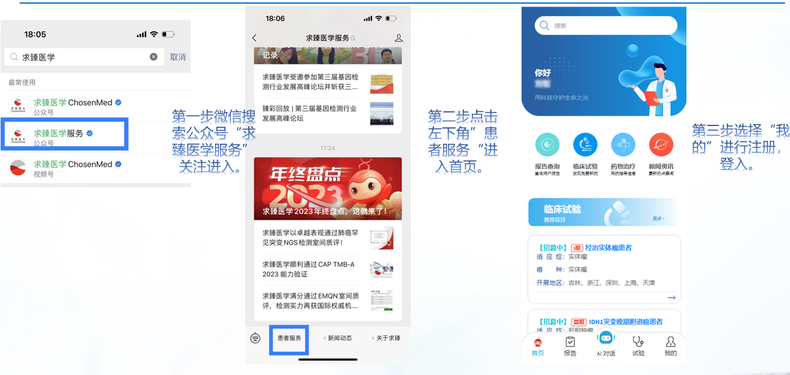
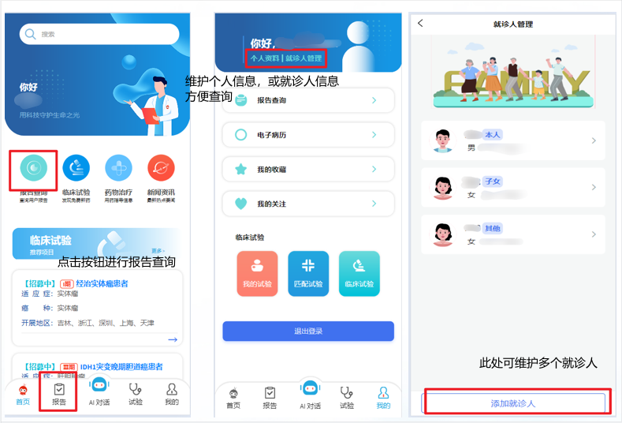
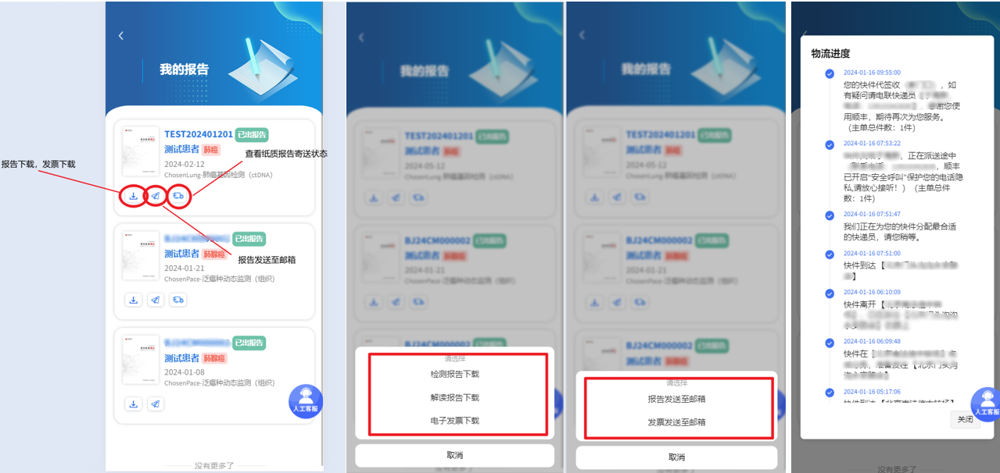
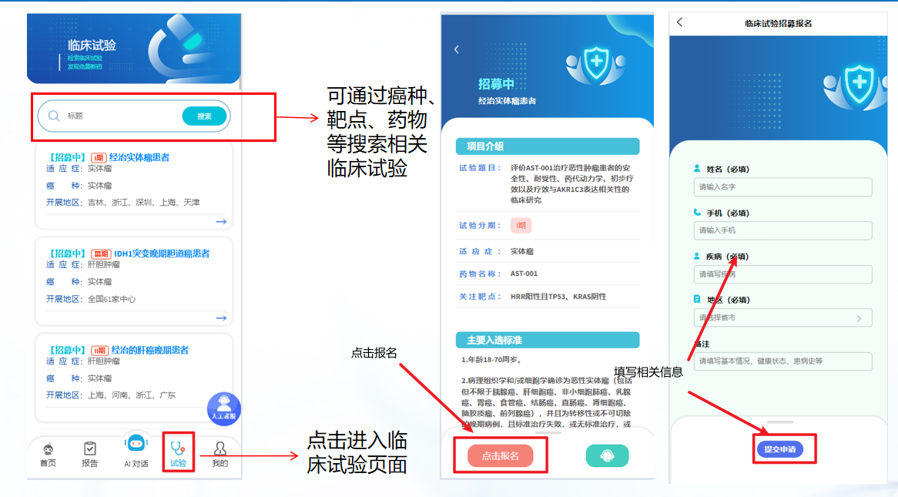

# 开启肿瘤精准诊疗新风潮：求臻医学智能化受检者服务平台报到

随着数字化和智能化浪潮的推进，医疗行业正经历着一场革命性的变革。作为肿瘤精准诊疗的领航者，求臻医学与时俱进，致力于打造一款集多项服务于一体的全新受检者服务平台。平台提供包括NGS检测报告的在线查询与下载、纸质报告申请、药物信息查询、临床试验的查询与申请、肿瘤诊疗资讯个性化推荐以及AI智能对话和智能客服等服务，致力于向患者及医疗专业人士提供更加便捷、高效的服务体验。

> 求臻医学受检者服务平台登录方式

## 报告轻松查，结果早知晓

传统的线下报告查询，往往需要患者长时间等待纸质报告，不仅耗时劳心而且还可能会影响到病情的及时诊治。求臻医学受检者服务平台的报告查询功能彻底转变了这一流程。现如今，患者仅需登录我们的平台，便能迅速查阅检测报告，大大节省了时间，简化了流程。平台还提供订单发票的在线查看服务，使患者能够随时了解医疗费用情况。除此之外，患者还可实时跟踪纸质报告的寄送状态，确保重要文件的及时送达。

> 添加就诊人

> 快捷查询方式

## 试验便捷寻，治疗新希望

临床试验作为接触尖端治疗的重要通道，传统申请过程却常因繁琐而令人望而却步。求臻医学受检者服务平台的临床试验匹配功能，为这一挑战提供了解决方案。患者仅需在平台上提交必要信息，便能轻松申请加入临床试验。与此同时，我们平台的智能系统将整合患者的详细资料，为医疗机构提供精确的患者匹配，从而加速临床试验的进程，为患者带来新的治疗希望。

> 临床试验查询与申请

## 资讯个性化，疗途更精准

肿瘤治疗的个性化需求，要求我们提供量身定制的诊疗信息。求臻医学受检者服务平台精准把握这一需求，依据患者的癌症类型、基因变异等关键信息，从庞大的肿瘤治疗资讯库中筛选并推荐最切合的资料。通过评分和排序，我们确保患者接收到的信息不仅相关，而且精确。利用尖端的数据分析和人工智能技术，平台结合患者的个人背景和医疗历程，为每个人打造个性化的诊疗资讯推荐。这些资讯覆盖治疗最新动态、临床试验信息、营养与心理支持等多维度内容，旨在满足患者在治疗旅程中的全方位信息需求，从而提升治疗效果和患者的主动参与。

> 诊疗资讯个性化推荐与收藏

## 客服智能伴，疑问即刻解

求臻医学受检者服务平台引入了基于自研大语言模型能力平台iChosenGPT的智能客服系统，确保了我们能够为用户提供全天候24小时不间断的咨询服务。无论何时何地，您都可以与我们的智能客服实时互动，轻松获取关于求臻医学的各类信息，如公司概况、服务内容、产品详情等。

智能客服致力于为您提供准确且迅速的反馈，确保您能够享受到更加便捷、高效的服务体验。然而，智能客服目前还不具备回答涉及具体疾病诊断和治疗计划的医疗咨询能力。对于这类专业性较强的医疗问题，我们建议用户咨询具备相应资质的专业医生，以获得权威指导。

## 医疗智慧化，健康触手及

受检者服务平台的推出，仅仅是求臻医学在智慧医疗领域探索的开始。展望未来，求臻医学将持续利优化该平台，进一步推进互联网医院和智慧医疗服务的发展，向患者和医疗专业人员提供更加丰富和个性化的服务选项；持续融入最新技术和创新模式，推动肿瘤精准诊疗领域的持续进步；相信在求臻医学及行业伙伴的引领加持下，智慧医疗将引领我们走向一个更加健康、便捷的未来。

## 参考链接

- 求臻医学受检者服务平台：https://service.chosenmedinfo.com