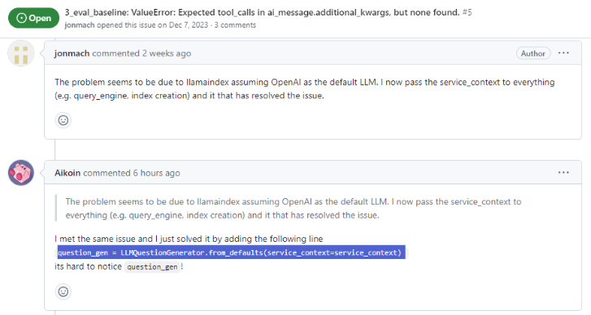

# ValueError: Expected tool_calls in ai_message.additional_kwargs, but none found

## 问题描述

- LlamaIndex中，使用 iChosenGPT-API 进行RAG时，报错“ValueError: Expected tool_calls in ai_message.additional_kwargs, but none found.”

- 但是将API换成OpenAI自身的却没有问题

## 问题排查

- 网络各种搜索，包括Llama-Index文档，以及 GitHub issues，还有 Google，都没有搜到能完全解决问题的答案，但是 issue 中有人提到这个：

    

- 看完依然不知所云，不知道这个用在哪里；

- 继续查看 SubQuestionQueryEngine 相关代码：

    

- OK，那就来试试：

    - 原代码：

        ```python
        query_engine_tools = [
            QueryEngineTool(
                query_engine=vector_query_engine,
                metadata=ToolMetadata(
                    name="report_docs",
                    description="NGS Report Interpreter",
                ),
            ),
        ]
        
        query_engine = SubQuestionQueryEngine.from_defaults(
            query_engine_tools=query_engine_tools,
            use_async=True,
        )
        ```

    - 修改后：

        ```python
        query_engine_tools = [
            QueryEngineTool(
                query_engine=vector_query_engine,
                metadata=ToolMetadata(
                    name="report_docs",
                    description="NGS Report Interpreter",
                ),
            ),
        ]

        from llama_index.question_gen.llm_generators import LLMQuestionGenerator
        question_gen = LLMQuestionGenerator.from_defaults(service_context=service_context)

        query_engine = SubQuestionQueryEngine.from_defaults(
            question_gen=question_gen,  # 非常重要，不加的话默认使用 OpenAIQuestionGenerator
            query_engine_tools=query_engine_tools,
            use_async=True,
        )
        ```

- 搞定！