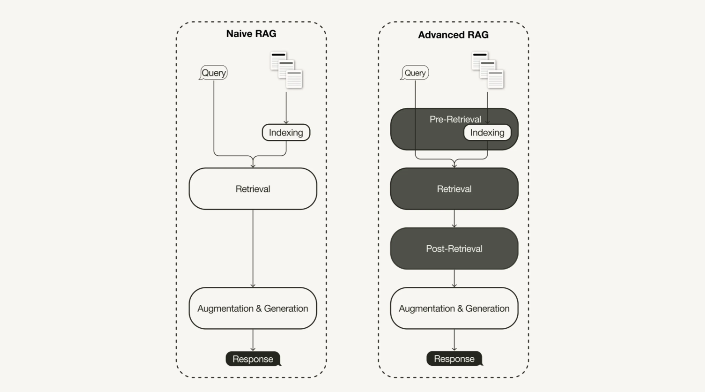
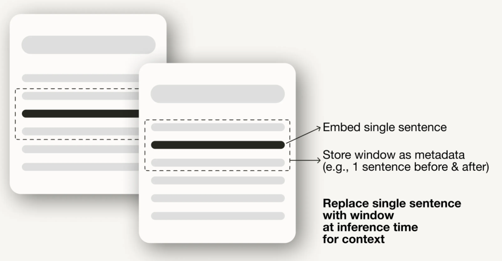
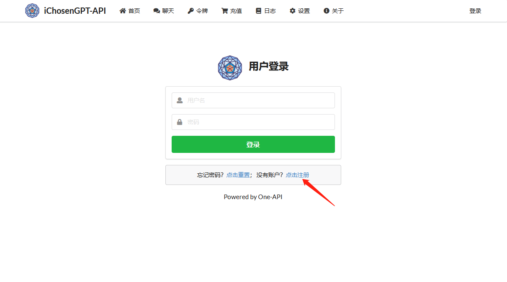
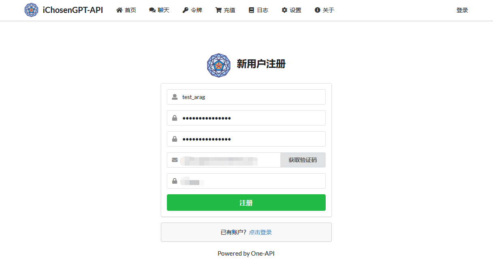
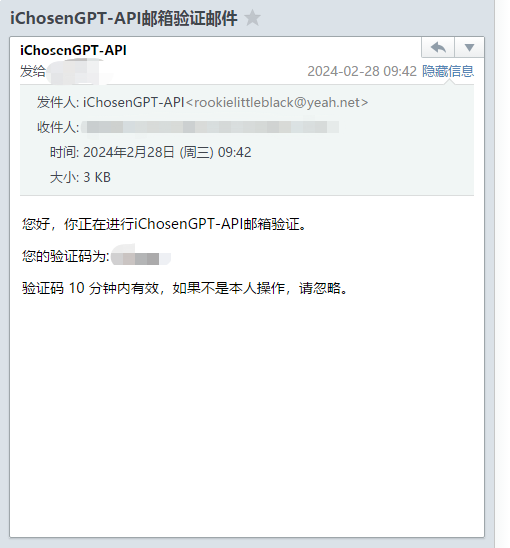
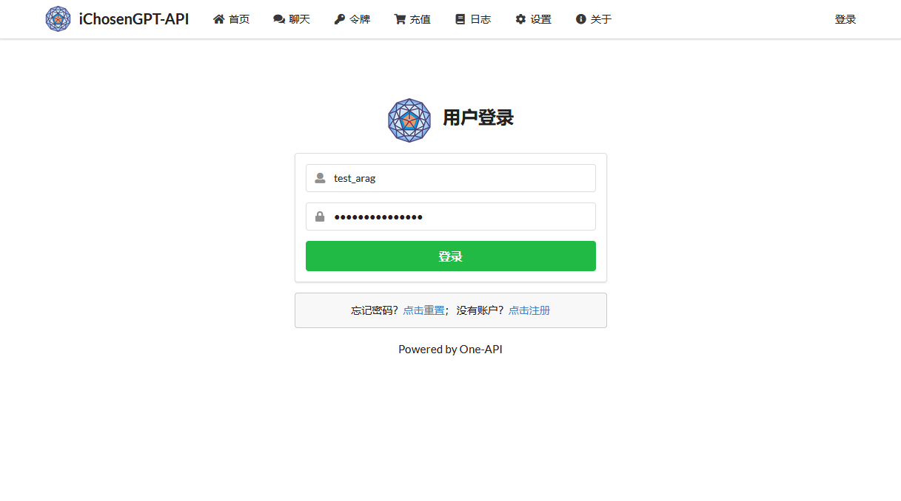
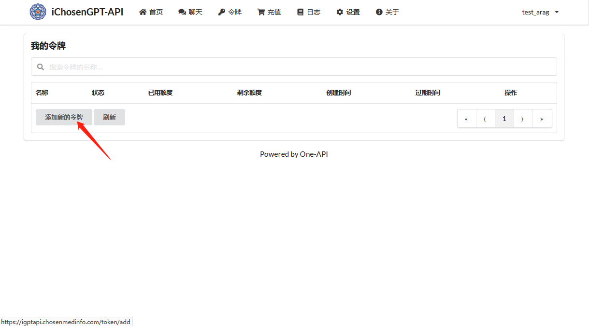
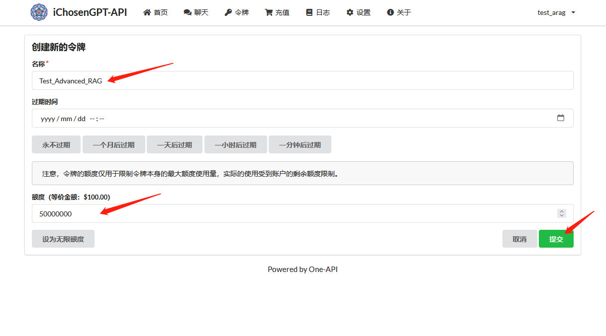
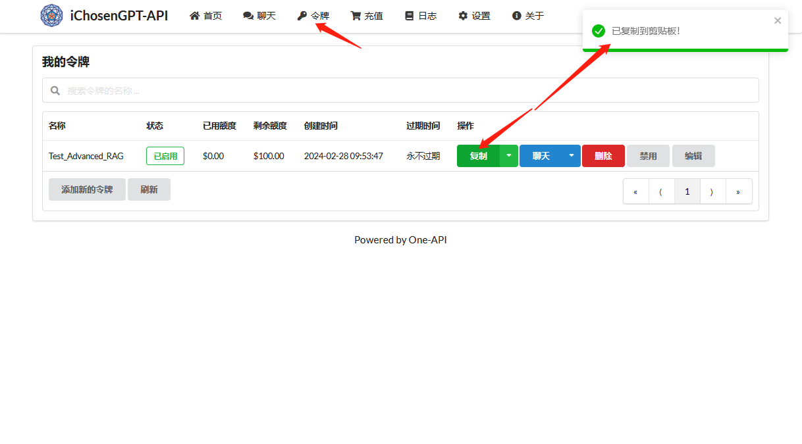

# 高级 RAG 的理论与实战

> 本文将重点研究如何通过在 Python 中实现针对性的高级 RAG 技术来解决朴素 RAG 管道（naive RAG pipelines）的局限性。

最近一项关于检索增强生成（RAG）的调查<sup>[1]</sup> 总结了三种最近发展起来的范式：

- 朴素 RAG（naive RAG）
- 高级 RAG（advanced RAG）
- 模块化 RAG（modular RAG）

高级RAG范式包括一系列针对朴素 RAG 已知局限性的针对性技术。本文首先讨论这些技术，可以分为检索前、检索和检索后优化。

在后半部分，你将学习如何使用 Python 中的 Llamaindex 实现一个朴素 RAG 管道，然后使用以下高级 RAG 技术之一将其增强为高级 RAG 管道：

- 检索前优化：句子窗口检索
- 检索优化：混合搜索
- 检索后优化：重新排名

本文将重点介绍高级 RAG 范式及其实现。

## 高级 RAG 理论

### 何谓高级 RAG

随着 RAG 领域的最新进展，高级 RAG 作为一种新的范式应运而生，旨在针对朴素 RAG 范式的某些局限性进行有针对性的增强。正如上面所提及的最近一项调查所总结的，高级 RAG 技术可以分为检索前、检索和检索后优化。



### 检索前优化

检索前优化侧重于**数据索引优化**和**查询优化**。数据索引优化技术旨在*以有助于提高检索效率的方式存储数据*，例如：

- **滑动窗口**：使用块之间的重叠，是最简单的技术之一。

- **增强数据粒度**：应用数据清理技术，如删除无关信息、确认事实准确性、更新过时信息等。

- **添加元数据**：如日期、目的或章节，用于过滤目的。

- **优化索引结构**：使用不同的策略来索引数据，如调整块大小或使用多索引策略。

> 本文将实现的一种技术是句子窗口检索，它为检索嵌入单个句子，并在推理时用较大的文本窗口替换它们。



此外，检索前技术不仅限于数据索引，还可以涵盖推理时的技术，如查询路由、查询重写和查询扩展。

### 检索优化

检索阶段的目标是**识别最相关的上下文**。通常，检索是基于向量搜索的，它计算查询和索引数据之间的语义相似性。因此，大多数检索优化技术都围绕着**嵌入模型**：

- **微调嵌入模型**：将嵌入模型定制到特定领域的上下文，特别是对于具有不断演变或罕见术语的领域。例如，BAAI/bge-small-en 是一个高性能的嵌入模型，可以进行微调。

- **动态嵌入**：与静态嵌入不同，它可以根据单词使用的上下文进行调整，而静态嵌入则为每个单词使用一个单一的向量。例如，OpenAI 的text-embeddings-ada-02 是一个复杂的动态嵌入模型，可以捕捉上下文理解。

除了**向量搜索**之外，还有其他检索技术，例如**混合搜索**，通常指的是将向量搜索与**基于关键字的搜索**相结合的概念。如果你的检索需要精确的关键字匹配，这种检索技术是有益的。

### 检索后优化

检索到的上下文的额外处理（post-processing）可以帮助解决超出上下文窗口限制或引入噪声等问题，从而妨碍对关键信息的关注。在前述 RAG 调查中总结的检索后优化技术包括：

- **提示压缩**：通过**删除无关信息**和**突出重要上下文**来减少总体提示长度。

- **重新排名**：使用**机器学习模型**重新计算检索到的上下文的**相关性分数**。


## 高级 RAG 实战

### 前提条件

本文将指导你使用 Python 中的 LlamaIndex 实现一个简单的和一个高级的 RAG 管道。

本节将介绍本文后续实战部分所需要的依赖包以及 API 密钥。

#### 安装依赖包

```bash
# 为本文单独创建一个 conda 环境
conda create -n test_blog_advancedrag python=3.11 -y
conda activate test_blog_advancedrag

# 安装最新版本的 LlamaIndex，本文实测时的版本号为
pip install llama-index

# 安装 python-dotenv，用于后续从 .env 环境变量配置文件中读取配置项到环境变量中
pip install python-dotenv

# 安装 socksio，用于后续 weaviate 连接
pip install httpx[socks]

# 高级 RAG 中会用到
pip install torch sentence-transformers
```

> 这里，我们创建了一个单独的 conda 环境。如果你不想单独创建，而且已经安装了 llama-index 依赖包的话，请确保该包的版本为 v0.10.XX，因为 llama-index 的升级中，v0.9 到 v0.10 还是做了不少改动的（比如一个比较大的改动是，v0.10 完全弃用了 ServiceContext）！
> 
> 如果你的版本是较早的版本，你可以通过以下代码实现升级（请注意，升级前请确保不会影响到其他代码的调用）：

```bash
pip uninstall -r <(pip list --format=freeze | grep "^llama-index" | cut -d = -f 1) 
pip install llama-index==0.10.12 --no-cache-dir --force-reinstall
pip install llama-index-llms-openai-like
```

LlamaIndex 提供了一个选项，可以将向量嵌入本地存储在 JSON 文件中，以实现持久存储，这对于快速原型设计一个想法非常有用。但是，由于我们旨在为企业级应用程序使用高级 RAG 技术，因此我们将使用**向量数据库**进行持久存储。

由于我们需要**元数据存储**和**混合搜索**功能，以及**存储向量嵌入**，因此我们将使用支持这些功能的开源向量数据库 **Weaviate（v3.26.2）**。

```bash
pip install weaviate-client llama-index-vector-stores-weaviate
```

#### 获取 API 密钥

我们将使用嵌入式 Weaviate，您可以免费使用，而无需注册API密钥。但是，本教程使用 iChosenGPT 的嵌入模型和LLM（为什么不使用 OpenAI 的API？答案很简单，国内用不了），为此您需要 iChosenGPT API 密钥。要获取一个，您需要一个 iChosenGPT 帐户（iChosenGPT-API 管理平台地址：https://igptapi.chosenmedinfo.com），并生成你自己的专属 API 密钥：

- 访问 iChosenGPT-API，注册账号：







- 用新注册的账号登录系统（或者如果你已经有账号，可以直接从这里开始）：



- 进入“令牌”管理页面，点击“添加新的令牌”按钮，创建新的令牌：





- 到这里，你已经可以在“令牌”管理列表页面看到新创建的令牌了，点击“复制”按钮，即可获取你的令牌，也就 iChosenGPT API Key 了：



接下来，在你项目的根目录中创建一个本地 .env 文件，并在其中定义您的 API 密钥（iChosenGPT API Key）和 API base (https://igptapi.chosenmedinfo.com/v1)：

```bash
# 为本项目创建新的工作空间
mkdir 20240228-0934_test_blog_advancedrag
cd 20240228-0934_test_blog_advancedrag

# 创建环境变量配置文件
vim .env
```

该 .env 文件内容如下：

```text
OPENAI_API_KEY="<YOUR_OPENAI_API_KEY>"

OPENAI_API_BASE="https://igptapi.chosenmedinfo.com/v1"
MODEL_NAME_EMBED="text-embedding-ada-002"
MODEL_DIME_EMBED="1024"
MODEL_NAME_LLM="iChosenGPTtlv0"
```

上面代码中的“<YOUR_OPENAI_API_KEY>”替换为你刚才在 iChosenGPT-API 的令牌页面复制得到的 API Key 即可。

接下来，你就可以在项目中，通过如下代码将配置内容读取到环境变量中：

```python
import os
from dotenv import load_dotenv,find_dotenv

load_dotenv(find_dotenv())
print(f"os.environ['OPENAI_API_BASE']: {os.environ['OPENAI_API_BASE']}")
```

运行上述代码，如果打印的结果为“os.environ['OPENAI_API_BASE']: https://igptapi.chosenmedinfo.com/v1”即表示配置成功，你可以安心往下进行了！

#### 下载示例数据

接下来，你将在根目录下创建一个名为 data 的本地目录，并从 LlamaIndex GitHub 代码库（MIT 许可）中下载一些示例数据。

```bash
mkdir data
cd data
wget https://raw.githubusercontent.com/run-llama/llama_index/main/docs/examples/data/paul_graham/paul_graham_essay.txt
cd ..
```

这样，你的项目根路径下就有文件“./data/paul_graham_essay.txt”可供后续使用了！

#### 下载 BAAI 的重排模型

```bash
cd /llms
mkdir 20240228-1159_BAAI
cd 20240228-1159_BAAI
#git clone https://huggingface.co/BAAI/bge-reranker-large.git
git clone https://www.modelscope.cn/quietnight/bge-reranker-large.git
```

下载完成后，你将可以通过路径“/llms/20240228-1159_BAAI/bge-reranker-large”访问这个 reranker 模型了！

### 使用 LlamaIndex 实现朴素 RAG

本节讨论如何使用 LlamaIndex 实现朴素的 RAG 管道。

#### 步骤1：定义嵌入模型和 LLM

首先，您可以在全局设置对象中定义嵌入模型和 LLM。这样做意味着您不必在代码中再次显式指定模型。

- **嵌入模型**：用于为文档块和查询生成向量嵌入。

- **LLM**：用于根据用户查询和相关上下文生成答案。

```python
from llama_index.core.settings import Settings
from llama_index.embeddings.openai import OpenAIEmbedding
from llama_index.legacy.llms.openai_like import OpenAILike

Settings.llm = OpenAILike(
    timeout=600,  # secs
    is_chat_model=True,
    is_function_calling_model=True,
    context_window=32768,
    temperature=0.1,
    model=os.environ['MODEL_NAME_LLM'],
)
Settings.embed_model = OpenAIEmbedding(
    model=os.environ['MODEL_NAME_EMBED'],
    embed_batch_size=100
)
```

#### 步骤 2：加载数据

加载前面下载的示例数据进行后续测试：

```python
from llama_index.core import SimpleDirectoryReader

# Load data
documents = SimpleDirectoryReader(
    input_files=["./data/paul_graham_essay.txt"]
).load_data()
print(f"len(documents): {str(len(documents))}")
```

#### 步骤3：将文档分割成节点

由于整个文档太大，无法适应 LLM 的上下文窗口，因此需要将其划分为较小的文本块，这些块在 LlamaIndex 中称为节点（node）。您可以使用定义的块大小为 1024 的 SimpleNodeParser 将加载的文档解析为节点。

```python
from llama_index.core.node_parser import SimpleNodeParser

node_parser = SimpleNodeParser.from_defaults(chunk_size=1024)

# Extract nodes from documents
nodes = node_parser.get_nodes_from_documents(documents)
print(f"len(nodes): {str(len(nodes))}")
```

#### 步骤 4：创建索引

接下来，您将在开源向量数据库 Weaviate 中建立索引，存储所有外部知识。

首先，您需要连接到 Weaviate 实例。在本例中，我们使用的是 Weaviate Embedded，它可以让你在没有 API 密钥的情况下免费在笔记本中进行实验。对于生产就绪的解决方案，建议通过 Docker 或托管服务等方式自行部署 Weaviate。

```python
import weaviate
from weaviate.embedded import EmbeddedOptions

# Connect to your Weaviate instance
client = weaviate.Client(
  embedded_options=EmbeddedOptions(
    port=6098,
    grpc_port=6099
  )
)
```

接下来，你将从 Weaviate 客户端创建一个 VectorStoreIndex，用于存储数据并与之交互。

```python
from llama_index.core import VectorStoreIndex, StorageContext
from llama_index.vector_stores.weaviate import WeaviateVectorStore

index_name = "IChosenGPTExternalContext"  # Index name must start with a capital letter, e.g. 'LlamaIndex'!

# Construct vector store
vector_store = WeaviateVectorStore(
    weaviate_client = client, 
    index_name = index_name
)

# Set up the storage for the embeddings
storage_context = StorageContext.from_defaults(vector_store=vector_store)

# Setup the index
# build VectorStoreIndex that takes care of chunking documents
# and encoding chunks to embeddings for future retrieval
index = VectorStoreIndex(
    nodes,
    storage_context = storage_context,
)
```

#### 步骤 5：设置查询引擎

最后，将索引设置为查询引擎。

```python
# The QueryEngine class is equipped with the generator
# and facilitates the retrieval and generation steps
query_engine = index.as_query_engine()
```

### 步骤 6：对数据进行朴素 RAG 查询

现在，您可以在数据上运行一个朴素 RAG 查询，如下所示：

```python
# Run your naive RAG query
response = query_engine.query(
    "What happened at Interleaf?"
)
```

### 使用 LlamaIndex 实现高级 RAG

在本节中，我们将介绍一些简单的调整方式，以便将上述朴素的 RAG 管道转变为高级管道。本演练将涵盖以下一些高级 RAG 技术：

- 检索前优化：句子窗口检索
- 检索优化：混合搜索
- 检索后优化：重新排序

#### 索引优化示例：句子窗口检索

对于句子窗口检索技术，您需要做出两点调整：首先，您必须调整存储和后处理数据的方式。我们将使用 SentenceWindowNodeParser 来代替 SimpleNodeParser。

```python
from llama_index.core.node_parser import SentenceWindowNodeParser

# create the sentence window node parser w/ default settings
node_parser = SentenceWindowNodeParser.from_defaults(
    window_size=3,
    window_metadata_key="window",
    original_text_metadata_key="original_text",
)
```

SentenceWindowNodeParser 有两个功能：

- 将文档分离成单句，并嵌入其中。

- 为每个句子创建一个上下文窗口。如果指定 window_size = 3，则窗口长度为三个句子，从嵌入句子的前一个句子开始，横跨后一个句子。窗口将作为元数据存储。

在检索过程中，会返回与查询最匹配的句子。检索结束后，您需要定义一个 MetadataReplacementPostProcessor，并将其用于 node_postprocessors列表中，从而用元数据中的整个窗口替换该句子。

```python
from llama_index.core.postprocessor import MetadataReplacementPostProcessor

# The target key defaults to `window` to match the node_parser's default
postproc = MetadataReplacementPostProcessor(
    target_metadata_key="window"
)

...

query_engine = index.as_query_engine( 
    node_postprocessors = [postproc],
)
```

#### 检索优化示例：混合搜索

如果底层向量数据库支持混合搜索查询，那么在 LlamaIndex 中实施混合搜索只需修改 query_engine 的两个参数即可。alpha 参数指定了向量搜索和基于关键字的搜索之间的权重，其中 alpha=0 表示基于关键字的搜索，alpha=1 表示纯向量搜索。

```python
query_engine = index.as_query_engine(
    ...,
    vector_store_query_mode="hybrid", 
    alpha=0.5,
    ...
)
```

#### 检索后优化示例：重新排序

在高级 RAG 管道中添加重排器只需三个简单步骤：

- 首先，定义 reranker 模型。在这里，我们使用的是 Hugging Face 中的 BAAI/bge-ranker-large 模型。

- 在查询引擎中，将 reranker 模型添加到 node_postprocessors 列表中。

- 增加查询引擎中的 similarity_top_k，以检索更多的上下文段落，重新排序后可将其减少到 top_n。


```python
# !pip install torch sentence-transformers
from llama_index.core.postprocessor import SentenceTransformerRerank

# Define reranker model
rerank = SentenceTransformerRerank(
    top_n = 2, 
    model = "/llms/20240228-1159_BAAI/bge-reranker-large"
)

...

# Add reranker to query engine
query_engine = index.as_query_engine(
  similarity_top_k = 6,
  ...,
  node_postprocessors = [rerank],
  ...,
)
```

在高级 RAG 范式中还有更多不同的技术，我们将持续探索，并不定期发布。

## 总结

本文介绍了高级 RAG 的概念，它涵盖了一系列技术来解决朴素 RAG 范式的局限性。

在概述了高级 RAG 技术（可分为检索前技术、检索技术和检索后技术）之后，本文使用 LlamaIndex 实现了一个朴素和高级 RAG 管道。

RAG 管道的组成部分包括 iChosenGPT 的语言模型、BAAI 在 Hugging Face 上托管的 reranker 模型以及 Weaviate 向量数据库。

我们使用 Python 中的 LlamaIndex 实现了以下部分技术：

- 检索前优化：句子窗口检索

- 检索优化：混合搜索

- 检索后优化：重新排序

### 环境变量配置文件代码

.env 文件：

```text
OPENAI_API_KEY="XXXXXX"
OPENAI_API_BASE="https://igptapi.chosenmedinfo.com/v1"
MODEL_NAME_EMBED="text-embedding-ada-002"
MODEL_DIME_EMBED="1024"
MODEL_NAME_LLM="iChosenGPTtlv0"
```

### 朴素 RAG 完整代码

```python
import os
from dotenv import load_dotenv,find_dotenv

load_dotenv(find_dotenv())
print(f"os.environ['OPENAI_API_BASE']: {os.environ['OPENAI_API_BASE']}")


### Step 1
from llama_index.core.settings import Settings
from llama_index.llms.openai_like import OpenAILike  # attention: DONOT use "from llama_index.legacy.llms.openai_like import OpenAILike"!!!
from llama_index.embeddings.openai import OpenAIEmbedding

Settings.llm = OpenAILike(
    timeout=600,  # secs
    is_chat_model=True,
    is_function_calling_model=True,
    context_window=32768,
    temperature=0.1,
    model=os.environ['MODEL_NAME_LLM'],
)
Settings.embed_model = OpenAIEmbedding(
    model=os.environ['MODEL_NAME_EMBED'],
    embed_batch_size=100
)


### Step 2
from llama_index.core import SimpleDirectoryReader

# Load data
documents = SimpleDirectoryReader(
    input_files=["./data/paul_graham_essay.txt"]
).load_data()
print(f"len(documents): {str(len(documents))}")


### Step 3
from llama_index.core.node_parser import SimpleNodeParser

node_parser = SimpleNodeParser.from_defaults(chunk_size=1024)

# Extract nodes from documents
nodes = node_parser.get_nodes_from_documents(documents)
print(f"len(nodes): {str(len(nodes))}")


### Step 4
import weaviate
from weaviate.embedded import EmbeddedOptions

# Connect to your Weaviate instance
client = weaviate.Client(
  embedded_options=EmbeddedOptions(
    port=6098,
    grpc_port=6099
  )
)


from llama_index.core import VectorStoreIndex, StorageContext
from llama_index.vector_stores.weaviate import WeaviateVectorStore

index_name = "IChosenGPTExternalContext"  # Index name must start with a capital letter, e.g. 'LlamaIndex'!

# Construct vector store
vector_store = WeaviateVectorStore(
    weaviate_client = client, 
    index_name = index_name
)

# Set up the storage for the embeddings
storage_context = StorageContext.from_defaults(vector_store=vector_store)

# Setup the index
# build VectorStoreIndex that takes care of chunking documents
# and encoding chunks to embeddings for future retrieval
index = VectorStoreIndex(
    nodes,
    storage_context = storage_context,
)


### Step 5
# The QueryEngine class is equipped with the generator
# and facilitates the retrieval and generation steps
query_engine = index.as_query_engine()


### Step 6: Run your naive RAG query
query = "What happened at Interleaf?"
response = query_engine.query(query)
print(f"\n=============================================")
print(f"Query: {str(query)}")
print(f"Response: {str(response)}")
print(f"=============================================\n")
```

### 高级 RAG 完整代码

```python
import os
from dotenv import load_dotenv,find_dotenv

load_dotenv(find_dotenv())
print(f"os.environ['OPENAI_API_BASE']: {os.environ['OPENAI_API_BASE']}")


### Step 1
from llama_index.core.settings import Settings
from llama_index.llms.openai_like import OpenAILike  # attention: DONOT use "from llama_index.legacy.llms.openai_like import OpenAILike"!!!
from llama_index.embeddings.openai import OpenAIEmbedding

Settings.llm = OpenAILike(
    timeout=600,  # secs
    is_chat_model=True,
    is_function_calling_model=True,
    context_window=32768,
    temperature=0.1,
    model=os.environ['MODEL_NAME_LLM'],
)
Settings.embed_model = OpenAIEmbedding(
    model=os.environ['MODEL_NAME_EMBED'],
    embed_batch_size=100
)


### Step 2
from llama_index.core import SimpleDirectoryReader

# Load data
documents = SimpleDirectoryReader(
    input_files=["./data/paul_graham_essay.txt"]
).load_data()
print(f"len(documents): {str(len(documents))}")


### Step 3
from llama_index.core.node_parser import SentenceWindowNodeParser

# create the sentence window node parser w/ default settings
node_parser = SentenceWindowNodeParser.from_defaults(
    window_size=3,
    window_metadata_key="window",
    original_text_metadata_key="original_text",
)

# Extract nodes from documents
nodes = node_parser.get_nodes_from_documents(documents)
print(f"len(nodes): {str(len(nodes))}")


### Step 4
import weaviate
from weaviate.embedded import EmbeddedOptions

# Connect to your Weaviate instance
client = weaviate.Client(
  embedded_options=EmbeddedOptions(
    port=6098,
    grpc_port=6099
  )
)


from llama_index.core import VectorStoreIndex, StorageContext
from llama_index.vector_stores.weaviate import WeaviateVectorStore

index_name = "IChosenGPTExternalContext"  # Index name must start with a capital letter, e.g. 'LlamaIndex'!

# Construct vector store
vector_store = WeaviateVectorStore(
    weaviate_client = client, 
    index_name = index_name
)

# Set up the storage for the embeddings
storage_context = StorageContext.from_defaults(vector_store=vector_store)

# Setup the index
# build VectorStoreIndex that takes care of chunking documents
# and encoding chunks to embeddings for future retrieval
index = VectorStoreIndex(
    nodes,
    storage_context = storage_context,
)


### Step 5
from llama_index.core.postprocessor import MetadataReplacementPostProcessor

# The target key defaults to `window` to match the node_parser's default
postproc = MetadataReplacementPostProcessor(
    target_metadata_key="window"
)

from llama_index.core.postprocessor import SentenceTransformerRerank

# Define reranker model
rerank = SentenceTransformerRerank(
    top_n = 2, 
    model = "/llms/20240228-1159_BAAI/bge-reranker-large"
)

# The QueryEngine class is equipped with the generator
# and facilitates the retrieval and generation steps
query_engine = index.as_query_engine( 
    node_postprocessors = [postproc, rerank],
    vector_store_query_mode="hybrid", 
    alpha=0.5,
    similarity_top_k = 6,
)


### Step 6: Run your naive RAG query
query = "What happened at Interleaf?"
response = query_engine.query(query)
print(f"\n=============================================")
print(f"Query: {str(query)}")
print(f"Response: {str(response)}")
print(f"=============================================\n")
```


## 参考文献

[1] Gao, Y., Xiong, Y., Gao, X., Jia, K., Pan, J., Bi, Y., … & Wang, H. (2023). Retrieval-augmented generation for large language models: A survey. arXiv preprint arXiv:2312.10997.

[2] https://towardsdatascience.com/advanced-retrieval-augmented-generation-from-theory-to-llamaindex-implementation-4de1464a9930
