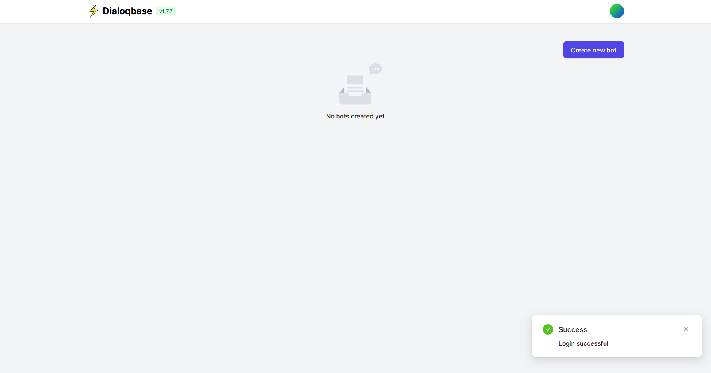
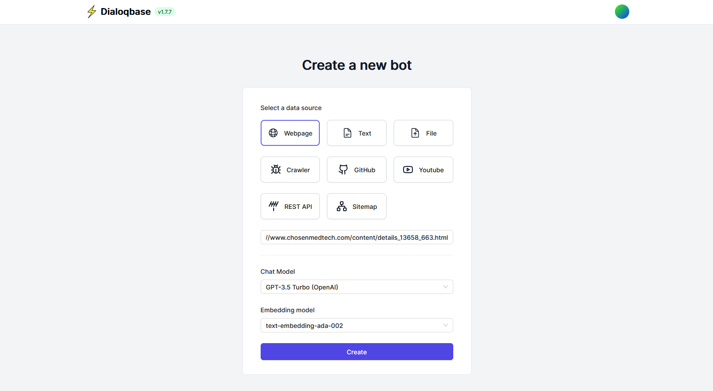
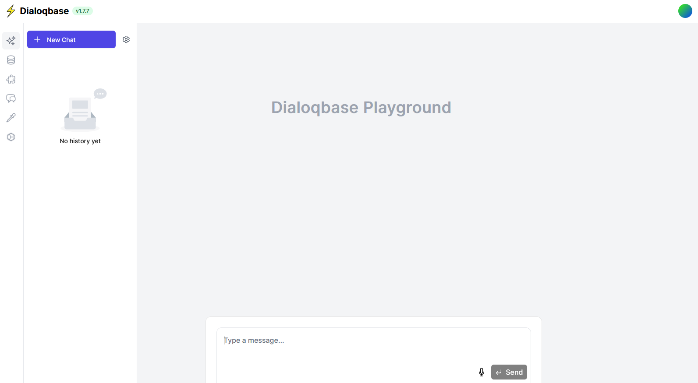
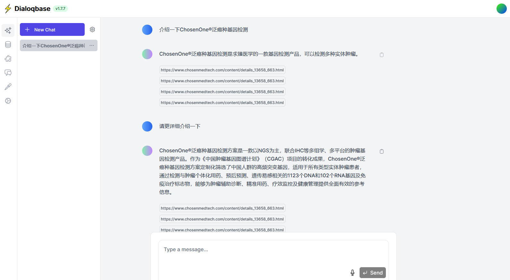

# 纯实战 - 基于开源项目 diaqlobase 搭建你的私域知识库问答系统

## 系统部署

### 本地环境准备

```bash
export PROJECT_ROOT_DIR=<YOUR_PROJECT_ROOT_DIR>
```

```bash
cd ${PROJECT_ROOT_DIR}
mkdir -p share/postgres
mkdir -p share/redis
mkdir -p share/uploads
```

### 拉取代码

```bash
cd ${PROJECT_ROOT_DIR}
git clone https://github.com/n4ze3m/dialoqbase.git
```

### 拉取镜像

```bash
cd ${PROJECT_ROOT_DIR}/dialoqbase/docker
docker-compose pull
```

这里会拉取`${PROJECT_ROOT_DIR}/dialoqbase/docker/docker-compose.yml`中的三个镜像：`n4z3m/dialoqbase:latest`、`ankane/pgvector:latest`、`redis:latest`。

为避免对系统中其他项目用到的镜像产生影响，拉取完成后可以分别进行重命名：

```bash
docker tag n4z3m/dialoqbase:latest test_dialoq_0320:latest  # 重命名！
docker tag redis:latest test_dialoq_0320_redis:latest  # 重命名！
docker tag ankane/pgvector:latest test_dialoq_0320_pg:latest  # 重命名！
docker rmi n4z3m/dialoqbase:latest  # 删除旧的标签！
docker rmi redis:latest  # 删除旧的标签！
docker rmi ankane/pgvector:latest  # 删除旧的标签！
```

查看镜像，应该显示如下：

```bash
(base) docker$ docker images
REPOSITORY               TAG            IMAGE ID       CREATED         SIZE
test_dialoq_0320         latest         059594608fce   7 days ago      2.5GB
test_dialoq_0320_redis   latest         170a1e90f843   2 months ago    138MB
test_dialoq_0320_pg      latest         f2c967e41f72   5 months ago    440MB
```

### 修改 docker-compose.yml 配置

```bash
cd ${PROJECT_ROOT_DIR}/dialoqbase/docker
vim docker-compose.yml
```

这里主要是修改如下几处：

- 映射的本地路径修改为上面创建的三个本地文件夹的绝对路径；

- 修改镜像名称为上面修改后的镜像名称；

- 修改容器名称为镜像同名；

- 修改3个service名称也分别于对应的镜像同名，引用到service名称的地方也同步修改；

- 三个服务都加上端口映射；

- 第一个容器配置DNS；

- 第一个容器修改postgres和redis的连接地址为内容IP+端口的形式；

- 给3个service都添加上networks配置（test_dialoq_0320_network）；

修改后的`docker-compose.yml`如下所示：

```yaml
version: '3.9'

services:
  test_dialoq_0320:
    image: test_dialoq_0320:latest
    container_name: test_dialoq_0320
    restart: unless-stopped
    dns:
      - 8.8.8.8
      - 8.8.4.4
    ports:
      - 6087:3000
    environment:
      DATABASE_URL: postgres://postgres:postgres@<YOUR_SERVER_IP>:6088/dialoqbase?connection_limit=15&pool_timeout=0
      DB_REDIS_URL: redis://<YOUR_SERVER_IP>:6089
    env_file:
      - .env
    depends_on:
      - test_dialoq_0320_pg
      - test_dialoq_0320_redis
    volumes:
      - <YOUR_PROJECT_ROOT_DIR>/share/uploads:/app/uploads
    networks:
      - test_dialoq_0320_network

  test_dialoq_0320_pg:
    image: test_dialoq_0320_pg:latest
    container_name: test_dialoq_0320_pg
    restart: unless-stopped
    ports:
      - 6088:5432
    environment:
      POSTGRES_USER: postgres
      POSTGRES_PASSWORD: postgres
      POSTGRES_DB: dialoqbase
    volumes:
      - <YOUR_PROJECT_ROOT_DIR>/share/postgres:/var/lib/postgresql/data
    networks:
      - test_dialoq_0320_network

  test_dialoq_0320_redis:
    image: test_dialoq_0320_redis:latest
    container_name: test_dialoq_0320_redis
    restart: unless-stopped
    ports:
      - 6089:6379
    volumes:
      - <YOUR_PROJECT_ROOT_DIR>/share/redis:/data
    networks:
      - test_dialoq_0320_network

networks:
  test_dialoq_0320_network:
    driver: bridge
```

### 修改 .env 配置

```bash
cd ${PROJECT_ROOT_DIR}/dialoqbase/docker
vim .env
```

这里主要修改 OPENAI_API_KEY 参数为你的 API Key，同时添加 OPENAI_API_URL 和 OPENAI_BASE_URL 为你的 API 提供者地址，如：

```bash
OPENAI_API_KEY="<YOUE_ICHOSENGPT_API_KEY>"

## 下面两个配置是新加的！
OPENAI_API_URL="https://igptapi.chosenmedinfo.com/v1"
OPENAI_BASE_URL="https://igptapi.chosenmedinfo.com/v1"
```

### 启动容器

```bash
cd ${PROJECT_ROOT_DIR}/dialoqbase/docker
docker-compose up -d
```

待容器全部成功启动后，你可以通过 http://<YOUR_SERVER_IP>:6087 访问系统了（初始登录账号和密码均为 admin）：



## 基础使用

- 点击右上角的“Create new bot”；

- 选择 data source 为 Webpage，然后输入链接地址，如“https://www.chosenmedtech.com/content/details_13658_663.html”。聊天模型和Embedding模型保持默认：



- 该链接对应的内容很快会消化（digest）完毕，显示如下页面：



- 问两个问题试试：



没毛病！

其他的 data sources 以及更多功能，交给你自己去探索吧，enjoy！