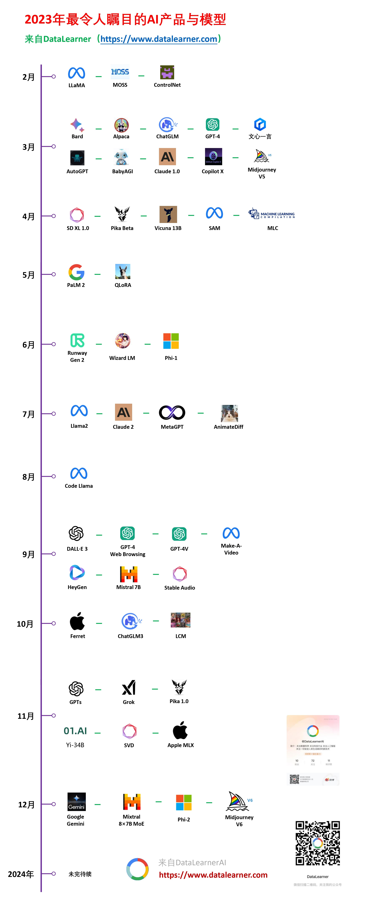
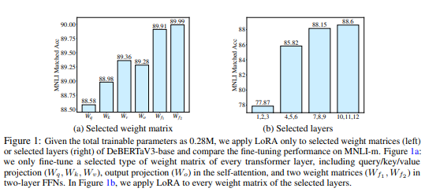
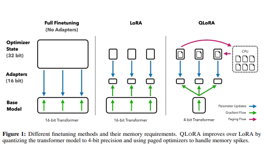

## 大模型参数高效微调技术概述
随着大模型技术的发展，大模型迎来了井喷式发展，例如 GPT4、Gemini、文心一言、LLaMA、Qwen、ChatGLM等应运而生，近日OpenAI发布的Sora模型更是惊艳众人。

注：图片来源于 [DataLeaner 数据学习](https://www.datalearner.com/) 网站

然而，由于这些大型动辄百亿、千亿甚至万亿级别的参数，预训练模型的训练需要庞大的计算资源和大量的数据，成本非常高昂，一般个人和中小型企业难以承受，这也导致了一些研究人员难以重复和验证先前的研究成果。
为此，研究人员开始研究参数高效微调 Parameter-Efficient Fine-Tuning (PEFT) 技术，即对已预训练好的模型，固定住其大部分参数，而仅调整其中小部分或额外增加的参数，以达到与全参微调相近的效果，参数高效微调因其调整的参数占比很小（小于10%甚至0.1%），所需运算资源少，从而缓解大型预训练模型的训练成本。这样一来，即使计算资源受限，也可以利用预训练模型的知识来迅速适应新任务，实现高效的迁移学习。

近年来，参数高效微调发展迅速，已出现30种以上的参数高效微调方法，可大致分为三个类别：
- 增加式方法：通过增加额外的参数或层来扩展现有的预训练模型，且仅训练新增加的参数。
  - 适配器：通过在基础模型中加入一些可调整参数的组件、模块来使模型适应下游任务，包括：Adapter Tuning。
  - 软提示词：通过某种方式达到给输入加入提示词的效果，从而适应下游任务，包括：Prefix Tuning、P-Tuning、Prompt Tuning和P-Tuning v2等。
- 选择式方法：选取模型的一部分现有参数进行微调，可以根据层的深度、层类型或者甚至是个别参数进行选择。包括：BitFit(冻结大部分Transformer编码器的参数，只训练偏置项和任务特定的分类层)。
- 重新参数化式方法：基于重新参数化的高效微调方法利用低秩表示来最小化可训练参数的数量。包括：LoRA、AdaLoRA等。

### PEFT技术的常用方法
- LORA
- Adapter Tuning
- Prompt Tuning
- Prefix Tuning
- P-Tuning v1/v2

### 1. LORA
LORA 是微软在2021年论文 [LoRA: Low-Rank Adaptation of Large Language Models](https://arxiv.org/abs/2106.09685) 中提出的微调方法。

LoRA的思路：
- 在原始 PLM (Pre-trained Language Model) 旁边增加一个旁路，做一个降维再升维的操作，来模拟所谓的intrinsic rank。
- 微调的时候冻结 PLM 的参数，只训练降维矩阵 A 与升维矩阵 B。而模型的输入输出维度不变，输出时将 BA 与 PLM 的参数叠加。
- 用随机高斯分布初始化 A，用 0 矩阵初始化 B，保证训练的开始此旁路矩阵依然是 0 矩阵。

LoRA的特点：
- 将矩阵乘积 BA 加到原模型参数矩阵W上可以避免推理延迟。
- 可插拔的低秩分解矩阵模块，方便切换到不同的任务。

### 2. Adapter Tuning
Adapter Tuning 是谷歌在2019年论文 [Parameter-Efficient Transfer Learning for NLP](https://arxiv.org/pdf/1902.00751.pdf) 中提出针对 BERT 的微调方式。

Adapter Tuning的思路：
- 首先，选择一个适合任务的预训练模型，例如BERT、GPT等。这些预训练模型在大规模数据上进行了训练，具有较强的语义表示能力。
- 在选择的预训练模型中，为目标任务添加适配器层。适配器层是一个小型的任务特定层，通常由一个或多个全连接层组成。适配器层的目的是将预训练模型的表示转换为适合目标任务的表示。
- 在适配器微调中，通常会冻结预训练模型的其他层，只微调适配器层的参数。这是因为预训练模型已经在大规模数据上进行了训练，其低层特征提取层已经具有较好的特征表示能力，不需要进行大幅度的更新。
- 在微调过程中，可以使用较小的学习率来微调适配器层的参数，以避免过大的参数更新。同时，可以使用较大的学习率来微调预训练模型的其他层，以更快地调整特征表示。
- 为了增加训练数据的多样性，可以使用各种数据增强技术，例如随机裁剪、翻转和旋转等。然后，使用目标任务的标注数据对适配器层进行训练。

Adapter Tuning的特点：
- 适配器微调在预训练模型中添加了适配器层，这些适配器层可以理解为任务特定的模块。通过适配器层，模型的性能在不同任务之间可以更好地解释和比较，并且适配器层可以用于其他类似的任务，提高模型的可复用性。
- 适配器微调可以在不同的预训练模型和任务中应用。适配器层的设计可以根据任务的特点进行调整，以适应不同的任务需求。这种灵活性和可扩展性使得适配器微调成为一种通用且高效的微调方法。

### 3. Prompt Tuning
Prompt Tuning 是2021年谷歌在论文 [The Power of Scale for Parameter-Efficient Prompt Tuning](https://arxiv.org/abs/2101.03961) 中提出的微调方法。通过训练一小组称为提示的参数来使大模型适应新任务的过程。这些提示被添加到输入文本之前，以指导大模型生成所需的输出。

Prompt Tuning的特点：
- 只在输入层加入prompt，并且不需要加入MLP进行调整来解决难训练的问题。
- 提出了Prompt Ensembling，即通过在同一任务上训练N个提示，也就是在同一个批次中，对同一个问题添加不同的Prompt，相当于为任务创建了N个独立的“模型”，同时仍然共享核心语言建模参数。

### 4. Prefix Tuning
Prefix Tuning 是斯坦福在2021年论文 [Prefix-Tuning: Optimizing Continuous Prompts for Generation](https://arxiv.org/abs/2101.00190) 中提出的微调方法。Prefix Tuning只是在每个任务前有少量的prefix的参数，比如翻译任务，可以在每句话的前面加上“翻译：”来引导模型进行翻译功能。

上图展示了Full Parameter Finetuning与Prefix Tuning之间的区别，其中，红色部分是需要微调的参数，可以发现，Prefix Tuning只是在每个任务前有少量的prefix的参数，比如翻译任务，可以在每句话的前面加上“翻译：”来引导模型进行翻译功能。

Prefix Tuning的特点:
- 冻结预训练语言模型的参数，为每个任务存储特定的连续可微的前缀，节省空间。
- 训练间增加MLP层以达到稳定。
- 对于不同模型构造不同的Prefix。

### 5. P-Tuning v1/v2
P-Tuning 是清华大学在2021年论文 [GPT Understands, Too](https://arxiv.org/abs/2103.10385) 中提出的微调方法。
P-Tuning v2 是清华大学在2022年论文 [P-Tuning v2: Prompt Tuning Can Be Comparable to Fine-tuning Universally Across Scales and Tasks](https://arxiv.org/pdf/2110.07602.pdf) 中提出的微调方法。

上图中，左侧为P-Tuning，右侧为P-Tuning v2。P-Tuning v2与P-Tuning的不同之处在于：将只在第一层插入continuous prompt修改为在许多层都插入continuous prompt，层与层之间的continuous prompt是相互独立的。

P-Tuning的特点：
- P-Tuning只在输入层加入可微的Virtual Token，其会自动插入到文本提示的离散Token嵌入中。
- Virtual Token不一定作为前缀，其插入位置是可选的。

P-Tuning v2的特点：
- P-Tuning v2每一层的输入都加入了Tokens，允许更高的任务容量同时保持参数效率；且添加到更深层的提示对模型的预测有更直接的影响。

### 6. AdaLoRA
AdaLoRA 是2023年论文 [ADALORA: ADAPTIVE BUDGET ALLOCATION FOR PARAMETER-EFFICIENT FINE-TUNING](https://arxiv.org/pdf/2303.10512.pdf) 中提出的微调方法。

LORA的局限性在于其预先规定了每个增量矩阵的秩必须相同。这样就忽略了不同层、不同类型参数对下游任务的重要程度。

AdaLORA主要包含两个模块：(i) SVD形式参数更新（SVD-based adaptation）：直接将增量矩阵参数化为SVD的形式，避免了在训练过程中进行SVD计算带来的资源消耗；(ii) 基于重要程度的参数分配(Importance-aware rank allocation): 裁剪一些冗余的奇异值。

AdaLoRA的特点：
- AdaLoRA基于权重矩阵的重要性而自适应调整不同模块的秩，节省计算量，AdaLoRA的做法是让模型学习SVD分解的近似。在损失函数中增加了惩罚项，防止矩阵P和Q偏离正交性太远，以实现稳定训练。

### 7. QLoRA
QLoRA 是2023年论文 [QLoRA: Efficient Finetuning of Quantized LLMs](https://arxiv.org/pdf/2305.14314.pdf) 中提出的微调方法。本质上是对LoRA的改进，相比LoRA进一步降低显存消耗。

QLoRA的特点：
- QLoRa引入了4位量化、双量化和利用nVidia统一内存进行分页优化器管理内存峰值来改进LoRA。

### 小结
以上是常用PEFT高效微调方法总结，作为在下游任务调整大模型的有效方式，节省了大量计算和存储，同时实现与全参数微调相当的性能。
随着大模型的浪潮式发展，同时高效微调技术的不断优化，PEFT给普通中小型企业个人用户基于开源大模型微调提供了可能，让更多人能够基于自己的业务场景参与到大模型的研究应用中来。