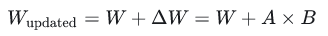
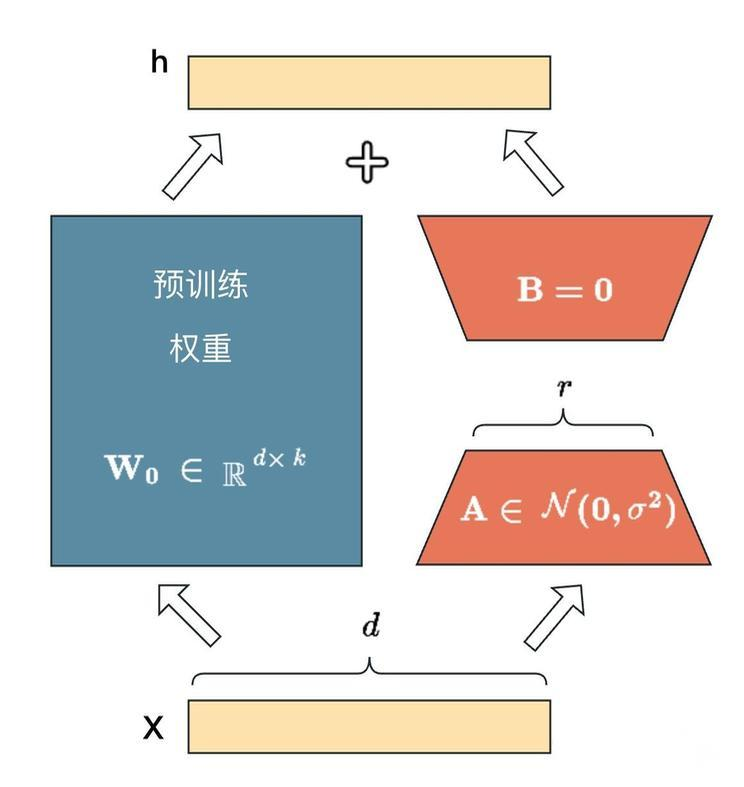
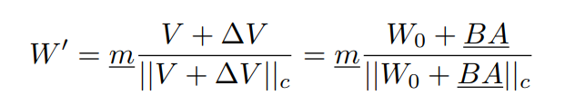
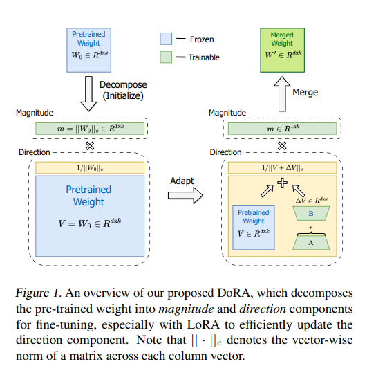
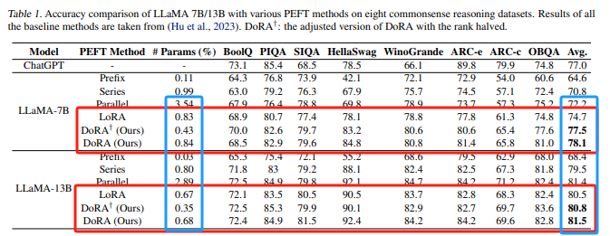

## 大模型高效微调 DoRA: LoRA升级版

DoRA（Weight-Decomposed Low-Rank Adaptation）的主要思想是**将预训练权重分解为幅度（magnitude）和方向（direction），并利用LoRA来微调方向矩阵，这种权重分解策略允许DoRA更精细地控制模型的学习过程，分别针对权重的幅度和方向进行优化。在调整方向部分时，DoRA利用了LoRA的策略，通过低秩适应来有效地更新方向，而幅度部分则单独进行调整。**

### LoRA回顾

LoRA 本质上就是把大矩阵拆成两个小矩阵的乘法

  

  

LoRA具体的代码实现

~~~python
import torch
import torch.nn as nn
import torch.nn.functional as F

class LoRALayer(nn.Module):
    def __init__(self, in_dim, out_dim, rank, alpha):
        super().__init__()
        std_dev = 1 / torch.sqrt(torch.tensor(rank).float())
        # 初始化参数 A 和 B，其中 A 是输入特征和排名之间的参数，B 是排名和输出特征之间的参数
        self.A = nn.Parameter(torch.randn(in_dim, rank) * std_dev)  # 参数 A
        self.B = nn.Parameter(torch.zeros(rank, out_dim))  # 参数 B
        self.alpha = alpha  # LoRA 中的 alpha 参数

    def forward(self, x):
        # LoRA 的前向传播过程
        x = self.alpha * torch.matmul(torch.matmul(x, self.A), self.B)  # 使用参数 A 和 B 进行计算
        return x

class LinearWithLoRAMerged(nn.Module):
    def __init__(self, linear, rank, alpha):
        super().__init__()
        self.linear = linear  # 原始的线性层
        self.lora = LoRALayer(linear.in_features, linear.out_features, rank, alpha)  # LoRA 层

    def forward(self, x):
        lora = torch.matmul(self.lora.A, self.lora.B)  # 组合 LoRA 中的参数 A 和 B
        combined_weight = self.linear.weight + self.lora.alpha * lora.T  # 将 LoRA 和原始权重结合起来
        return F.linear(x, combined_weight, self.linear.bias)  # 使用结合后的权重进行线性变换
~~~

### DoRA

DoRA的核心组成可分为以下几个部分：

- **权重分解**：DoRA首先对预训练模型的权重进行分解，将每个权重矩阵分解为幅度（magnitude）向量和方向（direction）矩阵。这种分解使得模型可以更好地控制权重的学习过程。
- **幅度和方向调整**：在微调阶段，DoRA分别对这两个分解出的组件进行调整。其中，幅度表示权重矩阵的大小，而方向则描述了权重向量的方向变化。
- **方向更新**：DoRA使用LoRA进行方向性更新，只调整方向部分的参数，而保持幅度部分不变。
- **混合权重**：最终的微调权重通过组合调整后的幅度m和经过LoRA更新的方向V来构建，形式上表现为W' = m * V + ∆V / ||V + ∆V||c。
- **模块选择**：在微调过程中，DoRA选择只更新某些模块（如QKV注意力机制中的query、key、value模块）的幅度和方向，而对于剩余的线性层（如MLP层）仅更新其幅度，这样的粒度控制有助于提高性能并减少所需训练的参数数量。

综合以上几点，DoRA通过创新的权重分解策略和定向低秩适应技术，既保持了与全量微调相似的学习行为和容量，又实现了参数效率的优化，从而在广泛的自然语言处理（NLP）任务到跨模态（Vision-Language）任务的各种应用场景中都取得了优于LoRA的效果。

DoRA具体代码实现

~~~python
import torch
import torch.nn as nn
import torch.nn.functional as F

torch.manual_seed(0)

class DoRALayer(nn.Module):
    def __init__(self, d_in, d_out, rank=4, weight=None, bias=None):
        super().__init__()

        # 初始化权重和偏置
        if weight is not None:
            self.weight = nn.Parameter(weight, requires_grad=False)
        else:
            self.weight = nn.Parameter(torch.Tensor(d_out, d_in), requires_grad=False)

        if bias is not None:
            self.bias = nn.Parameter(bias, requires_grad=False)
        else:
            self.bias = nn.Parameter(torch.Tensor(d_out), requires_grad=False)

        # 计算输出维度上的权重矩阵的列的幅度
        self.m = nn.Parameter(self.weight.norm(p=2, dim=0, keepdim=True))
        
        # 初始化 LoRA 的参数 A 和 B
        std_dev = 1 / torch.sqrt(torch.tensor(rank).float())
        self.lora_A = nn.Parameter(torch.randn(d_out, rank) * std_dev)
        self.lora_B = nn.Parameter(torch.zeros(rank, d_in))

    def forward(self, x):
        # 计算 LoRA 矩阵
        lora = torch.matmul(self.lora_A, self.lora_B)
        # 微调权重
        adapted = self.weight + lora
        # 对调整后的权重进行归一化
        column_norm = adapted.norm(p=2, dim=0, keepdim=True)
        norm_adapted = adapted / column_norm
        # 计算最终权重
        calc_weights = self.m * norm_adapted
        # 使用最终权重进行线性变换
        return F.linear(x, calc_weights, self.bias)
~~~

### DoRA相比LoRA的优势

DoRA 在各种下游任务（例如常识推理、视觉指令调整和图像/视频文本理解）上微调 LLaMA、LLaVA 和 VL-BART 方面始终优于 LoRA。

具体地：

- 更精准的控制：通过分别针对权重的幅度和方向进行调整，从而能够更准确地适应特定的任务需求。

- 学习能力更优：DoRA的权重分解策略增强了模型在微调过程中的学习能力，能够在不同大小和架构的模型以及各种下游任务上持续超越LoRA的表现，使其在多种下游任务上的性能更接近于全参数微调的方法。

- 保持高效性：尽管DoRA在微调策略上进行了创新，但它仍然保持了LoRA的高效性，避免增加额外的推理成本。

- 更好的训练稳定性：DoRA通过分解权重并专门针对方向使用低秩适应，提高了训练过程的稳定性，有助于避免过拟合和其他训练问题。

### 参考资料

- [DoRA论文](https://arxiv.org/pdf/2402.09353.pdf)

- [DoRA代码](https://github.com/catid/dora/tree/main)

- [LoRA论文](https://arxiv.org/abs/2106.09685)

- [LoRA代码](https://github.com/microsoft/LoRA)